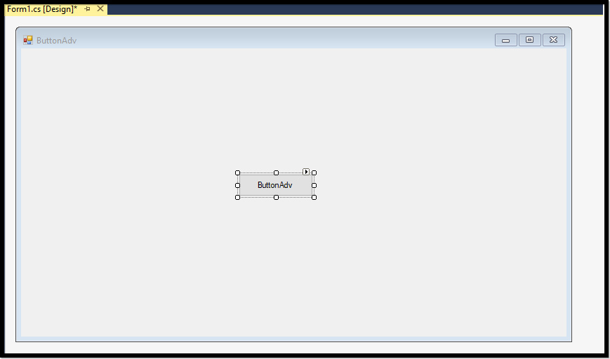
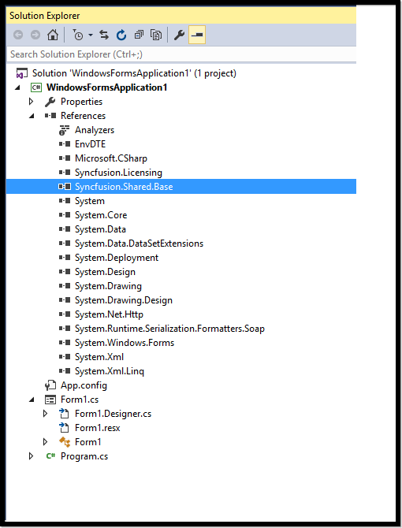
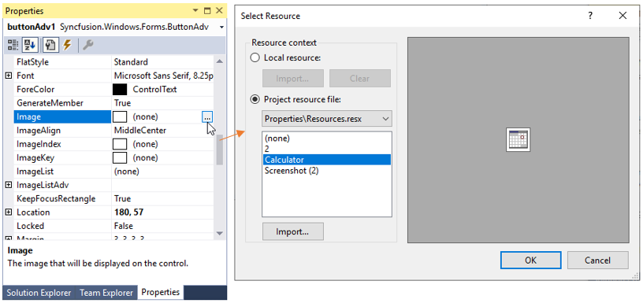
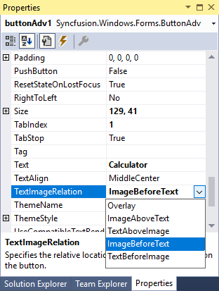
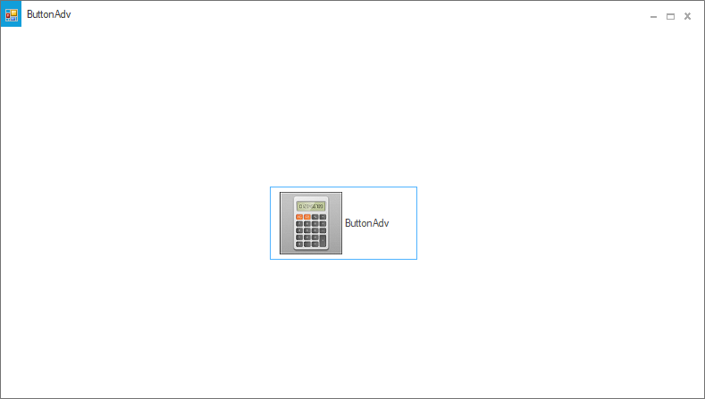
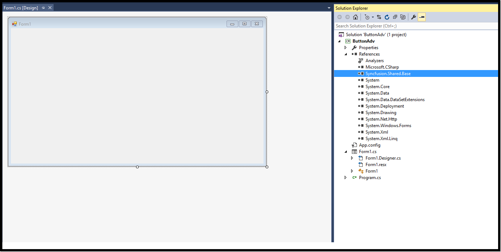
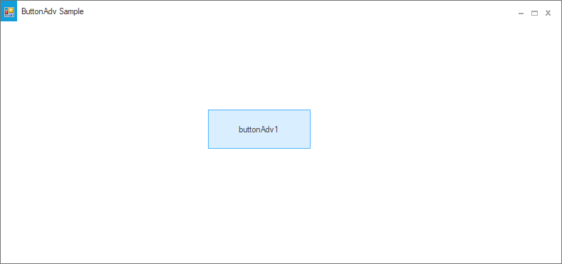

# Getting Started with Windows Forms ButtonAdv(Classic)

This section explains how to create a new Windows Forms project in Visual Studio and add `ButtonAdv` with its basic functionality.

## Assembly deployment

Refer to the [control dependencies](https://help.syncfusion.com/windowsforms/control-dependencies#buttonadv) section for the list of assemblies or NuGet package references required to use the control in an application.

[Check here](https://help.syncfusion.com/windowsforms/installation/install-nuget-packages) to find more details about on how to install nuget packages in Windows Forms application. 

## Adding a ButtonAdv control through the designer

**Step 1**: Create a new Windows Forms application in Visual Studio. Drag and drop `ButtonAdv` from the toolbox into the form designer. The required dependent assemblies are added automatically.

* Syncfusion.Shared.Base

**Step 2**: Set the desired properties for the `ButtonAdv` control through the Properties window. The following example shows how to add an image and customize its properties.

**Step 3**: Run the application. The following output is shown:

## Adding a ButtonAdv control through code

**Step 1**: Create a new Windows Forms application in Visual Studio and add the required assembly references and namespace.

* Syncfusion.Shared.Base





using Syncfusion.Windows.Forms.Tools;





Imports Syncfusion.Windows.Forms.Tools





 
**Step 2**: In Form1.cs, create an instance of **"ButtonAdv"** control and add in to the form. Also you can customize the ButtonAdv properties using the following code.





public Form1()
{
    InitializeComponent();

    ButtonAdv button = new ButtonAdv();
    button.UseVisualStyle = true;
    button.Location = new System.Drawing.Point(296, 179);
    button.Name = "buttonAdv1";
    button.Size = new System.Drawing.Size(165, 82);
    button.Text = "ButtonAdv";
    button.ThemeName = "Office2019Colorful";
    this.Controls.Add(button);
}





Public Sub New()
    InitializeComponent()

    Dim button As ButtonAdv = New ButtonAdv()
    button.UseVisualStyle = True
    button.Location = New System.Drawing.Point(296, 179)
    button.Name = "buttonAdv1"
    button.Size = New System.Drawing.Size(165, 82)
    button.Text = "ButtonAdv"
    button.ThemeName = "Office2019Colorful"
    Me.Controls.Add(button)

End Sub





**Step 3**: Run the application. The following output is shown:

## Adding an image and setting the image-text relationship for ButtonAdv

In `ButtonAdv`, an image can be embedded using the `Image` property. To display an image together with custom text, set the `Text` property and then define the relationship between the image and text by using `TextImageRelation`.





public Form1()
{
    InitializeComponent();

    ButtonAdv button = new ButtonAdv();
    button.Image = global::WindowsFormsApplication1.Properties.Resources.Calculatorimage;
    button.Location = new System.Drawing.Point(296, 179);
    button.Name = "buttonAdv1";
    button.Size = new System.Drawing.Size(165, 82);
    button.Text = "ButtonAdv";
    button.TextImageRelation = TextImageRelation.ImageBeforeText;
    button.ThemeName = "Office2019Colorful";
    this.Controls.Add(button);
}





Public Sub New()
    InitializeComponent()

    Dim button As ButtonAdv = New ButtonAdv()
    button.Image = [global].WindowsFormsApplication1.Properties.Resources.Calculatorimage
    button.Location = New System.Drawing.Point(296, 179)
    button.Name = "buttonAdv1"
    button.Size = New System.Drawing.Size(165, 82)
    button.Text = "ButtonAdv"
    button.TextImageRelation = TextImageRelation.ImageBeforeText
    button.ThemeName = "Office2019Colorful"
    Me.Controls.Add(button)

End Sub





