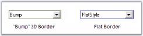
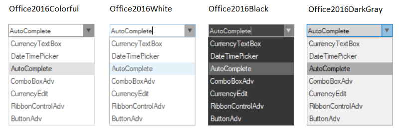

# ComboBoxAdv Appearance in Windows Forms ComboBoxAdv(Classic)

This section discusses the below topics. 

## Border Styles

This section discusses the border settings for the ComboBoxAdv control. 

<table>
<tr>
<th>
ComboBoxAdv Properties</th><th>
Description</th></tr>
<tr>
<td>
Border3DStyle</td><td>
Specifies the 3D BorderStyle for the control.The options are,
<ul><li> RaisedInner</li><li> RaisedOuter</li><li> Raised</li><li>Sunken(Default)</li><li> SunkenInner</li> SunkenOuter</li><li>Flat</li><li> Bump and</li><li> Adjust</li></ul>.  FlatStyle should be set to "Standard" to make this property setting effective.</td></tr>
<tr>
<td>
BorderSides</td><td>
Specifies the BorderSides of the control.The options are, <ul><li>Left</li><li> Top</li><li>Right</li><li> Bottom</li><li> Middle and</li><li> All(Default)</li> </ul></td></tr>
<tr>
<td>
FlatStyle</td><td>
Specifies the Flat Style. The options are* {{ 'Flat,' | markdownify }}* {{ 'Standard (Default) and'| markdownify }}* {{ 'System.' | markdownify }}</td></tr>
<tr>
<td>
FlatBorderColor</td><td>
Specifies the color with which flat border should be drawn. FlatStyle must be set to 'Flat' to get the color effect.</td></tr>
</table>




//Border appearance settings
this.comboBoxAdv1.Border3DStyle = System.Windows.Forms.Border3DStyle.Flat;
this.comboBoxAdv1.BorderSides = System.Windows.Forms.Border3DSide.All;
this.comboBoxAdv1.FlatStyle = Syncfusion.Windows.Forms.Tools.ComboFlatStyle.Flat;
this.comboBoxAdv1.FlatBorderColor = System.Drawing.Color.Blue;





'Border appearance settings
Me.comboBoxAdv1.Border3DStyle = System.Windows.Forms.Border3DStyle.Flat
Me.comboBoxAdv1.BorderSides = System.Windows.Forms.Border3DSide.All
Me.comboBoxAdv1.FlatStyle = Syncfusion.Windows.Forms.Tools.ComboFlatStyle.Flat
Me.comboBoxAdv1.FlatBorderColor = System.Drawing.Color.Blue




 

## Visual Styles

ComboBoxAdv supports visual styles such as Office2016Colorful, Office2016White, Office2016Black, Office2016DarkGray, Metro, Office2010, Default, OfficeXP, Office2003, Office2007, Office2007Outlook, , VS2005 , VS2007 with all three color schemes. The style can be set using Style property.




//To set Visual Style for ComboBox 

this.comboBoxAdv1.Style = Syncfusion.Windows.Forms.VisualStyle.Office2016Colorful;





'To set Visual Style for ComboBox 

Me.comboBoxAdv1.Style = Syncfusion.Windows.Forms.VisualStyle.Office2016Colorful




 

### Office Color Schemes

We can set color schemes for Office2007 style.




//To set Blue Color scheme
this.comboBoxAdv3.Office2007ColorTheme = Syncfusion.Windows.Forms.Office2007Theme.Silver;

//To set Silver Color scheme
this.comboBoxAdv6.Office2007ColorTheme = Syncfusion.Windows.Forms.Office2007Theme.Silver;

//To set Black Color scheme
this.comboBoxAdv9.Office2007ColorTheme = Syncfusion.Windows.Forms.Office2007Theme.Black;





'To set Blue Color scheme
Me.comboBoxAdv1.Office2007ColorTheme = Syncfusion.Windows.Forms.Office2007Theme.Blue

'To set Silver Color scheme
Me.comboBoxAdv1.Office2007ColorTheme = Syncfusion.Windows.Forms.Office2007Theme.Silver

'To set Black Color scheme
Me.comboBoxAdv1.Office2007ColorTheme = Syncfusion.Windows.Forms.Office2007Theme.Black




### Custom Colors

You can also apply custom colors to the ComboBoxAdv control by setting Office2007ColorTheme to "Managed" and specifying the custom color through the ApplyManagedColors method as follows.




this.comboBoxAdv1.Office2007ColorTheme = Syncfusion.Windows.Forms.Office2007Theme.Managed;
Office2007Colors.ApplyManagedColors(this, Color.Orchid);





Me.comboBoxAdv1.Office2007ColorTheme = Syncfusion.Windows.Forms.Office2007Theme.Managed
Office2007Colors.ApplyManagedColors(Me, Color.Orchid)




 

## Background Settings

When ComboBoxAdv control is set with some style, theme background is drawn. You can override this background with the BackColor property using the IgnoreThemeBackground property. When IgnoreThemeBackground is set to true, the control ignores the theme background and draws the back color as the background.




//Background settings
this.comboBoxAdv1.BackColor = System.Drawing.SystemColors.Info;
this.comboBoxAdv1.IgnoreThemeBackground = true;





'Background settings
Me.comboBoxAdv1.BackColor = System.Drawing.SystemColors.Info
Me.comboBoxAdv1.IgnoreThemeBackground = True




 

## Image Settings

Images can be easily associated with the items of the ComboBoxAdv control using the following properties. 

<table>
<tr>
<th>
ComboBoxAdv Properties</th><th>
Description</th></tr>
<tr>
<td>
ImageList</td><td>
Specifies the image list that is used for the ComboBoxAdv control.</td></tr>
<tr>
<td>
ShowImageInTextBox</td><td>
It sets the selected image in the textbox of the ComboBoxAdv control.</td></tr>
<tr>
<td>
ItemsImageIndexes</td><td>
Invokes an editor and lets you to set image index for individual dropdown items.</td></tr>
</table>




//ImageList for the ComboBoxAdv
this.comboBoxAdv1.ImageList = this.imageList1;
this.comboBoxAdv1.ItemsImageIndexes.Add(new Syncfusion.Windows.Forms.Tools.ComboBoxAdv.ImageIndexItem(this.comboBoxAdv1, "Pointer", 0));





'ImageList for the ComboBoxAdv
Me.comboBoxAdv1.ImageList = Me.imageList1
Me.comboBoxAdv1.ItemsImageIndexes.Add(New Syncfusion.Windows.Forms.Tools.ComboBoxAdv.ImageIndexItem(Me.comboBoxAdv1, "Pointer", 0))




### Image in TextBox

The following code example is used to show the images together with the selected text in the TextArea of the ComboBoxAdv control.




// Show the images in the TextArea.
this.comboBoxAdv1.ShowImageInTextBox = true





'Show the images in the TextArea.
Me.comboBoxAdv1.ShowImageInTextBox = True




## Customizable ComboBoxAdv Height

ComboBoxAdv allows you to customize the height of the Display area, making more space to display larger images and text items by setting the TextBoxHeight property of the ComboBox.




// Sets the height of the ComboBox.

this.comboBoxAdv1.TextBoxHeight = 80;





'Sets the height of the ComboBox.

Me.comboBoxAdv1.TextBoxHeight = 80



