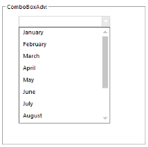
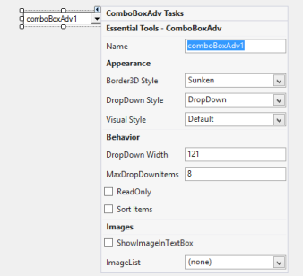
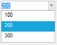

---
layout: post
title: Getting Started with Windows Forms ComboBoxAdv(Classic) | Syncfusion®
description: Learn how to get started with the Syncfusion® Windows Forms ComboBoxAdv(Classic) control. Explore setup, features, examples, and customization options.
platform: WindowsForms
control: ComboBoxAdv
documentation: ug
---

# Getting Started with Windows Forms ComboBoxAdv(Classic)

This section describes how to add the ComboBoxAdv control to a Windows Forms application and configure its commonly used settings.

* [Adding ComboBoxAdv via designer](#adding-comboboxadv-via-designer)
* [Configuring the ComboBoxAdv Control](#configuring-the-comboboxadv-control)
* [Adding ComboBoxAdv via code](#adding-comboboxadv-via-code)

## Assembly deployment

Refer to the [Control Dependencies](https://help.syncfusion.com/windowsforms/control-dependencies#comboboxadv) section for the list of assemblies or the NuGet package details that must be referenced to use the control in any application.

Refer to [NuGet Packages](https://help.syncfusion.com/windowsforms/installation/install-nuget-packages) to learn how to install NuGet packages in a Windows Forms application.

To install via the NuGet Package Manager Console, run:

```
Install-Package Syncfusion.Tools.Windows
```

## Adding ComboBoxAdv via designer

1. Create a new **Windows Forms Application** project in Visual Studio using the New Project dialog.
2. Add the required assembly references to the project:

    * `Syncfusion.Tools.Windows.dll`
    * `Syncfusion.Shared.Base.dll`
3. Open the Toolbox and locate the **ComboBoxAdv** control under the **Syncfusion Windows Forms** tab.
4. Drag the ComboBoxAdv control from the Toolbox onto the Form.



## Configuring the ComboBoxAdv control

The most commonly used settings of the ComboBoxAdv control can be configured through the Smart tag, the Properties window, or in code.



Typical settings include:

| Setting | Property | Where to configure |
| --- | --- | --- |
| Visual style | `Style` | Properties window / code |
| Drop-down behavior | `DropDownStyle` | Properties window / code |
| Data source | `DataSource`, `DisplayMember`, `ValueMember` | Properties window / code |
| Item height | `ItemHeight` | Properties window / code |
| Watermark text | `Watermark` | Properties window / code |

For the full list of options, see [ComboBoxAdv Options](ComboBoxAdv-Options.md) and [ComboBoxAdv Appearance](ComboBoxAdv-appearance.md).

## Adding ComboBoxAdv via code

To add the ComboBoxAdv control programmatically, follow these steps.

1. Add the following assembly references to the project:

    * `Syncfusion.Tools.Windows.dll`
    * `Syncfusion.Shared.Base.dll`

2. To initialize the control in code, perform the following in order:

    1. Add the required namespaces at the top of the file:

        
        

        
        using Syncfusion.Windows.Forms;
        using Syncfusion.Windows.Forms.Tools;
        

        
        Imports Syncfusion.Windows.Forms
        Imports Syncfusion.Windows.Forms.Tools
        

        
        
        {{ codesnippet_ns | OrderList_Indent_Level_2 }}

    2. Inside the Form's constructor (after `InitializeComponent()` in designer-based projects), declare the `comboBoxAdv1` field and create its instance:

        
        
        

        public Form1()
        {
            InitializeComponent();
            // Inside the Form class
            this.comboBoxAdv1 = new Syncfusion.Windows.Forms.Tools.ComboBoxAdv();
        }

        
        

        Public Sub New()
            InitializeComponent()
            ' Inside the Form class
            Me.comboBoxAdv1 = New Syncfusion.Windows.Forms.Tools.ComboBoxAdv()
        End Sub

        
        
        
        {{ codesnippet_ctor | OrderList_Indent_Level_2 }}

    3. Add items to the control using the `Items.Add` method:

        
        
        

        this.comboBoxAdv1.Items.Add("Item1");
        this.comboBoxAdv1.Items.Add("Item2");
        this.comboBoxAdv1.Items.Add("Item3");

        
        

        Me.comboBoxAdv1.Items.Add("Item1")
        Me.comboBoxAdv1.Items.Add("Item2")
        Me.comboBoxAdv1.Items.Add("Item3")

        
        
        
        {{ codesnippet_items | OrderList_Indent_Level_2 }}

    4. Add the control to the form by appending it to the `Controls` collection:

        
        
        

        this.Controls.Add(this.comboBoxAdv1);

        
        

        Me.Controls.Add(Me.comboBoxAdv1)

        
        
        
        {{ codesnippet_add | OrderList_Indent_Level_2 }}

### Complete code example

The following combined C# and VB.NET sample shows all of the steps above in a single, runnable example.





using Syncfusion.Windows.Forms;
using Syncfusion.Windows.Forms.Tools;

// Inside the Form class
public partial class Form1 : Form
{
    private Syncfusion.Windows.Forms.Tools.ComboBoxAdv comboBoxAdv1;

    public Form1()
    {
        InitializeComponent();
        this.comboBoxAdv1 = new ComboBoxAdv();
        this.comboBoxAdv1.Name = "comboBoxAdv1";
        this.comboBoxAdv1.Location = new System.Drawing.Point(20, 20);
        this.comboBoxAdv1.Size = new System.Drawing.Size(200, 25);

        // Add items to ComboBoxAdv (any object can be added; ToString() is used for display)
        this.comboBoxAdv1.Items.Add("Item1");
        this.comboBoxAdv1.Items.Add("Item2");
        this.comboBoxAdv1.Items.Add("Item3");

        this.Controls.Add(this.comboBoxAdv1);
    }
}




Imports Syncfusion.Windows.Forms
Imports Syncfusion.Windows.Forms.Tools

Public Partial Class Form1
    Inherits System.Windows.Forms.Form

    Private WithEvents comboBoxAdv1 As Syncfusion.Windows.Forms.Tools.ComboBoxAdv

    Public Sub New()
        InitializeComponent()

        Me.comboBoxAdv1 = New ComboBoxAdv()
        Me.comboBoxAdv1.Name = "comboBoxAdv1"
        Me.comboBoxAdv1.Location = New System.Drawing.Point(20, 20)
        Me.comboBoxAdv1.Size = New System.Drawing.Size(200, 25)

        ' Add items to ComboBoxAdv (any object can be added; ToString() is used for display)
        Me.comboBoxAdv1.Items.Add("Item1")
        Me.comboBoxAdv1.Items.Add("Item2")
        Me.comboBoxAdv1.Items.Add("Item3")

        Me.Controls.Add(Me.comboBoxAdv1)
    End Sub
End Class




{{ codesnippet1 | OrderList_Indent_Level_2 }}

