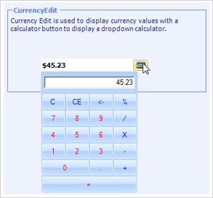

# Windows Forms CurrencyEdit Overview

The [CurrencyEdit](https://help.syncfusion.com/cr/windowsforms/Syncfusion.Windows.Forms.Tools.CurrencyEdit.html) control embeds a CurrencyTextBox control and a button to provide a drop-down calculator to enable calculations with the contents of the CurrencyTextBox. The CurrencyEdit control provides an easy way to collect and display the currency data.

 

## Key features

* **Culture formatting** - Ensures that the formatting of display is culture sensitive.

* **Theme** - Supports different types of themes to provide the look and feel for the grid.
