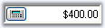

# Text Settings in WinForms CurrencyEdit

The following properties let you control the behavior of the text in the [WinForms CurrencyEdit](https://help.syncfusion.com/cr/windowsforms/Syncfusion.Windows.Forms.Tools.CurrencyEdit.html) control.

* [ShowTextBox](https://help.syncfusion.com/cr/windowsforms/Syncfusion.Windows.Forms.Tools.CurrencyEdit.html#Syncfusion_Windows_Forms_Tools_CurrencyEdit_ShowTextBox)
* [Text](https://help.syncfusion.com/cr/windowsforms/Syncfusion.Windows.Forms.Tools.CurrencyEdit.html#Syncfusion_Windows_Forms_Tools_CurrencyEdit_Text)
* [TextBox](https://help.syncfusion.com/cr/windowsforms/Syncfusion.Windows.Forms.Tools.CurrencyEdit.html#Syncfusion_Windows_Forms_Tools_CurrencyEdit_TextBox)
* [TextAlign](https://help.syncfusion.com/cr/windowsforms/Syncfusion.Windows.Forms.Tools.ButtonEdit.html#Syncfusion_Windows_Forms_Tools_ButtonEdit_TextAlign)
* [TransferFromCalculator](https://help.syncfusion.com/cr/windowsforms/Syncfusion.Windows.Forms.Tools.CurrencyEdit.html#Syncfusion_Windows_Forms_Tools_CurrencyEdit_TransferFromCalculator)
* [TransferToCalculator](https://help.syncfusion.com/cr/windowsforms/Syncfusion.Windows.Forms.Tools.CurrencyEdit.html#Syncfusion_Windows_Forms_Tools_CurrencyEdit_TransferToCalculator)
* [DecimalValue](https://help.syncfusion.com/cr/windowsforms/Syncfusion.Windows.Forms.Tools.CurrencyEdit.html#Syncfusion_Windows_Forms_Tools_CurrencyEdit_DecimalValue)



this.currencyEdit1.ShowTextBox = true;
this.currencyEdit1.Text = "$400.00";
this.currencyEdit1.TextAlign = HorizontalAlignment.Right;
this.currencyEdit1.TransferFromCalculator=true;
this.currencyEdit1.TransferToCalculator= false;
this.currencyEdit1.TextBox.DecimalValue = new decimal(new int[] {40000, 0, 0, 131072});


Me.currencyEdit1.ShowTextBox = True
Me.currencyEdit1.Text = "$400.00"
Me.currencyEdit1.TextAlign = HorizontalAlignment.Right
Me.currencyEdit1.TransferFromCalculator = True
Me.currencyEdit1.TransferToCalculator = False
Me.currencyEdit1.TextBox.DecimalValue = New Decimal(New Integer() {40000, 0, 0, 131072})



>**NOTE**: By enabling the [CurrencyEdit.UseVisualStyle](https://help.syncfusion.com/cr/windowsforms/Syncfusion.Windows.Forms.Tools.ButtonEdit.html#Syncfusion_Windows_Forms_Tools_ButtonEdit_UseVisualStyle) property and setting a visual style for the control using the [CurrencyEdit.ButtonStyle](https://help.syncfusion.com/cr/windowsforms/Syncfusion.Windows.Forms.Tools.ButtonEdit.html#Syncfusion_Windows_Forms_Tools_ButtonEdit_ButtonStyle) property, you can change the appearance of the calculator button.
