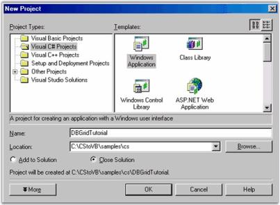
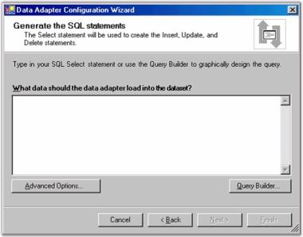
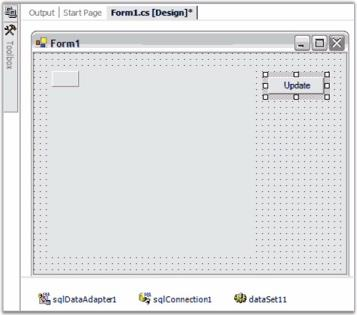

# Getting Started with Windows Forms GridDataBoundGrid(Classic)

This section will provide step-by-step procedure to create Grid DataBound Grid through designer and through programmatic approach in a .NET application.

## Assembly Deployment

Refer [control dependencies](https://help.syncfusion.com/windowsforms/control-dependencies#griddataboundgridclassic) section to get the list of assemblies or NuGet package needs to be added as reference to use the control in any application. 

## Configuring a simple GridDataBoundGrid

### Through Designer

In this lesson, you will learn how to use Forms Designer to create an Essential DataBound Grid. You can rely on the designer to generate all the codes necessary except for two lines: one that fills the ADO.NET adapter and one that updates the database when you are done.

#### Basic DataBound Grid

In this part, you will learn how to use the designer to place DataBound Grid on a form. 

1. In Visual Studio .NET, use the File -> Menu option to create a new Windows Application project, naming it DBGridTutorial.

You now have an empty form on the design surface. Open the Data section of your toolbox and drag a SQLDataAdapter onto your form. This will open a Data Adapter Wizard.

Use the wizard to create a connection to the Northwind database. This DataBase is installed as part of the .NET Framework ADO.NET samples.

 

Select use SQL statements.

To generate SQL statement, click Query Builder button.

In the Add Table dialog, select Products table and click Add, then Close.

In this Query Build window, select ProductName, ProductID, QuantityPerUnit and UnitPrice. Then press OK.

 

Click Next to confirm the Query you selected.

 

Click Finish. Your design surface will look similar to this.

  

Next you will need to generate a dataset from the SQLDataAdapter. Right-click sqlDataAdapter1 under the design surface and select Generate DataSet. You will then see this window.

 

Press OK to add DataSet11 object next to sqlConnection1 under the design surface.

From the toolbox, drag Grid Data Bound Grid control to your form. Size and position it and add a button labeled Update to your form.

  

Click DataBound Grid to display its properties in PropertyGrid. Set these properties.

<table>
<tr>
<th>
DataSource</th><th>
DataSet11</th></tr>
<tr>
<td>
DisplayMember</td><td>
Products</td></tr>
</table>
Double click the form on the design surface (not one of the controls, but the form itself) to add a load event handler. In this handler, add the single statement given below.



//Loads dataset with records.
this.sqlDataAdapter1.Fill(this.dataSet11);


'Loads dataset with records.
Me.sqlDataAdapter1.Fill(Me.dataSet11)



To support updating data in your database, you will need to call Update command on the SQLDataAdapter. Double click Update button on the design surface to add a Click Handler. Then add this single line of code to the handler.



//Saves Changes(if any) back to the database.
this.sqlDataAdapter1.Update(this.dataSet11);


'Saves Changes (if any) back to the database.
Me.sqlDataAdapter1.Update(Me.dataSet11);



Now when you click Update button, it will post the changes made back to your database.

#### Applying special column formats

GridBoundColumn collection property of DataBound Grid is used to set column properties. This collection will let you control columns displayed and their order. For each column that you want displayed, add a Grid Bound Column. In this Grid Bound Column, you must set MappingName property; the other properties such as HeaderText and Style are optional. Under the Style property, you will have access to normal GridStyleInfo properties that you can apply to this column such as BackColor, CellType and Font.

  

1. Open GridBoundColumns collection editor by using property grid.

   Click Add button to add a grid bound column, and then set MappingName property of that grid bound column to _ProductName_.

    

   Select StyleInfo property and set BackColor for the column as shown in the following screen shot.

    

   Repeat the above steps to add Grid Bound Columns for 'UnitPrice' and 'UnitsInStock'. For the 'UnitPrice' Grid Bound Column, set StyleInfo.Format to _C_.

Compile and run the project to see formatted Grid Data Bound Grid. In the following screen shot, you will be able to see the grid with columns specified and in the order that you specified them. Notice that the 'UnitPrice' column shows the price in specified currency format.

 

### Through Code

Here are some code samples that will create a DataTable and bind it a to Grid Data Bound Grid. Once you have a DataTable object populated you can use the GridDataBoundGrid.DataSource property to implement the binding.



DataTable myDataTable = new DataTable("MyDataTable");

//Declares the Data Column and Data Row variables.
DataColumn myDataColumn;
DataRow myDataRow;

//Creates a new Data Column, sets the Data Type and Column Name and adds to the Data Table.   
myDataColumn = new DataColumn();
myDataColumn.DataType = System.Type.GetType("System.Int32");
myDataColumn.ColumnName = "id";
myDataTable.Columns.Add(myDataColumn);

//Creates a second column.
myDataColumn = new DataColumn();
myDataColumn.DataType = Type.GetType("System.String");
myDataColumn.ColumnName = "item";
myDataTable.Columns.Add(myDataColumn);

//Creates new Data Row objects and adds to the Data Table.    

for (int i = 0; i <= 10; i++)
{
    myDataRow = myDataTable.NewRow();
    myDataRow["id"] = i;
    myDataRow["item"] = "item " + i.ToString();
    myDataTable.Rows.Add(myDataRow);
}
this.GridDataBoundGrid1.DataSource = myDataTable;

//Sizes the columns.
this.GridDataBoundGrid1.Model.ColWidths[1] = 30;
this.GridDataBoundGrid1.Model.ColWidths[2] = 50;


Dim myDataTable As DataTable = New DataTable("MyDataTable")

'Declares the Data Column and Data Row variables.
Dim myDataColumn As DataColumn
Dim myDataRow As DataRow

'Creates a new Data Column, sets Data Type and Column Name and adds to the Data Table. 
myDataColumn = New DataColumn()
myDataColumn.DataType = System.Type.GetType("System.Int32")
myDataColumn.ColumnName = "id"
myDataTable.Columns.Add(myDataColumn)

'Creates a second column.
myDataColumn = New DataColumn()
myDataColumn.DataType = Type.GetType("System.String")
myDataColumn.ColumnName = "item"
myDataTable.Columns.Add(myDataColumn)

'Creates new Data Row objects and adds to the Data Table.    
Dim i As Integer

For i = 0 To 10
myDataRow = myDataTable.NewRow
myDataRow("id") = i
myDataRow("item") = "item " & i
myDataTable.Rows.Add(myDataRow)
Next i
Me.gridDataBoundGrid1.DataSource = myDataTable

'Sizes the columns.
Me.gridDataBoundGrid1.Model.ColWidths(1) = 30
Me.gridDataBoundGrid1.Model.ColWidths(2) = 50



## Editing

By default, the GridDataBoundGrid is in editable state. Editing can be enabled or disabled by using the [ReadOnly] (https://help.syncfusion.com/cr/windowsforms/Syncfusion.Windows.Forms.Grid.GridStyleInfo.html#Syncfusion_Windows_Forms_Grid_GridStyleInfo_ReadOnly) property. It can be used for entire grid or particular cells. Moreover, editing can be customized by using the [CurrentCellStartEditing] (https://help.syncfusion.com/cr/windowsforms/Syncfusion.GridHelperClasses.GridCardView.html) and [CurrentCellEditingComplete] (https://help.syncfusion.com/cr/windowsforms/Syncfusion.Windows.Forms.Grid.GridControlBase.html) events.



// Disabling Edit mode for the whole Grid.
this.gridDataBoundGrid1.ReadOnly = false.

// Disabling edit mode for a particular cell.
GridStyleInfo style = gridDataBoundGrid1.Model[2, 2];

style.ReadOnly = false;



'Disabling Edit mode for the whole Grid.
Me.gridDataBoundGrid1.ReadOnly = False.

'Disabling edit mode for a particular cell.
Dim style As GridStyleInfo = gridDataBoundGrid1.Model(2, 2)

style.ReadOnly = False



## Selection

The GridDataBoundGrid supports two types of selections. They are [AllowSelection](https://help.syncfusion.com/cr/windowsforms/Syncfusion.Windows.Forms.Grid.Grouping.GridTableOptionsStyleInfo.html#Syncfusion_Windows_Forms_Grid_Grouping_GridTableOptionsStyleInfo_AllowSelection) and [ListBoxSelectionMode](https://help.syncfusion.com/cr/windowsforms/Syncfusion.Windows.Forms.Grid.Grouping.GridTableOptionsStyleInfo.html#Syncfusion_Windows_Forms_Grid_Grouping_GridTableOptionsStyleInfo_ListBoxSelectionMode). 

### AllowSelection

A particular range of cells, rows, columns, or table in the grid can be selected by setting the `AllowSelection` property to the appropriate [GridSelectionFlags](https://help.syncfusion.com/cr/windowsforms/Syncfusion.Windows.Forms.Grid.GridSelectionFlags.html#) enumeration.



//To select any range of cells
this.GridDataBoundGrid1.AllowSelection = Syncfusion.Windows.Forms.Grid.GridSelectionFlags.Any;



'To select any range of cells
Me.GridDataBoundGrid1.AllowSelection = Syncfusion.Windows.Forms.Grid.GridSelectionFlags.Any



### ListBoxSelectionMode

The `ListBoxSelectionMode` allows the user to select the rows on cell click. This enables the `CurrentCell` when selecting the rows whereas, the `AllowSelection` selects the entire row. Multiple rows can be selected based on the SelectionMode option.



//To select multiple rows
this.GridDataBoundGrid1.ListBoxSelectionMode = SelectionMode.MultiSimple;



'To select multiple rows
Me.GridDataBoundGrid1.ListBoxSelectionMode = SelectionMode.MultiSimple



## Sorting

Column sorting can be enabled in GridDataBoundGrid by using the `SortBehavior` property. The records can be sorted on single click or double click on the column header cell based on the `GridSortBehavior` enumeration.



//enables the sorting. 
this.gridDataBoundGrid1.SortBehavior = GridSortBehavior.SingleClick;



' enables the sorting.
 Me.gridDataBoundGrid1.SortBehavior = GridSortBehavior.SingleClick;



N> Sorting for the GridDataBoundGrid will be applied only when the DataSource for the grid is DataTable.
