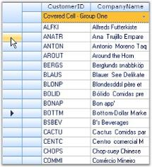

# Multiple Headers in Windows Forms GridDataBoundGrid

Grid Data Bound Grid supports display of multiple row and column headers. Additional row headers can be added along side the existing header by setting Model.Rows.HeaderCount and additional column headers can be added below the existing column header by setting the Model.Cols.HeaderCount property.

The following code example illustrates how to display multiple row and column headers.



int extraRowHeaders = 1;
int extraColHeaders = 1;

//Initializes extra row and column headers.
this.gridDataBoundGrid1.Model.Rows.HeaderCount = extraRowHeaders;
this.gridDataBoundGrid1.Model.Cols.HeaderCount = extraColHeaders;


Dim extraRowHeaders As Integer = 1
Dim extraColHeaders As Integer = 1

'Initializes extra row and column headers.
Me.gridDataBoundGrid1.Model.Rows.HeaderCount = extraRowHeaders
Me.gridDataBoundGrid1.Model.Cols.HeaderCount = extraColHeaders



The resultant output is shown below.

