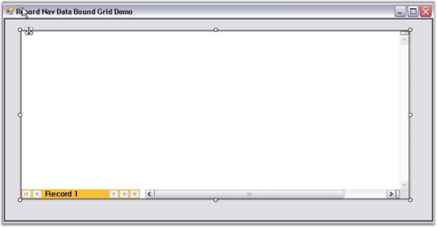

# Record Navigation Bar in Windows Forms GridDataBoundGrid(Classic)

It is possible to display DataBound Grid within Grid Record Navigation control. This combination will give you a look similar to Microsoft Access.

N> For more details, refer to the following browser sample:

**_<Install Location>\Syncfusion\EssentialStudio\[Version Number]\Windows\GridDataBound.Windows\Samples\Product Showcase\Record Navigation Data Bound Grid Demo_**

### Example

The following sample displays DataBound Grid within Grid Record Navigation control. This sample was created using the designer. 

1. Step 1: Create an SqlDataAdapter and connect to the Customers table of Northwind database. 

   

         N> A DataSet is generated.

2. Step 2: Drag Grid Record Navigation control onto the form.

    

3. Step 3: Drag Grid DataBound Grid onto the Grid Record Navigation control.

    

   N> Records can be displayed by typing in the NavigationBar.

    

DataBound Grid is displayed within Grid Record Navigation control.

