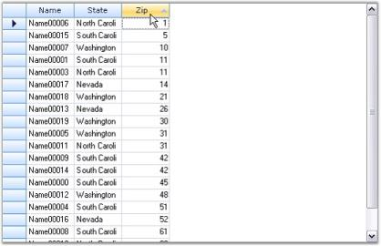

# Sorting

Sorting feature available in DataBound Grid control allows the user to arrange items in a sequence and/or in different sets. SortBehavior property under the control allows you to sort a column in a data bound grid when the column header cell is clicked. Implementation of this property will rearrange the cell data in the clicked column. This property can be set using either a code or designer. By default, it is set to perform sorting on double-click. GridSortBehavior is an enumeration that defines the sorting behavior options/values.

Following is the list of options/values that can be assigned to SortBehavior property:

* SingleClick: Sort column when user clicks once.
* DoubleClick: Sort column when user double-clicks.
* None: No sorting when user clicks.

The following code example illustrates sorting of columns on a single click.



this.gridDataBoundGrid1.SortBehavior = GridSortBehavior.SingleClick;


Me.gridDataBoundGrid1.SortBehavior = GridSortBehavior.SingleClick



## Sort by DisplayMember

By default, sorting is done in DataBound Grid through IBindingList.

N> IBindingList interface provides features required to support both complex and simple scenarios when binding to a data source.

Sort method relies on the data source for the grid and by default sorting is done based on the value members present in the data source and not based on display member. We can implement Sort By DisplayMember feature in Data Bound Grid. The code for foreign key column can be added to the View of the data table so that the sort behavior can be redirected to use foreign key column linked to the combo box column when the user sorts combo box column.

### Example

The following code example implements a solution for sorting a column by its display member instead of its value member. Here the foreign key column is added to the View of the data to redirect sort behavior to use foreign key column. 

To accomplish this, two handlers, CellClick event and QueryCellInfo event have been used. In CellClick event, display member is set to the existing mapping name in sortName (which will be the value member) so that sorting is done by display member.



string sortName = column.MappingName;

if (column.MappingName == "SupplierID")
    sortName = "CompanyName";

else if (column.MappingName == "CategoryID")
    sortName = "CategoryName";


Dim sortName As String = column.MappingName

If column.MappingName = "SupplierID" Then
sortName = "CompanyName"

ElseIf column.MappingName = "CategoryID" Then
sortName = "CategoryName"
End If



DataView is created by using List property under CurrencyManager class.



CurrencyManager cm = BindingContext[grid.DataSource, grid.DataMember] as CurrencyManager;
DataView dataView = cm.List as DataView;


Dim cm As CurrencyManager = TryCast(BindingContext(Grid.DataSource, Grid.DataMember), CurrencyManager)
Dim dataView As DataView = TryCast(cm.List, DataView)



DataView sort is applied to this with sortName.


if (dataView.Sort == sortName)
{
    dataView.Sort = sortName + " DESC";
}

else
    dataView.Sort = sortName;


If dataView.Sort = sortName Then
dataView.Sort = sortName & " DESC"

Else
dataView.Sort = sortName
End If



N> CurrencyManager manages a list of binding objects when data source uses IBindingList interface.

In QueryCellInfo handler, the sorting icon is drawn with respect to sorting



if (dataView.Sort == sortName)
    e.Style.Tag = ListSortDirection.Ascending;

else if (dataView.Sort == sortName + " DESC")
    e.Style.Tag = ListSortDirection.Descending;


If dataView.Sort = sortName Then
e.Style.Tag = ListSortDirection.Ascending

ElseIf dataView.Sort = sortName & " DESC" Then
e.Style.Tag = ListSortDirection.Descending
End If



A sample demonstrating this feature is available under the following sample installation path.

**_<Install Location>\Syncfusion\EssentialStudio\[Version Number]\Windows\Grid.Windows\Samples\2.0\Data Bound\Sort By DisplayMember Demo_**

