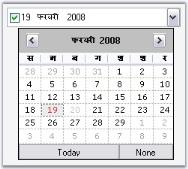
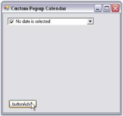

# Advanced features in Windows Forms DateTimePickerAdv(Classic)

This section covers the below topics:

## Data Binding

Essential Tools supports extensive DataBinding in DateTimePickerAdv using the Value and [BindableValue](https://help.syncfusion.com/cr/windowsforms/Syncfusion.Windows.Forms.Tools.DateTimePickerAdv.html#Syncfusion_Windows_Forms_Tools_DateTimePickerAdv_BindableValue) property. The following example illustrates the DataBinding of the DataSet belonging to a DataGrid. 

N> Always use [BindableValue](https://help.syncfusion.com/cr/windowsforms/Syncfusion.Windows.Forms.Tools.DateTimePickerAdv.html#Syncfusion_Windows_Forms_Tools_DateTimePickerAdv_BindableValue) property if dataset contains Null value. In cases where no Null value exists in the dataset, Value property can be used.

To bind a DateTimePickerAdv, perform the following steps.

1. Add a DateTimePickerAdv and a DataGrid controls to the form.

2. Create a dataset using the code below.






// Creating DataSet,Table and rows.
DataSet dataSet = null;
DataTable table = null;

dataSet = new DataSet();
table = dataSet.Tables.Add("Table");

table.Columns.Add("DateTimeColumn", typeof(DateTime));
table.Columns[0].AllowDBNull = true;

table.Rows.Add(new object[]{DateTime.Now - TimeSpan.FromDays(60)});
table.Rows.Add(new object[]{DateTime.Now});
table.Rows.Add(new object[]{DBNull.Value});





' Creating DataSet,Table and rows.
Private dataSet As DataSet = Nothing
Private table As DataTable = Nothing

Private dataSet = New DataSet()
Private table = dataSet.Tables.Add("Table")

table.Columns.Add("DateTimeColumn", GetType(DateTime))
Private table.Columns(0).AllowDBNull = True

table.Rows.Add(New Object(){DateTime.Now - TimeSpan.FromDays(60)})
table.Rows.Add(New Object(){DateTime.Now})
table.Rows.Add(New Object(){DBNull.Value})              





{{ codesnippet1 | OrderList_Indent_Level_1 }}

3. Assign the dataset to the DataGrid control using its DataSource property. Set the control's DataMember property to the member that must be bound.






dataGrid1.DataSource = dataSet;
dataGrid1.DataMember = "Table";





Private dataGrid1.DataSource = dataSet
Private dataGrid1.DataMember = "Table"





{{ codesnippet2 | OrderList_Indent_Level_1 }}

4. Bind the datasource with the DateTimePickerAdv control.






//Setting the BindableValue property in order to Data Bind.
dateTimePickerAdv1.DataBindings.Add("BindableValue", dataSet, "Table.DateTimeColumn");
dateTimePickerAdv1.Focus();




   
'Setting the BindableValue property in order to Data Bind.
dateTimePickerAdv1.DataBindings.Add("BindableValue", dataSet, "Table.DateTimeColumn")
dateTimePickerAdv1.Focus()                       





{{ codesnippet3 | OrderList_Indent_Level_1 }}

5. Run the application. Select a data in the datagrid and DateTimePicker will display the corresponding date value (The DateTimePickerAdv is bound to the datasource using BindableValue property as datasource contains Null value. Selecting in the datagrid will automatically position the datasource to the related row which will update the DateTimePickerAdv with the appropriate data).

 

A sample which demonstrates this feature is available in the below sample installation path.

…\_My Documents\Syncfusion\EssentialStudio\Version Number\Windows\Tools.Windows\Samples\Advanced Editor Functions\ActionGroupingDemo_

## Globalization

DateTimePickerAdv supports globalization through [DateTimePickerAdv.Culture](https://help.syncfusion.com/cr/windowsforms/Syncfusion.Windows.Forms.Tools.DateTimePickerAdv.html#Syncfusion_Windows_Forms_Tools_DateTimePickerAdv_Culture) and [UseCurrentCulture](https://help.syncfusion.com/cr/windowsforms/Syncfusion.Windows.Forms.Tools.DateTimePickerAdv.html#Syncfusion_Windows_Forms_Tools_DateTimePickerAdv_UseCurrentCulture) property.





this.dateTimePickerAdv1.UseCurrentCulture = false;
this.dateTimePickerAdv1.Culture = new System.Globalization.CultureInfo("hi-IN");





Me.dateTimePickerAdv1.UseCurrentCulture = False
Me.dateTimePickerAdv1.Culture = New System.Globalization.CultureInfo("hi-IN")





 

## Custom PopupWindow

This section deals with creating a custom popup window for the DateTimePickerAdv control. We can implement [IDateTimePickerAdvCalendar](https://help.syncfusion.com/cr/windowsforms/Syncfusion.Windows.Forms.Tools.IDateTimePickerAdvCalendar.html) interface to drop down a custom window.

[IDateTimePickerAdvCalendar](https://help.syncfusion.com/cr/windowsforms/Syncfusion.Windows.Forms.Tools.IDateTimePickerAdvCalendar.html) Interface Members

* [Active](https://help.syncfusion.com/cr/windowsforms/Syncfusion.Windows.Forms.Tools.IDateTimePickerAdvCalendar.html#Syncfusion_Windows_Forms_Tools_IDateTimePickerAdvCalendar_Active)

* [Culture](https://help.syncfusion.com/cr/windowsforms/Syncfusion.Windows.Forms.Tools.IDateTimePickerAdvCalendar.html#Syncfusion_Windows_Forms_Tools_IDateTimePickerAdvCalendar_Culture)

**Appearance properties**

* [CalendarFont](https://help.syncfusion.com/cr/windowsforms/Syncfusion.Windows.Forms.Tools.IDateTimePickerAdvCalendar.html#Syncfusion_Windows_Forms_Tools_IDateTimePickerAdvCalendar_CalendarFont)
* [CalendarForeColor](https://help.syncfusion.com/cr/windowsforms/Syncfusion.Windows.Forms.Tools.IDateTimePickerAdvCalendar.html#Syncfusion_Windows_Forms_Tools_IDateTimePickerAdvCalendar_CalendarForeColor)
* [CalendarMonthBackground](https://help.syncfusion.com/cr/windowsforms/Syncfusion.Windows.Forms.Tools.IDateTimePickerAdvCalendar.html#Syncfusion_Windows_Forms_Tools_IDateTimePickerAdvCalendar_CalendarMonthBackground)
* [TitleBackColor](https://help.syncfusion.com/cr/windowsforms/Syncfusion.Windows.Forms.Tools.IDateTimePickerAdvCalendar.html#Syncfusion_Windows_Forms_Tools_IDateTimePickerAdvCalendar_TitleBackColor)
* [TitleForeColor](https://help.syncfusion.com/cr/windowsforms/Syncfusion.Windows.Forms.Tools.IDateTimePickerAdvCalendar.html#Syncfusion_Windows_Forms_Tools_IDateTimePickerAdvCalendar_TitleForeColor)
* [TrailingForeColor](https://help.syncfusion.com/cr/windowsforms/Syncfusion.Windows.Forms.Tools.IDateTimePickerAdvCalendar.html#Syncfusion_Windows_Forms_Tools_IDateTimePickerAdvCalendar_TrailingForeColor)

**Value properties** (MinDate, MaxDate, Value)</td><td>

* [MinDate](https://help.syncfusion.com/cr/windowsforms/Syncfusion.Windows.Forms.Tools.IDateTimePickerAdvCalendar.html#Syncfusion_Windows_Forms_Tools_IDateTimePickerAdvCalendar_MinDate)
* [MaxDate](https://help.syncfusion.com/cr/windowsforms/Syncfusion.Windows.Forms.Tools.IDateTimePickerAdvCalendar.html#Syncfusion_Windows_Forms_Tools_IDateTimePickerAdvCalendar_MaxDate)
* [Value](https://help.syncfusion.com/cr/windowsforms/Syncfusion.Windows.Forms.Tools.IDateTimePickerAdvCalendar.html#Syncfusion_Windows_Forms_Tools_IDateTimePickerAdvCalendar_Value)

**Events**

* [NullButtonDown](https://help.syncfusion.com/cr/windowsforms/Syncfusion.Windows.Forms.Tools.IDateTimePickerAdvCalendar.html)
* [SelectDate](https://help.syncfusion.com/cr/windowsforms/Syncfusion.Windows.Forms.Tools.IDateTimePickerAdvCalendar.html)
* [DateChange](https://help.syncfusion.com/cr/windowsforms/Syncfusion.Windows.Forms.Tools.IDateTimePickerAdvCalendar.html)

### Creating a Custom Popup Window for DateTimePickerAdv

Follow the below steps to add a Windows [MonthCalendar](https://docs.microsoft.com/en-us/dotnet/framework/winforms/controls/monthcalendar-control-windows-forms) control as the Popup for the [DateTimePickerAdv](https://help.syncfusion.com/cr/windowsforms/Syncfusion.Windows.Forms.Tools.DateTimePickerAdv.html), using [PopupControlContainer](https://help.syncfusion.com/cr/windowsforms/Syncfusion.Windows.Forms.PopupControlContainer.html).

1. Drag a DateTimePickerAdv, PopupControlContainer and a button onto the form designer from the toolbox. 

 

2. Create a control that implements the [IDateTimePickerAdvCalendar](https://help.syncfusion.com/cr/windowsforms/Syncfusion.Windows.Forms.Tools.IDateTimePickerAdvCalendar.html) interface using the below code.






//Creating Calendar which implements the IDateTimePickerAdvCalendar
private MyCustomCalendar MonthCalendar;

//Initializing the Calendar 
this.MonthCalendar = new MyCustomCalendar();

//Defining the Calendar Class which implements IDateTimePickerAdvCalendar
public class MyCustomCalendar : MonthCalendar, IDateTimePickerAdvCalendar
{
    private bool active;
	public bool Active
	{
		get { return active; }
		set { active = value; }
	}
	public System.Drawing.Font CalendarFont
	{
		get { return Font; }
		set { Font = value; }
	}
	public Color CalendarForeColor
	{
		get { return ForeColor; }
		set { ForeColor = value; }
	}
	public Color CalendarMonthBackground
	{
		get { return BackColor; }
		set { BackColor = value; }
	}
	public DateTime Value
	{
		get { return SelectionStart; }
		set { SelectionStart = SelectionEnd = value; }
	}
	public event DateTimePickerAdv.NullButtonEventHandler NullButtonDown;
	public event DateTimePickerAdv.SelectDateEventHandler SelectDate;
	public event DateTimePickerAdv.DateChangedEventHandler DateChange;
	public MyCustomCalendar()
	{
		this.DateSelected += new System.Windows.Forms.DateRangeEventHandler(OnDateSelected);
		this.DateChanged += new System.Windows.Forms.DateRangeEventHandler(OnDateChanged);
	}
	protected void OnDateSelected(object sender, System.Windows.Forms.DateRangeEventArgs e)
	{
		if (SelectDate != null)
		{
			SelectDate(this, new EventArgs());
		}
	}
	protected void OnDateChanged(object sender, System.Windows.Forms.DateRangeEventArgs e)
	{
		if (DateChange != null)
		{
			DateChange(this, new EventArgs());
		}
	}
	public string Culture
	{
		get { return "Not Supported"; }
	}
	public void FireNullEvent()
	{
		if (NullButtonDown != null)
		{
			NullButtonDown(this, new EventArgs());
		}
	}
	CultureInfo IDateTimePickerAdvCalendar.Culture
	{
		get { throw new Exception("The method or operation is not implemented."); }
		set { throw new Exception("The method or operation is not implemented."); }
	}           
}





'Creating Calendar which implements the IDateTimePickerAdvCalendar 
Private MonthCalendar As MyCustomCalendar

'Initializing the Calendar 
Me.MonthCalendar = New MyCustomCalendar()

'Defining the Calendar Class which implements IDateTimePickerAdvCalendar 
Public Class MyCustomCalendar
		Inherits MonthCalendar
		Implements IDateTimePickerAdvCalendar
	Private m_active As Boolean
	Public Property Active() As Boolean
		Get
			Return m_active
		End Get
		Set(ByVal value As Boolean)
			m_active = value
		End Set
	End Property
	Public Property CalendarFont() As System.Drawing.Font
		Get
			Return Font
		End Get
		Set(ByVal value As System.Drawing.Font)
			Font = value
		End Set
	End Property
	Public Property CalendarForeColor() As Color
		Get
			Return ForeColor
		End Get
		Set(ByVal value As Color)
			ForeColor = value
		End Set
	End Property
	Public Property CalendarMonthBackground() As Color
		Get
			Return BackColor
		End Get
		Set(ByVal value As Color)
			BackColor = value
		End Set
	End Property
	Public Property Value() As DateTime
		Get
			Return SelectionStart
		End Get
		Set(ByVal value As DateTime)
			SelectionStart = SelectionEnd = value
		End Set
	End Property
	Public Event NullButtonDown As DateTimePickerAdv.NullButtonEventHandler
	Public Event SelectDate As DateTimePickerAdv.SelectDateEventHandler
	Public Event DateChange As DateTimePickerAdv.DateChangedEventHandler
	Public Sub New()
		AddHandler Me.DateSelected, AddressOf OnDateSelected
		AddHandler Me.DateChanged, AddressOf OnDateChanged
	End Sub
	Protected Sub OnDateSelected(ByVal sender As Object, ByVal e As System.Windows.Forms.DateRangeEventArgs)
		RaiseEvent SelectDate(Me, New EventArgs())
	End Sub
	Protected Sub OnDateChanged(ByVal sender As Object, ByVal e As System.Windows.Forms.DateRangeEventArgs)
		RaiseEvent DateChange(Me, New EventArgs())
	End Sub
	Public ReadOnly Property Culture() As String
		Get
			Return "Not Supported"
		End Get
	End Property
	Public Sub FireNullEvent()
		RaiseEvent NullButtonDown(Me, New EventArgs())
	End Sub
	Private Property Culture() As CultureInfo Implements IDateTimePickerAdvCalendar.Culture
		Get
			Throw New Exception("The method or operation is not implemented.")
		End Get
		Set(ByVal value As CultureInfo)
			Throw New Exception("The method or operation is not implemented.")
		End Set
	End Property
End Class





{{ codesnippet4 | OrderList_Indent_Level_1 }}

3. Set the [Active](https://help.syncfusion.com/cr/windowsforms/Syncfusion.Windows.Forms.Tools.IDateTimePickerAdvCalendar.html#Syncfusion_Windows_Forms_Tools_IDateTimePickerAdvCalendar_Active) property of the MonthCalendar to True. Set the DateTimePickerAdv's [CustomPopupWindow](https://help.syncfusion.com/cr/windowsforms/Syncfusion.Windows.Forms.Tools.DateTimePickerAdv.html#Syncfusion_Windows_Forms_Tools_DateTimePickerAdv_CustomPopupWindow) property to the PopupControlContainer control. Set the DateTimePickerAdv's [CustomDrop](https://help.syncfusion.com/cr/windowsforms/Syncfusion.Windows.Forms.Tools.DateTimePickerAdv.html#Syncfusion_Windows_Forms_Tools_DateTimePickerAdv_CustomDrop) property to theTrue. 






this.dateTimePickerAdv1.CustomDrop = true;
this.dateTimePickerAdv1.CustomPopupWindow = this.popupControlContainer1;

//Setting the DateTimePickerAdv control to consider the interface events by enabling Active property
this.MonthCalendar.Active = true;

//Adding Calendar to the Popup Control Container
this.popupControlContainer1.Controls.Add(this.MonthCalendar);





Me.dateTimePickerAdv1.CustomDrop = True 
Me.dateTimePickerAdv1.CustomPopupWindow = Me.popupControlContainer1 

'Setting the DateTimePickerAdv control to consider the interface events by enabling Active property 
Me.MonthCalendar.Active = True 

'Adding Calendar to the Popup Control Container 
Me.popupControlContainer1.Controls.Add(Me.MonthCalendar)





{{ codesnippet5 | OrderList_Indent_Level_1 }}

4. In the button click event, call the MyCustomCalendar's [FireNullEvent](https://help.syncfusion.com/cr/windowsforms/Syncfusion.Windows.Forms.Tools.DateTimePickerAdvCalendarAdapter.html#Syncfusion_Windows_Forms_Tools_DateTimePickerAdvCalendarAdapter_FireNullEvent) method. 






private void buttonAdv1_Click(object sender, EventArgs e)
{
	//Calling the below method to fire the Null Event of the Calendar control created
	MonthCalendar.FireNullEvent();
}





Private Sub buttonAdv1_Click(ByVal sender As Object, ByVal e As EventArgs)
	'Calling the below method to fire the Null Event of the Calendar control created 
	MonthCalendar.FireNullEvent()
End Sub





{{ codesnippet6 | OrderList_Indent_Level_1 }}

5. Run the application and click the dropdown button of the DateTimePickerAdv control to display the custom popup. 

 

6. When you click the button, the DateTimePickerAdv will display the [NullString](https://help.syncfusion.com/cr/windowsforms/Syncfusion.Windows.Forms.Tools.DateTimePickerAdv.html#Syncfusion_Windows_Forms_Tools_DateTimePickerAdv_NullString) specified in [NullString](https://help.syncfusion.com/cr/windowsforms/Syncfusion.Windows.Forms.Tools.DateTimePickerAdv.html#Syncfusion_Windows_Forms_Tools_DateTimePickerAdv_NullString) property.

 

A sample which demonstrates adding a MonthCalendarAdv itself as a custom popup calendar to the DateTimePickerAdv control is available in the below sample installation location.

…\_My Documents\Syncfusion\EssentialStudio\Version Number\Windows\Tools.Windows\Samples\Advanced Editor Functions\ActionGroupingDemo_

