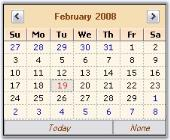

# Customizing the Calendar

DateTimePickerAdv control has properties which can improve the look and feel of the popup calendar. This section discusses various appearance settings available for the calendar.

## Overview

DateTimePickerAdv control contains embedded calendar control which pops-up on clicking the dropdown button at the end of the control. The popup calendar is a MonthCalendarAdv control and hence supports all the properties of the MonthCalendarAdv control. These properties of the calendar can be accessed using DateTimePickerAdv.Calendar.TodayButton _(for example)_property. 

 

Additionally, the calendar popup can be customized using the DateTimePickerAdv properties. Refer Customizing the Calendar topic.

## Day Names

In the calendar, we can specify whether shortest day names can be used or not using UseShortestDayNames property. By default it is true.





this.dateTimePickerAdv1.UseShortestDayNames = false;





Me.dateTimePickerAdv1.UseShortestDayNames = False





## Buttons in Calendar

We can specify the visibility of the None button using NoneButtonVisible property. Default value is true. 





this.dateTimePickerAdv1.NoneButtonVisible = false;





Me.dateTimePickerAdv1.NoneButtonVisible = False





N> None button will not be visible when EnableNullDate property is set to false. See_ Null Value Settings _to know about EnableNullDate property.

## Background Settings

The background of the Calendar can be customized using the [CalendarMonthBackground]() and [CalendarTitleBackColor]() properties of DateTimePickerAdv.





this.dateTimePickerAdv1.CalendarMonthBackground = System.Drawing.Color.OldLace;
this.dateTimePickerAdv1.CalendarTitleBackColor = System.Drawing.Color.Wheat;





Me.dateTimePickerAdv1.CalendarMonthBackground = System.Drawing.Color.OldLace
Me.dateTimePickerAdv1.CalendarTitleBackColor = System.Drawing.Color.Wheat





 

## Foreground Settings

The foreground appearance can be customized using the below properties.

* [CalendarFont](https://help.syncfusion.com/cr/windowsforms/Syncfusion.Tools.Windows~Syncfusion.Windows.Forms.Tools.DateTimePickerAdv~CalendarFont.html)
* [CalendarForeColor](https://help.syncfusion.com/cr/windowsforms/Syncfusion.Tools.Windows~Syncfusion.Windows.Forms.Tools.DateTimePickerAdv~CalendarForeColor.html)
* [CalendarTitleForeColor](https://help.syncfusion.com/cr/windowsforms/Syncfusion.Tools.Windows~Syncfusion.Windows.Forms.Tools.DateTimePickerAdv~CalendarTitleForeColor.html)
* [CalendarTrailingForeColor](https://help.syncfusion.com/cr/windowsforms/Syncfusion.Tools.Windows~Syncfusion.Windows.Forms.Tools.DateTimePickerAdv~CalendarTrailingForeColor.html)





this.dateTimePickerAdv1.CalendarFont = new System.Drawing.Font("Microsoft Sans Serif", 8.25F, System.Drawing.FontStyle.Italic);
this.dateTimePickerAdv1.CalendarForeColor = System.Drawing.Color.SaddleBrown;
this.dateTimePickerAdv1.CalendarTitleForeColor = System.Drawing.Color.SaddleBrown;
this.dateTimePickerAdv1.CalendarTrailingForeColor = System.Drawing.Color.Blue;





Me.dateTimePickerAdv1.CalendarFont = New System.Drawing.Font("Microsoft Sans Serif", 8.25F, System.Drawing.FontStyle.Italic) 
Me.dateTimePickerAdv1.CalendarForeColor = System.Drawing.Color.SaddleBrown 
Me.dateTimePickerAdv1.CalendarTitleForeColor = System.Drawing.Color.SaddleBrown 
Me.dateTimePickerAdv1.CalendarTrailingForeColor = System.Drawing.Color.Blue





 
_CalendarFont = "Italic"; TrailingForeColor = "Blue"_

## Calendar Size

The default size of the popup calendar can be changed using the below properties.

* [CalendarSize](https://help.syncfusion.com/cr/windowsforms/Syncfusion.Tools.Windows~Syncfusion.Windows.Forms.Tools.DateTimePickerAdv~CalendarSize.html)
* [CalendarSizeToFit](https://help.syncfusion.com/cr/windowsforms/Syncfusion.Tools.Windows~Syncfusion.Windows.Forms.Tools.DateTimePickerAdv~CalendarSizeToFit.html)





this.dateTimePickerAdv1.CalendarSize = new System.Drawing.Size(250, 200);
this.dateTimePickerAdv1.CalendarSizeToFit = false;





Me.dateTimePickerAdv1.CalendarSize = New System.Drawing.Size(250, 200)
Me.dateTimePickerAdv1.CalendarSizeToFit = False







[Calendar Value](http://help.syncfusion.com/windowsforms/calendar/calendar-value)

