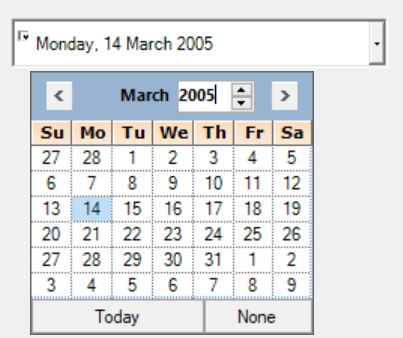

# Creating DateTimePickerAdv in Windows Forms DateTimePickerAdv(Classic)

## Assembly deployment

Refer to the [control dependencies](https://help.syncfusion.com/windowsforms/control-dependencies#currencyedit) section to get the list of assemblies or NuGet package that needs to be added as a reference to use the control in any application.

You can find more details about installing the NuGet packages in a Windows Forms application in the following link: 

[How to install nuget packages](https://help.syncfusion.com/windowsforms/visual-studio-integration/nuget-packages)

### Create a simple application with DateTimePickerAdv

You can create a Windows Forms application with [DateTimePickerAdv](https://help.syncfusion.com/cr/windowsforms/Syncfusion.Windows.Forms.Tools.DateTimePickerAdv.html) using the following steps:

### Create a project

Create a new Windows Forms project in Visual Studio to display the [DateTimePickerAdv](https://help.syncfusion.com/cr/windowsforms/Syncfusion.Windows.Forms.Tools.DateTimePickerAdv.html) control.

## Add control through designer

The [DateTimePickerAdv](https://help.syncfusion.com/cr/windowsforms/Syncfusion.Windows.Forms.Tools.DateTimePickerAdv.html) control can be added to an application by dragging it from the toolbox to a designer view. The following assembly references are added automatically:

* Syncfusion.Tools.Base
* Syncfusion.Tools.Windows
* Syncfusion.Grid.Base
* Syncfusion.Grid.Windows
* Syncfusion.Shared.Base
* Syncfusion.Shared.Windows

 

## Add control manually in code

To add the control manually in C#, follow the given steps:

**1.** Add the following required assembly references to the project: 

* Syncfusion.Tools.Base
* Syncfusion.Tools.Windows
* Syncfusion.Grid.Base
* Syncfusion.Grid.Windows
* Syncfusion.Shared.Base
* Syncfusion.Shared.Windows

**2.** Include the **Syncfusion.Windows.Forms.Tools** namespace.



using Syncfusion.Windows.Forms.Tools;


Imports Syncfusion.Windows.Forms.Tools



**3.** Create a [DateTimePickerAdv](https://help.syncfusion.com/cr/windowsforms/Syncfusion.Windows.Forms.Tools.DateTimePickerAdv.html) instance, and add it to the window.



CurrencyEdit currencyEdit1 = new CurrencyEdit();
this.Controls.Add(currencyEdit1);


Dim currencyEdit1 As New CurrencyEdit()
Me.Controls.Add(currencyEdit1)



## Change DateTime format

The DateTimePickerAdv control contains the following built-in formats for displaying the date and time:

* Long
* Sort
* Time
* Custom

You can set the date time format using the [Format](https://help.syncfusion.com/cr/windowsforms/Syncfusion.Windows.Forms.Tools.DateTimePickerAdv.html#Syncfusion_Windows_Forms_Tools_DateTimePickerAdv_Format) property of [DateTimePickerAdv](https://help.syncfusion.com/cr/windowsforms/Syncfusion.Windows.Forms.Tools.DateTimePickerAdv.html).



//Time format for the text field
this.dateTimePickerAdv5.Format = System.Windows.Forms.DateTimePickerFormat.Time;


'Time format for the text field
Me.dateTimePickerAdv5.Format = System.Windows.Forms.DateTimePickerFormat.Time



 

### Custom format

You can provide custom format styles using the CustomFormat property.



// Set the Format type and the CustomFormat string.
this.dateTimePickerAdv1.Format = System.Windows.Forms.DateTimePickerFormat.Custom;
this.dateTimePickerAdv1.CustomFormat = "MMMM/yyyy";


'Set the Format type and the CustomFormat string.
Me.dateTimePickerAdv1.Format = System.Windows.Forms.DateTimePickerFormat.Custom
Me.dateTimePickerAdv1.CustomFormat = "MMMM/yyyy"



 

N> The DateTimePickerAdv control supports all custom date-time formats string of .NetFramework. Refer to this [documentation](https://docs.microsoft.com/en-us/dotnet/standard/base-types/custom-date-and-time-format-strings) for more information.

## Editing modes

You can edit the date values in the DateTimePickerAdv control directly.

 

 

## Date range constraints

You can set the minimum and maximum dates to the DateTimePickerAdv control using the [MinValue](https://help.syncfusion.com/cr/windowsforms/Syncfusion.Windows.Forms.Tools.DateTimePickerAdv.html#Syncfusion_Windows_Forms_Tools_DateTimePickerAdv_MinValue) and [MaxValue](https://help.syncfusion.com/cr/windowsforms/Syncfusion.Windows.Forms.Tools.DateTimePickerAdv.html#Syncfusion_Windows_Forms_Tools_DateTimePickerAdv_MaxValue) properties.



this.dateTimePickerAdv1.MaxValue = new System.DateTime(2008, 2, 29, 0, 0, 0);
this.dateTimePickerAdv1.MinValue = new System.DateTime(2007, 2, 1, 0, 0, 0, 0);


Me.dateTimePickerAdv1.MaxValue = New System.DateTime(2008, 2, 29, 0, 0, 0)
Me.dateTimePickerAdv1.MinValue = New System.DateTime(2007, 2, 1, 0, 0, 0, 0)



  
