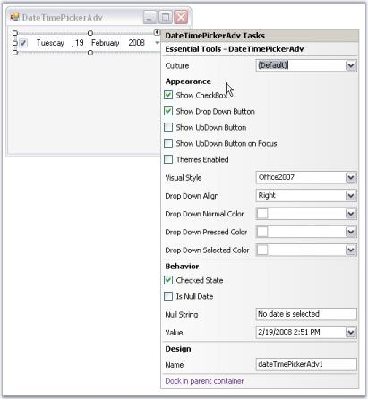

# Design Time Features in Windows Forms DateTimePickerAdv

In the designer, DateTimePickerAdv control has shortcut for some property settings in its Task Window. Task Window is opened through the control's smart tag option.

 

