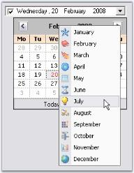

# Runtime Features in Windows Forms DateTimePickerAdv(Classic)

This section covers the below topics:

## Month Images

We can set images for the popup menu of the Calendar using [MonthImageList](https://help.syncfusion.com/cr/windowsforms/Syncfusion.Windows.Forms.Tools.DateTimePickerAdv.html#Syncfusion_Windows_Forms_Tools_DateTimePickerAdv_MonthImageList) property of DateTimePickerAdv control.





// imageList1
this.imageList1.ImageSize = new System.Drawing.Size(16, 16);
this.imageList1.ImageStream = ((System.Windows.Forms.ImageListStreamer)(resources.GetObject("imageList1.ImageStream")));
// ImageList of the PopupMenu of the Popup Calendar
this.dateTimePickerAdv1.MonthImageList = this.imageList1;





' imageList1
Me.imageList1.ImageSize = New System.Drawing.Size(16, 16)
Me.imageList1.ImageStream= (CType(resources.GetObject("imageList1.ImageStream"), System.Windows.Forms.ImageListStreamer))
' ImageList of the PopupMenu of the Popup Calendar
Me.dateTimePickerAdv1.MonthImageList = Me.imageList1





 

## Navigating between fields

At run time, user can easily navigate between values in the text field like date, month, year, time using the TAB key. The below properties settings are necessary for tabbing between the fields.

* [TabStop](https://help.syncfusion.com/cr/windowsforms/Syncfusion.Windows.Forms.Tools.DateTimePickerAdv.html#Syncfusion_Windows_Forms_Tools_DateTimePickerAdv_TabStop)
* [TabForwarding](https://help.syncfusion.com/cr/windowsforms/Syncfusion.Windows.Forms.Tools.DateTimePickerAdv.html#Syncfusion_Windows_Forms_Tools_DateTimePickerAdv_TabForwarding)
* [TabIndex](https://docs.microsoft.com/en-us/dotnet/api/system.windows.forms.control.tabindex?redirectedfrom=MSDN&view=netframework-4.7.2#System_Windows_Forms_Control_TabIndex)
* [TabLeave](https://help.syncfusion.com/cr/windowsforms/Syncfusion.Windows.Forms.Tools.DateTimePickerAdv.html#Syncfusion_Windows_Forms_Tools_DateTimePickerAdv_TabLeave)





this.dateTimePickerAdv1.TabForwarding = true;
this.dateTimePickerAdv1.TabIndex = 1;
this.dateTimePickerAdv1.TabLeave = true;
this.dateTimePickerAdv1.TabStop = true;





Me.dateTimePickerAdv1.TabForwarding = True
Me.dateTimePickerAdv1.TabIndex = 1
Me.dateTimePickerAdv1.TabLeave = True
Me.dateTimePickerAdv1.TabStop = True





## Context Menu

When you right-click on a DateTimePickerAdv control at run time, a context menu will be displayed like the below image. 

This default context menu can be replaced with Syncfusion XP Menu by setting [UseEnhancedMenu](https://help.syncfusion.com/cr/windowsforms/Syncfusion.Windows.Forms.Tools.DateTimePickerAdv.html#Syncfusion_Windows_Forms_Tools_DateTimePickerAdv_UseEnhancedMenu) property to true. By default it is set to false. 





this.dateTimePickerAdv1.UseEnhancedMenu = true;





Me.dateTimePickerAdv1.UseEnhancedMenu = True





 

## Menu Options

The menu options are: 

* Cut - Cuts the displayed date and by default displays "No Date is selected" string.
* Copy - Copies the displayed date and stores in clipboard.
* Paste - Pastes the copied date.
* No Date/Time - Selects no date and displays "No Date is selected".

We can set the text value format that is copied to the clipboard using [ClipboardFormat](https://help.syncfusion.com/cr/windowsforms/Syncfusion.Windows.Forms.Tools.DateTimePickerAdv.html#Syncfusion_Windows_Forms_Tools_DateTimePickerAdv_ClipboardFormat) property.

* [ClipboardFormat](https://help.syncfusion.com/cr/windowsforms/Syncfusion.Windows.Forms.Tools.DateTimePickerAdv.html#Syncfusion_Windows_Forms_Tools_DateTimePickerAdv_ClipboardFormat)
* [CopyFieldsOnly](https://help.syncfusion.com/cr/windowsforms/Syncfusion.Windows.Forms.Tools.DateTimePickerAdv.html#Syncfusion_Windows_Forms_Tools_DateTimePickerAdv_CopyFieldsOnly)





this.dateTimePickerAdv1.CopyFieldsOnly = true;
this.dateTimePickerAdv1.ClipboardFormat = System.Windows.Forms.DateTimePickerFormat.Short;





Me.dateTimePickerAdv1.CopyFieldsOnly = True
Me.dateTimePickerAdv1.ClipboardFormat = System.Windows.Forms.DateTimePickerFormat.Short







 Text Field, Null value Settings

 
