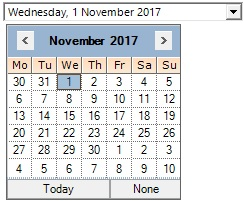
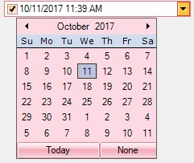
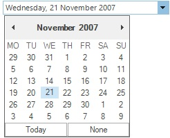

# VisualStyle in Windows Forms DateTimePicker

Styles

The DateTimePickerAdv control for Windows Forms Supports for below listed Visual Styles. You can easily modify the look using the [Style](https://help.syncfusion.com/cr/windowsforms/Syncfusion.Windows.Forms.Tools.DateTimePickerAdv.html#Syncfusion_Windows_Forms_Tools_DateTimePickerAdv_Style) property of DateTimePickerAdv.

The styles are built in for DateTimePickerAdv.

•	Default

•	Office2007

•	Office2007Outlook

•	Office2010

•	Metro

•	Office2016Colorful

•	Office2016DarkGray

•	Office2016Black

•	Office2016White

**Default**

This option helps to set the Default theme.





// Default

this.dateTimePickerAdv1.Style=Syncfusion.Windows.Forms.VisualStyle.default;





' Default

Me.dateTimePickerAdv1.Style = Syncfusion.Windows.Forms.VisualStyle.default





 

**Office2007**

This option helps to set the Office2007 theme.





// Office2007

this.dateTimePickerAdv1.Style=Syncfusion.Windows.Forms.VisualStyle.Office2007;





' Office2007

Me.dateTimePickerAdv1.Style = Syncfusion.Windows.Forms.VisualStyle.Office2007





 

It also specifies the color schemes for Office 2007 visual styles. They can be Blue, Silver, Black and Managed.

•	Blue

•	Black

•	Silver

•	Managed

**Blue**

This option helps to set the Office2007 Blue theme.





// Office2007 Blue

this.dateTimePickerAdv1.Style=Syncfusion.Windows.Forms.VisualStyle.Office2007;
this.dateTimePickerAdv1.Office2007Theme = Syncfusion.Windows.Forms.Office2007Theme.Blue;





' Office2007ThemeBlue

Me.dateTimePickerAdv1.Style = Syncfusion.Windows.Forms.VisualStyle.Office2007
Me.dateTimePickerAdv1.Office2007Theme = Syncfusion.Windows.Forms.Office2007Theme.Blue





 

**Black**

This option helps to set the Office2007 Black theme.





// Office2007ThemeBlack

this.dateTimePickerAdv1.Style=Syncfusion.Windows.Forms.VisualStyle.Office2007;
this.dateTimePickerAdv1.Office2007Theme=Syncfusion.Windows.Forms.Office2007Theme.Black;





'Office2007ThemeBlack

Me.dateTimePickerAdv1.Style = Syncfusion.Windows.Forms.VisualStyle.Office2007
Me.dateTimePickerAdv1.Office2007Theme = Syncfusion.Windows.Forms.Office2007Theme.Black





 

**Silver**

This option helps to set the Office2007 Silver theme.





// Office2007themeSilver

this.dateTimePickerAdv1.Style=Syncfusion.Windows.Forms.VisualStyle.Office2007;
this.dateTimePickerAdv1.Office2007Theme =Syncfusion.Windows.Forms.Office2007Theme.Silver;





' Office2007ThemeSilver

Me.dateTimePickerAdv1.Style = Syncfusion.Windows.Forms.VisualStyle.Office2007
Me.dateTimePickerAdv1.Office2007Theme =Syncfusion.Windows.Forms.Office2007Theme.Silver





 

**Managed**

This option helps to apply the custom colors to the DateTimePickerAdv by setting Office2010Theme to “Managed” and specifying the custom color through the ApplyManagedColors method as follows.





// Managed

this.dateTimePickerAdv1.Style = Syncfusion.Windows.Forms.VisualStyle.Office2007;
this.dateTimePickerAdv1.Office2007Theme = Syncfusion.Windows.Forms.Office2007Theme.Managed;
Syncfusion.Windows.Forms.Office2007Colors.ApplyManagedColors(this, Color.Red);





'Managed

Me.dateTimePickerAdv1.Style = Syncfusion.Windows.Forms.VisualStyle.Office2010
Me.dateTimePickerAdv1.Office2010Theme = Syncfusion.Windows.Forms.Office2007Theme.Managed
Syncfusion.Windows.Forms.Office2007Colors.ApplyManagedColors(Me, Color.Red)





 

**Office2007Outlook**

This option is used to set the Office200&Outlook theme.





// Office2007Outlook

this.dateTimePickerAdv1.Style =  Syncfusion.Windows.Forms.VisualStyle.Office2007Outlook;





'Office2007Outlook

Me.dateTimePickerAdv1.VisualStyle = Syncfusion.Windows.Forms.VisualStyle.Office2007Outlook





 

**Office2010**

This option helps to set the Office2010 theme.





// Office2010
this.dateTimePickerAdv1.Style = Syncfusion.Windows.Forms.VisualStyle.Office2010;





'Office2010
Me.dateTimePickerAdv1.VisualStyle = Syncfusion.Windows.Forms.VisualStyle.Office2010





 

It also allows to specify the color schemes for Office 2010 visual styles. They can be blue, silver and black and managed

•	Blue

•	Black

•	Silver

•	Managed

**Blue**

This option helps to set the Office2010 Blue theme.





// Office2010Blue

this.dateTimePickerAdv1.Style = Syncfusion.Windows.Forms.VisualStyle.Office2010;
this.dateTimePickerAdv1.Office2010Theme = Syncfusion.Windows.Forms.Office2010Theme.Blue;





'Office2010Blue

Me.dateTimePickerAdv1.VisualStyle = Syncfusion.Windows.Forms.VisualStyle.Office2010
Me.dateTimePickerAdv1.Office2010Theme = Syncfusion.Windows.Forms.Office2010Theme.Blue





 

**Black**

This option helps to set the Office2010 Black theme.





// Office2010Black

this.dateTimePickerAdv1.Style = Syncfusion.Windows.Forms.VisualStyle.Office2010;
this.dateTimePickerAdv1.Office2010Theme = Syncfusion.Windows.Forms.Office2010Theme.Black;





'Office2007Black

Me.dateTimePickerAdv1.VisualStyle = Syncfusion.Windows.Forms.VisualStyle.Office2010
Me.dateTimePickerAdv1.Office2010Theme = Syncfusion.Windows.Forms.Office2010Theme.Black





 

**Silver**

This option helps to set the Office2010 Silver theme.





// Office2007Silver

this.dateTimePickerAdv1.Style = Syncfusion.Windows.Forms.VisualStyle.Office2010;
this.dateTimePickerAdv1.Office2010Theme = Syncfusion.Windows.Forms.Office2010Theme.Silver;





'Office2007Silver

Me.dateTimePickerAdv1.VisualStyle = Syncfusion.Windows.Forms.VisualStyle.Office2010
Me.dateTimePickerAdv1.Office2010Theme = Syncfusion.Windows.Forms.Office2010Theme.Silver





 

**Managed**

This option helps to apply the custom colors to the MonthCalendarAdv by setting Office2010Theme to “Managed” and specifying the custom color through the ApplyManagedColors method as follows.





//Managed

this.dateTimePickerAdv1.Style= Syncfusion.Windows.Forms.VisualStyle.Office2010;
this.dateTimePickerAdv1.Office2010Theme = Syncfusion.Windows.Forms.Office2010Theme.Managed;
Syncfusion.Windows.Forms.Office2010Colors.ApplyManagedColors(this, Color.Red);





'Managed
Me.dateTimePickerAdv1.Style = Syncfusion.Windows.Forms.VisualStyle.Office2010
Me.dateTimePickerAdv1.Office2010Theme = Syncfusion.Windows.Forms.Office2010Theme.Managed
Syncfusion.Windows.Forms.Office2010Colors.ApplyManagedColors(Me, Color.Red)





 

**Metro**

This option helps to set the Metro theme.
 
 



// Metro
this.dateTimePickerAdv1.Style = Syncfusion.Windows.Forms.VisualStyle.Metro;





'Metro
Me.dateTimePickerAdv1.VisualStyle = Syncfusion.Windows.Forms.VisualStyle.Metro





 

**Office2016Colorful**

This option helps to set the Office2016Colorful theme.





// office2016Colorful

this.dateTimePickerAdv1.Style = Syncfusion.Windows.Forms.VisualStyle.Office2016Colorful;





'office2016Colorful

Me.dateTimePickerAdv1.VisualStyle = Syncfusion.Windows.Forms.VisualStyle.Office2016Colorful





 

**Office2016DarkGray**

This option helps to set the Office2016DarkGray theme. theme.





// office2016DarkGray

this.dateTimePickerAdv1.Style = Syncfusion.Windows.Forms.VisualStyle.Office2016DarkGray;





' office2016DarkGray

Me.dateTimePickerAdv1.VisualStyle = Syncfusion.Windows.Forms.VisualStyle.Office2016DarkGray





 

**Office2016Black**

This option helps to set the Office2016Black theme.





// office2016Black

this.dateTimePickerAdv1.Style = Syncfusion.Windows.Forms.VisualStyle.Office2016Black;





' office2016Black

Me.dateTimePickerAdv1.VisualStyle = Syncfusion.Windows.Forms.VisualStyle.Office2016Black





 

**Office2016White**

This option helps to set the Office2016White theme.





//office2016White

this.dateTimePickerAdv1.Style = Syncfusion.Windows.Forms.VisualStyle.Office2016White;





'office2016White

Me.dateTimePickerAdv1.VisualStyle = Syncfusion.Windows.Forms.VisualStyle.Office2016White





 
