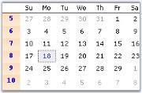
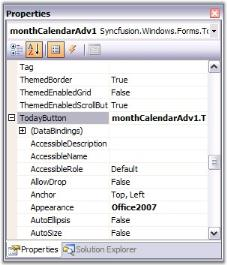

# Customizing Sections in Windows Forms MonthCalendarAdv

## Grid settings

In the MonthCalendarAdv control, the dates of a month is placed inside a grid and the dates are separated using [GridLines](https://help.syncfusion.com/cr/windowsforms/Syncfusion.Windows.Forms.Tools.MonthCalendarAdv.html#Syncfusion_Windows_Forms_Tools_MonthCalendarAdv_GridLines).

The below properties lets you to change the default appearance of the grid in the MonthCalendarAdv.

* [GridBackColor](https://help.syncfusion.com/cr/windowsforms/Syncfusion.Windows.Forms.Tools.MonthCalendarAdv.html#Syncfusion_Windows_Forms_Tools_MonthCalendarAdv_GridBackColor)
* [GridLines](https://help.syncfusion.com/cr/windowsforms/Syncfusion.Windows.Forms.Tools.MonthCalendarAdv.html#Syncfusion_Windows_Forms_Tools_MonthCalendarAdv_GridLines)





this.monthCalendarAdv1.GridBackColor = System.Drawing.Color.FloralWhite;

this.monthCalendarAdv1.GridLines = Syncfusion.Windows.Forms.Grid.GridBorderStyle.Dashed;





Me.monthCalendarAdv1.GridBackColor = System.Drawing.Color.FloralWhite

Me.monthCalendarAdv1.GridLines = Syncfusion.Windows.Forms.Grid.GridBorderStyle.Dashed





 

### Header settings

This section will walk you through the different properties used to customize the header portion of the MonthCalendarAdv control.

### Gradient background

Gradient background can be set for the header using the below properties.

* [HeadGradient](https://help.syncfusion.com/cr/windowsforms/Syncfusion.Windows.Forms.Tools.MonthCalendarAdv.html#Syncfusion_Windows_Forms_Tools_MonthCalendarAdv_HeadGradient)
* [HeaderStartColor](https://help.syncfusion.com/cr/windowsforms/Syncfusion.Windows.Forms.Tools.MonthCalendarAdv.html#Syncfusion_Windows_Forms_Tools_MonthCalendarAdv_HeaderStartColor)
* [HeaderEndColor](https://help.syncfusion.com/cr/windowsforms/Syncfusion.Windows.Forms.Tools.MonthCalendarAdv.html#Syncfusion_Windows_Forms_Tools_MonthCalendarAdv_HeaderEndColor)
* [HeaderVerticalGradient](https://help.syncfusion.com/cr/windowsforms/Syncfusion.Windows.Forms.Tools.MonthCalendarAdv.html#Syncfusion_Windows_Forms_Tools_MonthCalendarAdv_HeaderVerticalGradient)





this.monthCalendarAdv1.HeadGradient = true;

this.monthCalendarAdv1.HeaderVerticalGradient = true;

this.monthCalendarAdv1.HeaderEndColor = System.Drawing.Color.SteelBlue;                    

this.monthCalendarAdv1.HeaderStartColor = System.Drawing.Color.AliceBlue;





Me.monthCalendarAdv1.HeadGradient = True

Me.monthCalendarAdv1.HeaderVerticalGradient = True

Me.monthCalendarAdv1.HeaderEndColor = System.Drawing.Color.SteelBlue                   

Me.monthCalendarAdv1.HeaderStartColor = System.Drawing.Color.AliceBlue





 

### Foreground settings

The font style and fore color of the header text can be specified through [HeaderFont](https://help.syncfusion.com/cr/windowsforms/Syncfusion.Windows.Forms.Tools.MonthCalendarAdv.html#Syncfusion_Windows_Forms_Tools_MonthCalendarAdv_HeaderFont) and [HeadForeColor](https://help.syncfusion.com/cr/windowsforms/Syncfusion.Windows.Forms.Tools.MonthCalendarAdv.html#Syncfusion_Windows_Forms_Tools_MonthCalendarAdv_HeadForeColor) properties.





this.monthCalendarAdv1.HeaderFont = new System.Drawing.Font("Arial", 9F, System.Drawing.FontStyle.Bold);

this.monthCalendarAdv1.HeadForeColor = System.Drawing.Color.Navy;





Me.monthCalendarAdv1.HeaderFont = New System.Drawing.Font("Arial", 9F, System.Drawing.FontStyle.Bold)

Me.monthCalendarAdv1.HeadForeColor = System.Drawing.Color.Navy





 

### Height and image for header

The height of the header can be increased or decreased using [HeaderHeight](https://help.syncfusion.com/cr/windowsforms/Syncfusion.Windows.Forms.Tools.MonthCalendarAdv.html#Syncfusion_Windows_Forms_Tools_MonthCalendarAdv_HeaderHeight) property. Header can also host an image in its background using [HeaderImage](https://help.syncfusion.com/cr/windowsforms/Syncfusion.Windows.Forms.Tools.MonthCalendarAdv.html#Syncfusion_Windows_Forms_Tools_MonthCalendarAdv_HeaderImage) property.



this.monthCalendarAdv1.HeaderImage = ((System.Drawing.Image)(resources.GetObject("monthCalendarAdv1.HeaderImage")));

this.monthCalendarAdv1.HeaderHeight = 30;





Me.monthCalendarAdv1.HeaderImage = DirectCast((resources.GetObject("monthCalendarAdv1.HeaderImage")), System.Drawing.Image) 

Me.monthCalendarAdv1.HeaderHeight = 30



## Header settings

This section will walk you through the different properties used to customize the header portion of the MonthCalendarAdv control.

### Gradient background

Gradient background can be set for the header using the below properties.

* [HeadGradient](https://help.syncfusion.com/cr/windowsforms/Syncfusion.Windows.Forms.Tools.MonthCalendarAdv.html#Syncfusion_Windows_Forms_Tools_MonthCalendarAdv_HeadGradient)
* [HeaderStartColor](https://help.syncfusion.com/cr/windowsforms/Syncfusion.Windows.Forms.Tools.MonthCalendarAdv.html#Syncfusion_Windows_Forms_Tools_MonthCalendarAdv_HeaderStartColor)
* [HeaderEndColor](https://help.syncfusion.com/cr/windowsforms/Syncfusion.Windows.Forms.Tools.MonthCalendarAdv.html#Syncfusion_Windows_Forms_Tools_MonthCalendarAdv_HeaderEndColor)
* [HeaderVerticalGradient](https://help.syncfusion.com/cr/windowsforms/Syncfusion.Windows.Forms.Tools.MonthCalendarAdv.html#Syncfusion_Windows_Forms_Tools_MonthCalendarAdv_HeaderVerticalGradient)





this.monthCalendarAdv1.HeadGradient = true;

this.monthCalendarAdv1.HeaderVerticalGradient = true;

this.monthCalendarAdv1.HeaderEndColor = System.Drawing.Color.SteelBlue;                    

this.monthCalendarAdv1.HeaderStartColor = System.Drawing.Color.AliceBlue;





Me.monthCalendarAdv1.HeadGradient = True

Me.monthCalendarAdv1.HeaderVerticalGradient = True

Me.monthCalendarAdv1.HeaderEndColor = System.Drawing.Color.SteelBlue                   

Me.monthCalendarAdv1.HeaderStartColor = System.Drawing.Color.AliceBlue





 

### Foreground settings

The font style and fore color of the header text can be specified through [HeaderFont](https://help.syncfusion.com/cr/windowsforms/Syncfusion.Windows.Forms.Tools.MonthCalendarAdv.html#Syncfusion_Windows_Forms_Tools_MonthCalendarAdv_HeaderFont) and [HeadForeColor](https://help.syncfusion.com/cr/windowsforms/Syncfusion.Windows.Forms.Tools.MonthCalendarAdv.html#Syncfusion_Windows_Forms_Tools_MonthCalendarAdv_HeadForeColor) properties.





this.monthCalendarAdv1.HeaderFont = new System.Drawing.Font("Arial", 9F, System.Drawing.FontStyle.Bold);

this.monthCalendarAdv1.HeadForeColor = System.Drawing.Color.Navy;





Me.monthCalendarAdv1.HeaderFont = New System.Drawing.Font("Arial", 9F, System.Drawing.FontStyle.Bold)

Me.monthCalendarAdv1.HeadForeColor = System.Drawing.Color.Navy





 

### Height and image for header

The height of the header can be increased or decreased using [HeaderHeight](https://help.syncfusion.com/cr/windowsforms/Syncfusion.Windows.Forms.Tools.MonthCalendarAdv.html#Syncfusion_Windows_Forms_Tools_MonthCalendarAdv_HeaderHeight) property. Header can also host an image in its background using [HeaderImage](https://help.syncfusion.com/cr/windowsforms/Syncfusion.Windows.Forms.Tools.MonthCalendarAdv.html#Syncfusion_Windows_Forms_Tools_MonthCalendarAdv_HeaderImage) property.





this.monthCalendarAdv1.HeaderImage = ((System.Drawing.Image)(resources.GetObject("monthCalendarAdv1.HeaderImage")));

this.monthCalendarAdv1.HeaderHeight = 30;





Me.monthCalendarAdv1.HeaderImage = DirectCast((resources.GetObject("monthCalendarAdv1.HeaderImage")), System.Drawing.Image) 

Me.monthCalendarAdv1.HeaderHeight = 30





 

## Week numbers

MonthCalendarAdv control can display unique [week numbers](https://help.syncfusion.com/windowsforms/classic/month-calendar/customizing-sections-of-calendar#week-numbers) for all the weeks in a year. This section discusses the properties which can customize the appearance of the week numbers.

### Foreground settings

By default, week numbers will not be shown in the calendar. [ShowWeekNumbers](https://help.syncfusion.com/cr/windowsforms/Syncfusion.Windows.Forms.Tools.MonthCalendarAdv.html#Syncfusion_Windows_Forms_Tools_MonthCalendarAdv_ShowWeekNumbers) property should be set to `true` to display the week numbers. The font and fore color can be set using the below properties.

* [WeekFont](https://help.syncfusion.com/cr/windowsforms/Syncfusion.Windows.Forms.Tools.MonthCalendarAdv.html#Syncfusion_Windows_Forms_Tools_MonthCalendarAdv_WeekFont)
* [WeekTextColor](https://help.syncfusion.com/cr/windowsforms/Syncfusion.Windows.Forms.Tools.MonthCalendarAdv.html#Syncfusion_Windows_Forms_Tools_MonthCalendarAdv_WeekTextColor)





this.monthCalendarAdv1.ShowWeekNumbers = true;

this.monthCalendarAdv1.WeekFont = new System.Drawing.Font("Courier New", 9F, System.Drawing.FontStyle.Bold, System.Drawing.GraphicsUnit.Point, ((byte)(0)));

this.monthCalendarAdv1.WeekTextColor = System.Drawing.Color.Blue;





Me.monthCalendarAdv1.ShowWeekNumbers = True

Me.monthCalendarAdv1.WeekFont = New System.Drawing.Font("Courier New", 9F, System.Drawing.FontStyle.Bold, System.Drawing.GraphicsUnit.Point, CByte((0))) 

Me.monthCalendarAdv1.WeekTextColor = System.Drawing.Color.Blue 





 

### Gradient background

By default the week numbers column has a gradient background. To customize the background manually, use [WeekInterior](https://help.syncfusion.com/cr/windowsforms/Syncfusion.Windows.Forms.Tools.MonthCalendarAdv.html#Syncfusion_Windows_Forms_Tools_MonthCalendarAdv_WeekInterior) property.





this.monthCalendarAdv1.WeekInterior = new Syncfusion.Drawing.BrushInfo(Syncfusion.Drawing.GradientStyle.Vertical, System.Drawing.Color.AliceBlue, System.Drawing.Color.LightSteelBlue);





Me.monthCalendarAdv1.WeekInterior = New Syncfusion.Drawing.BrushInfo(Syncfusion.Drawing.GradientStyle.Vertical, System.Drawing.Color.AliceBlue, System.Drawing.Color.LightSteelBlue) 





 

## Day settings

MonthCalendarAdv has properties to customize the days displayed in the calendar. This section discusses those properties.

### Foreground settings

The below properties deals with the foreground appearance of the dates.

* [DayNamesColor](https://help.syncfusion.com/cr/windowsforms/Syncfusion.Windows.Forms.Tools.MonthCalendarAdv.html#Syncfusion_Windows_Forms_Tools_MonthCalendarAdv_DayNamesColor)
* [DayNamesFont](https://help.syncfusion.com/cr/windowsforms/Syncfusion.Windows.Forms.Tools.MonthCalendarAdv.html#Syncfusion_Windows_Forms_Tools_MonthCalendarAdv_DayNamesFont)
* [DaysFont](https://help.syncfusion.com/cr/windowsforms/Syncfusion.Windows.Forms.Tools.MonthCalendarAdv.html#Syncfusion_Windows_Forms_Tools_MonthCalendarAdv_DaysFont)
* [DaysColor](https://help.syncfusion.com/cr/windowsforms/Syncfusion.Windows.Forms.Tools.MonthCalendarAdv.html#Syncfusion_Windows_Forms_Tools_MonthCalendarAdv_DaysColor)





this.monthCalendarAdv1.DayNamesFont = new System.Drawing.Font("Courier New", 9F, System.Drawing.FontStyle.Bold);

this.monthCalendarAdv1.DaysNamesColor = Color.Black;

this.monthCalendarAdv1.DaysColor = System.Drawing.SystemColors.HotTrack;

this.monthCalendarAdv1.DaysFont = new System.Drawing.Font("Courier New", 8.25F, System.Drawing.FontStyle.Regular);





Me.monthCalendarAdv1.DayNamesFont = New System.Drawing.Font("Courier New", 9F, System.Drawing.FontStyle.Bold) 

Me.monthCalendarAdv1.DaysNamesColor = Color.Black

Me.monthCalendarAdv1.DaysColor = System.Drawing.SystemColors.HotTrack 

Me.monthCalendarAdv1.DaysFont = New System.Drawing.Font("Courier New", 8.25F, System.Drawing.FontStyle.Regular) 





 

### Height and day names format

The height of the day header and the day name formats are specified using below properties.

* [DayNamesHeight](https://help.syncfusion.com/cr/windowsforms/Syncfusion.Windows.Forms.Tools.MonthCalendarAdv.html#Syncfusion_Windows_Forms_Tools_MonthCalendarAdv_DayNamesHeight)
* [UseShortestDayNames](https://help.syncfusion.com/cr/windowsforms/Syncfusion.Windows.Forms.Tools.MonthCalendarAdv.html#Syncfusion_Windows_Forms_Tools_MonthCalendarAdv_UseShortestDayNames)





this.monthCalendarAdv1.DayNamesHeight = 22;

this.monthCalendarAdv1.UseShortestDayNames = false;





Me.monthCalendarAdv1.DayNamesHeight = 22

Me.monthCalendarAdv1.UseShortestDayNames = False





 

### Gradient background for day header

By default the day's header has a gradient background. We can change the default background style using [DaysHeaderInterior](https://help.syncfusion.com/cr/windowsforms/Syncfusion.Windows.Forms.Tools.MonthCalendarAdv.html#Syncfusion_Windows_Forms_Tools_MonthCalendarAdv_DaysHeaderInterior) property.





this.monthCalendarAdv1.DaysHeaderInterior = new Syncfusion.Drawing.BrushInfo(Syncfusion.Drawing.GradientStyle.Vertical, System.Drawing.Color.AntiqueWhite, System.Drawing.Color.SandyBrown);





Me.monthCalendarAdv1.DaysHeaderInterior = New Syncfusion.Drawing.BrushInfo(Syncfusion.Drawing.GradientStyle.Vertical, System.Drawing.Color.AntiqueWhite, System.Drawing.Color.SandyBrown)





 

## Today's date

The fore color for Today's date is set using [TodayFontColor](https://help.syncfusion.com/cr/windowsforms/Syncfusion.Windows.Forms.Tools.MonthCalendarAdv.html#Syncfusion_Windows_Forms_Tools_MonthCalendarAdv_TodayFontColor) property. Using Today button at the bottom of the control, today's date can be focused. See Buttons for details.





this.monthCalendarAdv1.TodayFontColor = System.Drawing.Color.Crimson;





Me.monthCalendarAdv1.TodayFontColor = System.Drawing.Color.Crimson





The today's date for the below calendar image is "eighteenth".

## Text settings

This section discusses the properties which controls the appearance and behavior of the dates (contents) inside the grid cells.

### Highlighting the dates

We can highlight the selected date using [HighlightColor](https://help.syncfusion.com/cr/windowsforms/Syncfusion.Windows.Forms.Tools.MonthCalendarAdv.html#Syncfusion_Windows_Forms_Tools_MonthCalendarAdv_HighlightColor) property.





this.monthCalendarAdv1.HighlightColor = System.Drawing.Color.Blue;





Me.monthCalendarAdv1.HighlightColor = System.Drawing.Color.Blue





## Buttons

The MonthCalendarAdv control contains the below buttons.

* LeftScrollButton,
* RightScrollButton,
* Today button and
* None button.

To know about the placement of these buttons in the control, refer [MonthCalendarAdv](https://help.syncfusion.com/windowsforms/classic/month-calendar/overview) topic. Left and Right scroll buttons at the top of the control can have custom images. See Scroll Buttons for details.

Today and None buttons are displayed at the bottom of the calendar and they can be customized to set background image and font styles. This section will discuss the properties which controls the appearance and behavior of the MonthCalendarAdv.

* [TodayButton](https://help.syncfusion.com/cr/windowsforms/Syncfusion.Windows.Forms.Tools.MonthCalendarAdv.html#Syncfusion_Windows_Forms_Tools_MonthCalendarAdv_TodayButton)
* [NoneButton](https://help.syncfusion.com/cr/windowsforms/Syncfusion.Windows.Forms.Tools.MonthCalendarAdv.html#Syncfusion_Windows_Forms_Tools_MonthCalendarAdv_NoneButton)
* [BottomHeight](https://help.syncfusion.com/cr/windowsforms/Syncfusion.Windows.Forms.Tools.MonthCalendarAdv.html#Syncfusion_Windows_Forms_Tools_MonthCalendarAdv_BottomHeight)

### Customizing today and none buttons

The 'Today' and 'None' buttons are like Essential Tools ButtonAdv controls and they support all the properties of ButtonAdv control. You can access those properties using MonthCalendarAdv.NoneButton.Visible which controls the visibility (for example).





//Hides the Today and None Buttons

monthCalendarAdv1.TodayButton.Visible=false;

monthCalendarAdv1.NoneButton.Visible=false;





'Hides the Today and None Buttons

monthCalendarAdv1.TodayButton.Visible=False

monthCalendarAdv1.NoneButton.Visible=False






[ButtonAdv](https://help.syncfusion.com/windowsforms/classic/button/overview)


## Scroll buttons

### Scroll button images

The default scroll button images can be replaced with custom images using the [LeftScrollButtonImage](https://help.syncfusion.com/cr/windowsforms/Syncfusion.Windows.Forms.Tools.MonthCalendarAdv.html#Syncfusion_Windows_Forms_Tools_MonthCalendarAdv_LeftScrollButtonImage) and [RightScrollButtonImage](https://help.syncfusion.com/cr/windowsforms/Syncfusion.Windows.Forms.Tools.MonthCalendarAdv.html#Syncfusion_Windows_Forms_Tools_MonthCalendarAdv_RightScrollButtonImage) properties. The properties related to scroll buttons are as follows.

* [LeftScrollButtonImage](https://help.syncfusion.com/cr/windowsforms/Syncfusion.Windows.Forms.Tools.MonthCalendarAdv.html#Syncfusion_Windows_Forms_Tools_MonthCalendarAdv_LeftScrollButtonImage)
* [RightScrollButtonImage](https://help.syncfusion.com/cr/windowsforms/Syncfusion.Windows.Forms.Tools.MonthCalendarAdv.html#Syncfusion_Windows_Forms_Tools_MonthCalendarAdv_RightScrollButtonImage)
* [StretchScrollImage](https://help.syncfusion.com/cr/windowsforms/Syncfusion.Windows.Forms.Tools.MonthCalendarAdv.html#Syncfusion_Windows_Forms_Tools_MonthCalendarAdv_StretchScrollImage)
* [ScrollButtonSize](https://help.syncfusion.com/cr/windowsforms/Syncfusion.Windows.Forms.Tools.MonthCalendarAdv.html#Syncfusion_Windows_Forms_Tools_MonthCalendarAdv_ScrollButtonSize)





this.monthCalendarAdv1.LeftScrollButtonImage = ((System.Drawing.Image)(resources.GetObject("monthCalendarAdv1.LeftScrollButtonImage")));

this.monthCalendarAdv1.RightScrollButtonImage = ((System.Drawing.Image)(resources.GetObject("monthCalendarAdv1.RightScrollButtonImage")));

this.monthCalendarAdv1.ScrollButtonSize = new System.Drawing.Size(30, 25);

this.monthCalendarAdv1.StretchScrollImage = false;





Me.monthCalendarAdv1.LeftScrollButtonImage = DirectCast((resources.GetObject("monthCalendarAdv1.LeftScrollButtonImage")), System.Drawing.Image) 

Me.monthCalendarAdv1.RightScrollButtonImage = DirectCast((resources.GetObject("monthCalendarAdv1.RightScrollButtonImage")), System.Drawing.Image) 

Me.monthCalendarAdv1.ScrollButtonSize = New System.Drawing.Size(30, 25) 

Me.monthCalendarAdv1.StretchScrollImage = False 





