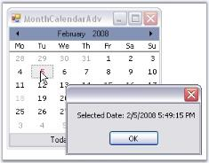

# Identify current selected date at run time in Windows Forms

This page explains How to identify the current selected date at run time and more details.

## How to identify the current selected date at run time?

The MonthCalendarAdv gives an array of selected dates. If you want to get only one date, choose the first element from that array. Also, set [AllowMultipleSelection](https://help.syncfusion.com/cr/windowsforms/Syncfusion.Windows.Forms.Tools.MonthCalendarAdv.html#Syncfusion_Windows_Forms_Tools_MonthCalendarAdv_AllowMultipleSelection) property to `false`. The [DateSelected](https://help.syncfusion.com/cr/windowsforms/Syncfusion.Windows.Forms.Tools.MonthCalendarAdv.html) Event is fired after the user had completed the selection.





private void monthCalendarAdv1_DateSelected(object sender,EventArgs e)

{

   // DateSelected event is fired and selected dates will be displayed.

  MessageBox.Show("Selected Date: " + monthCalendarAdv1.SelectedDates[0].ToString());

}





Private Sub monthCalendarAdv1_DateSelected(ByVal sender As Object, ByVal e As EventArgs)

   ' DateSelected event is fired and selected dates will be displayed.

MessageBox.Show("Selected Date: " + monthCalendarAdv1.SelectedDates[0].ToString()) 

End Sub





