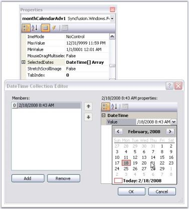
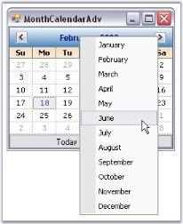

# RunTime Features in Windows Forms MonthCalendarAdv(Classic)

## Selecting a date

### Range of selection

The minimum and maximum date selectable by the calendar can be specified using [MinValue](https://help.syncfusion.com/cr/windowsforms/Syncfusion.Windows.Forms.Tools.MonthCalendarAdv.html#Syncfusion_Windows_Forms_Tools_MonthCalendarAdv_MinValue) and [MaxValue](https://help.syncfusion.com/cr/windowsforms/Syncfusion.Windows.Forms.Tools.MonthCalendarAdv.html#Syncfusion_Windows_Forms_Tools_MonthCalendarAdv_MaxValue) properties. (This is similar to MinDate and MaxDate of windows MonthCalendar control).





this.monthCalendarAdv1.Value = new System.DateTime(2008, 2, 19);

this.monthCalendarAdv1.MinValue = new System.DateTime(2000, 2, 21, 0, 0, 0, 0);

this.monthCalendarAdv1.MaxValue = new System.DateTime(2008, 2, 21, 0, 0, 0, 0);





Me.monthCalendarAdv1.Value = New Date(2008, 2, 19) 

Me.monthCalendarAdv1.MinValue = New System.DateTime(2000, 2, 21, 0, 0, 0, 0)

Me.monthCalendarAdv1.MaxValue = New System.DateTime(2008, 2, 21, 0, 0, 0, 0)





When we drag and drop a MonthCalendarAdv control, current system date, i.e, today's date will be selected by default. To change the selected date, DateTime Collection Editor is used, which is invoked using SelectedDates property.

N> It is possible to set color for the highlighted date. See_ Text Settings _topic for details.

### Multiple selection at run time

It is possible to enable multiple selection of the dates at run time. The below properties enables multiple selection.

* [AllowMultipleSelection](https://help.syncfusion.com/cr/windowsforms/Syncfusion.Windows.Forms.Tools.MonthCalendarAdv.html#Syncfusion_Windows_Forms_Tools_MonthCalendarAdv_AllowMultipleSelection)
* [MouseDragMultiSelect](https://help.syncfusion.com/cr/windowsforms/Syncfusion.Windows.Forms.Tools.MonthCalendarAdv.html#Syncfusion_Windows_Forms_Tools_MonthCalendarAdv_MouseDragMultiselect)





this.monthCalendarAdv1.AllowMultipleSelection = true;

this.monthCalendarAdv1.MouseDragMultiselect = true;





this.monthCalendarAdv1.AllowMultipleSelection = True

Me.monthCalendarAdv1.MouseDragMultiselect = True





 

**Select date range programmatically**

Using the [SelectedDates](https://help.syncfusion.com/cr/windowsforms/Syncfusion.Windows.Forms.Tools.MonthCalendarAdv.html#Syncfusion_Windows_Forms_Tools_MonthCalendarAdv_SelectedDates) property, range of dates can be selected in the MonthCalendarAdv control. The dates should be given in array format using the DateTime Array list.





DateTime[] dateTimes = new DateTime[] { new DateTime(2010, 11, 2), new DateTime(2010, 11, 3) };

DateTime[] dateTotal = new DateTime[] { };





Dim dateTimes As DateTime() = New DateTime() {New DateTime(2010, 11, 2), New DateTime(2010, 11, 3)}

Me.monthCalendarAdv1.SelectedDates = dateTimes





Dates should be specified in the DataTime Array List. Then the DateTime Array list should be declared to the SelectedDates Property. This would select the dates that are in the DateTime Array list.

N> Date range should be specified manually in the DateTime Array list.

## Month settings

### Navigation at RunTime

At run time, you have options to move to the next month or previous month using the left or right scroll buttons and also using the context menu displayed, when you click on the month of the calendar. To specify images for individual months in the menu, use MonthImageList property.





this.monthCalendarAdv1.MonthImageList = this.imageList1;





Me.monthCalendarAdv1.MonthImageList = Me.imageList1





### Foreground color for inactive months

The [InactiveMonthColor](https://help.syncfusion.com/cr/windowsforms/Syncfusion.Windows.Forms.Tools.MonthCalendarAdv.html#Syncfusion_Windows_Forms_Tools_MonthCalendarAdv_InactiveMonthColor) property used to sets the color for the inactive months.





this.monthCalendarAdv1.InactiveMonthColor = System.Drawing.Color.InactiveCaptionText;




Me.monthCalendarAdv1.InactiveMonthColor = System.Drawing.Color.InactiveCaptionText





 

### First day of the week

MonthCalendarAdv lets you specify the first day to be displayed in a week using [FirstDayOfWeek](https://help.syncfusion.com/cr/windowsforms/Syncfusion.Windows.Forms.Tools.MonthCalendarAdv.html#Syncfusion_Windows_Forms_Tools_MonthCalendarAdv_FirstDayOfWeek) property. Default will be Sunday.





this.monthCalendarAdv1.FirstDayOfWeek = Day.Monday;





Me.monthCalendarAdv1.FirstDayOfWeek = Day.Monday





 

## Interactive features

This section covers the below topics:

### Context menu

This section deals with replacing MonthCalendarAdv 'Go to Today' ContextMenu with a Custom Context Menu. At run-time, you can right click any calendar date and go to the today date using 'Go to Today' ContextMenu.

This is the default context menu. To replace this with a custom context menu, you need to derive a Custom MonthCalendarAdv from the existing one and override the InitializeGrid so that the GetInternalGridControl method can be used to access the ContextMenu and replace it with a custom contextMenu.





//Declaring and Initializing the calendar, Context menu and menu item

private CustomMonthCalendarAdv monthCalendarAdv1;

private System.Windows.Forms.MenuItem menuItem1;

private System.Windows.Forms.ContextMenu contextMenuStrip1;

this.contextMenuStrip1 = new System.Windows.Forms.ContextMenu();

this.menuItem1 = new System.Windows.Forms.MenuItem();

this.monthCalendarAdv1 = new MonthCalendar.Form1.CustomMonthCalendarAdv();

this.contextMenuStrip1.MenuItems.AddRange(new System.Windows.Forms.MenuItem[] {this.menuItem1});

this.menuItem1.Text = "Go To Tomorrow";

this.menuItem1.Click += new System.EventHandler(this.menuItem1_Click);

//Override the internal grid context menu using the custom context menu

private void Form1_Load_1(object sender, EventArgs e)

{

    this.monthCalendarAdv1.GetInternalGridControl().ContextMenu = this.contextMenuStrip1;

}

//Focus moves to tomorrow's date, when menu item is clicked

private void menuItem1_Click(object sender, System.EventArgs e)

{

    this.monthCalendarAdv1.Value = DateTime.Today.AddDays(1);

}

//Defining CustomMonthCalendarAdv class

public class CustomMonthCalendarAdv : Syncfusion.Windows.Forms.Tools.MonthCalendarAdv

{

    private Syncfusion.Windows.Forms.Tools.CalendarGrid internalGrid;

    // Overrides the InitializeGrid.

    protected override void InitializeGrid(ref Syncfusion.Windows.Forms.Tools.CalendarGrid grid)

    {

        base.InitializeGrid(ref grid);

        internalGrid = grid;

    }

    // Returns the internal grid.

    public Syncfusion.Windows.Forms.Tools.CalendarGrid GetInternalGridControl()

    {

        return internalGrid;

    }

}





'Declaring and Initializing the calendar, Context menu and menu item 

Private monthCalendarAdv1 As CustomMonthCalendarAdv

Private menuItem1 As System.Windows.Forms.MenuItem

Private contextMenuStrip1 As System.Windows.Forms.ContextMenu

Me.contextMenuStrip1 = New System.Windows.Forms.ContextMenu() 

Me.menuItem1 = New System.Windows.Forms.MenuItem() 

Me.monthCalendarAdv1 = New MonthCalendar.Form1.CustomMonthCalendarAdv() 

Me.contextMenuStrip1.MenuItems.AddRange(New System.Windows.Forms.MenuItem() {Me.menuItem1}) 

Me.menuItem1.Text = "Go To Tomorrow" 

AddHandler Me.menuItem1.Click, AddressOf Me.menuItem1_Click 

'Override the internal grid context menu using the custom context menu 

Private Sub Form1_Load_1(ByVal sender As Object, ByVal e As EventArgs)

    Me.monthCalendarAdv1.GetInternalGridControl().ContextMenu = Me.contextMenuStrip1

End Sub

'Focus moves to tomorrow's date, when menu item is clicked. 

Private Sub menuItem1_Click(ByVal sender As Object, ByVal e As System.EventArgs)

    Me.monthCalendarAdv1.Value = DateTime.Today.AddDays(1)

End Sub

'Defining CustomMonthCalendarAdv class 

Public Class CustomMonthCalendarAdv

    Inherits Syncfusion.Windows.Forms.Tools.MonthCalendarAdv

    Private internalGrid As Syncfusion.Windows.Forms.Tools.CalendarGrid

    ' Overrides the InitializeGrid. 

    Protected Overloads Overrides Sub InitializeGrid(ByRef grid As Syncfusion.Windows.Forms.Tools.CalendarGrid)

        MyBase.InitializeGrid(grid)

        internalGrid = grid

    End Sub

    ' Returns the internal grid. 

    Public Function GetInternalGridControl() As Syncfusion.Windows.Forms.Tools.CalendarGrid

        Return internalGrid

    End Function

End Class





 

## ToolTips

Tooltips can be set using [DateCellQueryInfo event](https://help.syncfusion.com/windowsforms/classic/month-calendar/event-handling#datecellqueryinfo-event).
