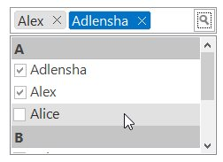

# Appearance in Windows Forms MultiSelectionComboBox

VisualStyles provides rich and professional look and feel UI for the MultiSelectionComboBox. Some of the available VisualStyles are as follows:

* Default
* Office2016Colorful
* Office2016White
* Office2016Black
* Office2016DarkGray

The visual style can be applied for the MultiSelectionComboBox using `Style` property.





//Set the visual Style of the MultiSelectionComboBox control.
this.multiSelectionComboBox1.Style = Syncfusion.Windows.Forms.Tools.MultiSelectionComboBoxStyle.Office2016Colorful;





'Set the visual Style of the MultiSelectionComboBox control.
Me.multiSelectionComboBox1.Style = Syncfusion.Windows.Forms.Tools.MultiSelectionComboBoxStyle.Office2016Colorful
 




 
