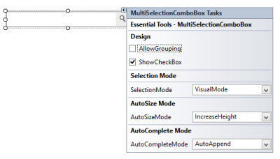

# Getting Started with Windows Forms MultiSelectionComboBox

This section briefly describes you on how to design a MultiSelectionComboBox control in a Windows Forms Application.

* Adding a MultiSelectionComboBox Control
* Configuring the MultiSelectionComboBox Control

## Adding a MultiSelectionComboBox control

* Create a new Windows Forms Application Project in VS IDE through New Project Wizard.
* Drop a MultiSelectionComboBox control on the Form. The MultiSelectionComboBox is loaded in the form as illustrated in the following screenshot.

   

## Configuring the MultiSelectionComboBox control

The commonly used settings of the MultiSelectionComboBox control can be configured either through Designer using the Smart tag or through the Properties window or through code. 

To add MultiSelectionComboBox control to a Windows Forms application through code behind,

* Include the namespaces “Syncfusion.Windows.Forms” and “Syncfusion.Windows.Forms.Tools”.




//namespaces
using Syncfusion.Windows.Forms.Tools;
using Syncfusion.Windows.Forms;




 
'namespaces
Imports Syncfusion.Windows.Forms
Imports Syncfusion.Windows.Forms.Tools




* Create an instance of the MultiSelectionComboBox control and add it to the Form.




MultiSelectionComboBox MultiSelectionComboBox1 = new MultiSelectionComboBox();
this.MultiSelectionComboBox1.ButtonStyle = ButtonAppearance.Metro;
this.MultiSelectionComboBox1.Size = new System.Drawing.Size(217, 30);
this.MultiSelectionComboBox1.UseVisualStyle = true;
this.Controls.Add(this.MultiSelectionComboBox1);





Dim MultiSelectionComboBox1 As MultiSelectionComboBox = New MultiSelectionComboBox()
Me.MultiSelectionComboBox1.ButtonStyle = ButtonAppearance.Metro
Me.MultiSelectionComboBox1.Size = New System.Drawing.Size(217, 30)        Me.MultiSelectionComboBox1.UseVisualStyle = True
Me.Controls.Add(Me.MultiSelectionComboBox1)



