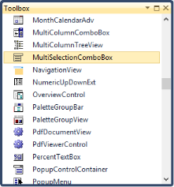
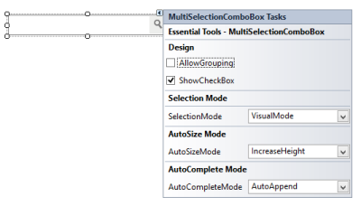

# Getting Started with Windows Forms MultiSelectionComboBox

This section explains how to use the MultiSelectionComboBox control to build a combo box that allows users to select one or more items from a checkable drop-down list.

## Assembly deployment

Refer to the [Control Dependencies](https://help.syncfusion.com/windowsforms/control-dependencies#multiselectioncombobox) section for the list of assemblies or the NuGet package details that must be referenced to use the control in any application.

Refer to [NuGet Packages](https://help.syncfusion.com/windowsforms/installation/install-nuget-packages) to learn how to install NuGet packages in a Windows Forms application.

To install via the NuGet Package Manager Console, run:

```
Install-Package Syncfusion.Tools.Windows
```

## Adding MultiSelectionComboBox via designer

1. Create a new Windows Forms project in Visual Studio.

2. Add the [MultiSelectionComboBox](https://help.syncfusion.com/cr/windowsforms/Syncfusion.Windows.Forms.Tools.MultiSelectionComboBox.html) to the application by dragging it from the toolbox to the designer surface. The following dependent assemblies are added automatically:

	* Syncfusion.Tools.Windows

   

## Configuring the MultiSelectionComboBox control

The commonly used settings of the MultiSelectionComboBox control can be configured through the Designer's Smart tag, the Properties window, or through code.



The Smart tag exposes the following design-time settings.

| Setting | Description |
| --- | --- |
| `AllowGrouping` | When checked, enables the grouping of items in the drop-down list. |
| `ShowCheckBox` | When checked, displays a check box next to each item so multiple items can be selected. |
| `SelectionMode` | Specifies the item-selection mode. `VisualMode` is the default. |
| `AutoSizeMode` | Controls how the control resizes itself when the selected text changes. The default is `IncreaseHeight`. |
| `AutoCompleteMode` | Specifies how auto-completion behaves as the user types. The default is `AutoAppend`. |

## Adding MultiSelectionComboBox via code

To add the control manually, follow these steps:

1. Create a C# or VB.NET application in Visual Studio.

2. Add the following assembly references to the project:

	* Syncfusion.Tools.Windows

3. Include the required namespace.




using System.Windows.Forms;
using Syncfusion.Windows.Forms;
using Syncfusion.Windows.Forms.Tools;




Imports System.Windows.Forms
Imports Syncfusion.Windows.Forms
Imports Syncfusion.Windows.Forms.Tools




4. Create an instance of the `MultiSelectionComboBox`, configure its properties, and add it to the form.





namespace WindowsFormsApplication1
{
    public partial class Form1 : Form
    {
        private MultiSelectionComboBox multiSelectionComboBox1;
        public Form1()
        {
            InitializeComponent();
            multiSelectionComboBox1 = new MultiSelectionComboBox();
            multiSelectionComboBox1.ButtonStyle = ButtonAppearance.Metro;
            multiSelectionComboBox1.Size = new System.Drawing.Size(217, 30);
            multiSelectionComboBox1.UseVisualStyle = true;
            this.Controls.Add(multiSelectionComboBox1);
        }
    }
}





Public Class Form1
    Inherits Form

    Private multiSelectionComboBox1 As MultiSelectionComboBox
    Public Sub New()
        InitializeComponent()
        multiSelectionComboBox1 = New MultiSelectionComboBox()
        multiSelectionComboBox1.ButtonStyle = ButtonAppearance.Metro
        multiSelectionComboBox1.Size = New System.Drawing.Size(217, 30)
        multiSelectionComboBox1.UseVisualStyle = True
        Me.Controls.Add(multiSelectionComboBox1)
    End Sub
End Class




{{ codesnippet1 | OrderList_Indent_Level_1 }}

For more data-binding options, refer to [Data Binding](https://help.syncfusion.com/windowsforms/classic/MultiSelectionComboBox/data-binding).
