# SuperToolTip in Windows Forms SuperToolTip (Classic)

In Office 2007, Microsoft introduced a SuperToolTip control to display enhanced tooltips. Syncfusion Essential Tools provides a similar control, SuperToolTip, that enables you to provide rich tooltip information in your applications.

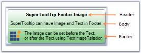

* **Header** - Used to display the title text of the tooltip.
* **Body** - The description part of the tooltip.
* **Footer** - Use the footer for additional information.

## Version Compatibility

The SuperToolTip (Classic) control is available in Syncfusion Essential Studio Windows Forms and is supported on .NET Framework 4.0+ and .NET Core 3.1 / .NET 5+. The associated NuGet package is `Syncfusion.Tools.Windows`.

## Assembly Deployment

The following assemblies (or the equivalent `Syncfusion.Core.WinForms` NuGet package) should be added as a reference to use the SuperToolTip component in any application:

* `Syncfusion.Core.WinForms`
* `Syncfusion.Shared.Base`

Refer to the [control dependencies](https://help.syncfusion.com/windowsforms/control-dependencies#supertooltip) section for the full list of dependencies.

### Creating SuperToolTip through designer

1. Drag and drop the SuperToolTip from the toolbox onto your form. The component is added to the component tray.
2. Select the target control on the form (for example, a `ToolStripButton`, `ToolStripTabItem`, or any `Control`). The Properties window now shows an extended `SuperTooltip on superToolTip1` property.
3. Click the **…** ellipse button next to the `SuperTooltip on superToolTip1` property to open the ToolTip Editor Dialog Box. This editor lets you customize the ToolTip items (header, body, footer, image, and styles).

   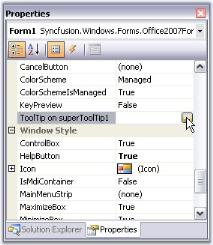

   N> You can also get or set a tooltip programmatically. See [Through code](#through-code).

4. After configuring the tooltip, click **OK** to apply the changes.

   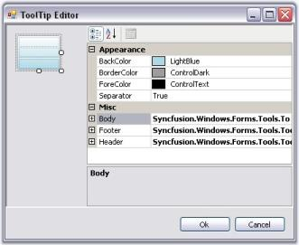

### Through code

The following code shows how to create a `SuperToolTip` and associate it with a `ToolStripTabItem`. The sample assumes a `ToolStripTabItem` named `toolStripTabItem1` already exists on the form.




using Syncfusion.Windows.Forms.Tools;
private SuperToolTip superToolTip1;
this.superToolTip1 = new Syncfusion.Windows.Forms.Tools.SuperToolTip(this);

//Adding ToolTip Header Item
Syncfusion.Windows.Forms.Tools.ToolTipInfo toolTipInfo1 = new Syncfusion.Windows.Forms.Tools.ToolTipInfo();
toolTipInfo1.Header.Text = "Cut";
toolTipInfo1.Header.TextAlign = System.Drawing.ContentAlignment.TopCenter;

//Associating SuperToolTip for ToolStripTabItem
this.superToolTip1.SetToolTip(this.toolStripTabItem1, toolTipInfo1);





Imports Syncfusion.Windows.Forms.Tools
Private superToolTip1 As SuperToolTip
Me.superToolTip1 = New Syncfusion.Windows.Forms.Tools.SuperToolTip(Me)

'Adding ToolTip Header Item
Dim toolTipInfo1 As New Syncfusion.Windows.Forms.Tools.ToolTipInfo()
toolTipInfo1.Header.Text = "Cut"
toolTipInfo1.Header.TextAlign = System.Drawing.ContentAlignment.TopCenter

'Associating SuperToolTip for ToolStripTabItem
Me.superToolTip1.SetToolTip(Me.toolStripTabItem1, toolTipInfo1)




## Appearance settings

The appearance of the SuperToolTip can be customized using the following properties. These properties can also be edited during design time using the ToolTip Editor.

<table>
<tr>
<th>
Property</th><th>
Description</th></tr>
<tr>
<td>
BackColor</td><td>
Sets the background gradient color.</td></tr>
<tr>
<td>
BorderColor</td><td>
Sets the border color for the control.</td></tr>
<tr>
<td>
ForeColor</td><td>
Sets the fore color for the control.</td></tr>
<tr>
<td>
Separator</td><td>
Shows or hides a separator between the Body and the Footer tooltip items.</td></tr>
</table>

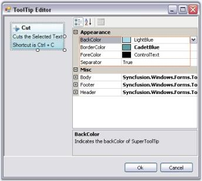




// Assumes toolTipInfo1 and toolTipInfo2 are already created and associated with controls.
toolTipInfo1.BackColor = System.Drawing.SystemColors.LightBlue;
toolTipInfo1.BorderColor = System.Drawing.Color.CadetBlue;
toolTipInfo1.ForeColor = System.Drawing.SystemColors.ControlText;
toolTipInfo1.Separator = true;





' Assumes toolTipInfo1 is already created and associated with a control.
toolTipInfo1.BackColor = System.Drawing.SystemColors.LightBlue
toolTipInfo1.BorderColor = System.Drawing.Color.CadetBlue
toolTipInfo1.ForeColor = System.Drawing.SystemColors.ControlText
toolTipInfo1.Separator = True




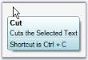

### Visual Style

The SuperToolTip control supports the following visual styles: `Default`, `Metro`, `Office2016Colorful`, `Office2016White`, `Office2016Black`, and `Office2016DarkGray`. The following code shows how to set the `Office2016Colorful` style.




// Sample code for setting the Office2016Colorful style for SuperToolTip.
this.superToolTip1.VisualStyle = Syncfusion.Windows.Forms.Tools.SuperToolTip.Appearance.Office2016Colorful;





' Sample code for setting the Office2016Colorful style for SuperToolTip.
Me.superToolTip1.VisualStyle = Syncfusion.Windows.Forms.Tools.SuperToolTip.Appearance.Office2016Colorful




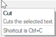

### Behavior settings

The following properties control the behavior of the SuperToolTip control.

<table>
<tr>
<th>
Property</th><th>
Description</th></tr>
<tr>
<td>
InitialDelay</td><td>
Indicates the time (in milliseconds) before the tooltip is displayed. The default is `500` ms.</td></tr>
<tr>
<td>
MaxWidth</td><td>
Sets the maximum width (in pixels) for the tooltip to be displayed. When the text of the tooltip exceeds the max width, the text wraps to the next line. The default is `0` (no maximum).</td></tr>
<tr>
<td>
ToolTipDuration</td><td>
Indicates the duration of the ToolTip (in seconds) when the mouse hovers over a control. The default is `5` seconds.</td></tr>
<tr>
<td>
UseFading</td><td>
Specifies the fading effect for the SuperToolTip. The options are `System` and `Blend`. The default is `System`.</td></tr>
<tr>
<td>
RightToLeft</td><td>
When set to `true`, displays the tooltip in right-to-left fashion. Default value is `false`.</td></tr>
<tr>
<td>
ShowToolTip</td><td>
Gets or sets the value indicating whether to show or hide the SuperToolTip. Default value is `true`.</td></tr>
</table>




// Assumes a SuperToolTip named superToolTip1 and a TreeViewAdv named treeViewAdv1 already exist on the form.
this.superToolTip1.InitialDelay = 750;
this.superToolTip1.MaxWidth = 500;
this.superToolTip1.ToolTipDuration = 3;
this.superToolTip1.UseFading = Syncfusion.Windows.Forms.Tools.SuperToolTip.FadingType.System;
this.superToolTip1.RightToLeft = RightToLeft.Yes;
this.treeViewAdv1.ShowToolTip = true;





// Assumes a SuperToolTip named superToolTip1 already exists on the form.
Me.superToolTip1.InitialDelay = 750
Me.superToolTip1.MaxWidth = 500
Me.superToolTip1.ToolTipDuration = 3
Me.superToolTip1.UseFading = Syncfusion.Windows.Forms.Tools.SuperToolTip.FadingType.System
Me.superToolTip1.RightToLeft = RightToLeft.Yes
Me.superToolTip1.ShowToolTip = True




### Balloon style appearance in SuperToolTip

A `Style` property is added to set the Balloon style for the SuperToolTip. The `SuperToolTipStyle` enumeration contains the `Balloon` and `Normal` values.

Set the `Style` property to `Balloon` to change the SuperToolTip appearance to a balloon.

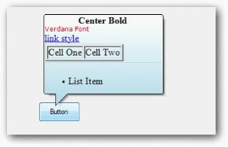

The following code illustrates how to set the `SuperToolTipStyle`.




this.superToolTip1.Style = Syncfusion.Windows.Forms.Tools.SuperToolTip.SuperToolTipStyle.Balloon;





Me.superToolTip1.Style = Syncfusion.Windows.Forms.Tools.SuperToolTip.SuperToolTipStyle.Balloon




## ToolTip items customization

This section discusses the customization properties for the ToolTipItems.

N> All these properties are applicable to all three ToolTipItems (Header, Body, and Footer).

### Image settings

<table>
<tr>
<th>
Property</th><th>
Description</th></tr>
<tr>
<td>
Image</td><td>
Sets the image to be shown on the tooltip.</td></tr>
<tr>
<td>
ImageAlign</td><td>
Indicates the alignment of the image.</td></tr>
<tr>
<td>
ImageScalingSize</td><td>
Sets the size of the image in pixels.</td></tr>
<tr>
<td>
ImageTransparentColor</td><td>
Sets the transparent color for the image. Use this when the source image has a background color that should not be visible in the tooltip.</td></tr>
</table>

Images can be associated with the header, body, and footer of the SuperToolTip using these properties. The example below uses a `ComponentResourceManager` named `resources` and assumes a `toolTipInfo1` is already created and associated with a control.




toolTipInfo1.Footer.Image = ((System.Drawing.Image)(resources.GetObject("resource.Image")));
toolTipInfo1.Footer.ImageAlign = System.Drawing.ContentAlignment.MiddleCenter;
toolTipInfo1.Footer.ImageScalingSize = new System.Drawing.Size(16, 16);





toolTipInfo1.Footer.Image = DirectCast((resources.GetObject("resource.Image")), System.Drawing.Image) 
toolTipInfo1.Footer.ImageAlign = System.Drawing.ContentAlignment.MiddleCenter 
toolTipInfo1.Footer.ImageScalingSize = New System.Drawing.Size(16, 16)




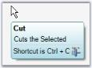

### Text appearance (Font and color)

<table>
<tr>
<th>
Property</th><th>
Description</th></tr>
<tr>
<td>
Font</td><td>
Sets the font for the item's text.</td></tr>
<tr>
<td>
ForeColor</td><td>
Sets the foreground color for the item's text.</td></tr>
</table>




toolTipInfo1.Header.Font = new System.Drawing.Font("Microsoft Sans Serif", 8.25F, System.Drawing.FontStyle.Bold);
toolTipInfo1.Header.ForeColor = System.Drawing.Color.Black;





toolTipInfo1.Header.Font = New System.Drawing.Font("Microsoft Sans Serif", 8.25F, System.Drawing.FontStyle.Bold)
toolTipInfo1.Header.ForeColor = System.Drawing.Color.Black




### Appearance and text settings

<table>
<tr>
<th>
Property</th><th>
Description</th></tr>
<tr>
<td>
Hidden</td><td>
Shows or hides a tooltip item. Default is `false`.</td></tr>
<tr>
<td>
Text</td><td>
Sets the text to be displayed in the ToolTip item. It supports multiline text.</td></tr>
<tr>
<td>
TextAlign</td><td>
Indicates the alignment of the tooltip text.</td></tr>
<tr>
<td>
TextImageRelation</td><td>
Sets the location of the text in relation to the image. The options are `ImageBeforeText` and `TextBeforeImage`.</td></tr>
<tr>
<td>
TextMargin</td><td>
Sets the text margin (in pixels) for the tooltip item.</td></tr>
</table>




toolTipInfo1.Header.Hidden = true;
toolTipInfo1.Header.Text = "Cut";
toolTipInfo1.Header.TextAlign = System.Drawing.ContentAlignment.MiddleLeft;
toolTipInfo1.Header.TextImageRelation = Syncfusion.Windows.Forms.Tools.ToolTipTextImageRelation.ImageBeforeText;
toolTipInfo1.Header.TextMargin = new System.Windows.Forms.Padding(1, 1, 1, 1);





toolTipInfo1.Header.Hidden = True
toolTipInfo1.Header.Text = "Cut"
toolTipInfo1.Header.TextAlign = System.Drawing.ContentAlignment.MiddleLeft
toolTipInfo1.Header.TextImageRelation = Syncfusion.Windows.Forms.Tools.ToolTipTextImageRelation.ImageBeforeText
toolTipInfo1.Header.TextMargin = New System.Windows.Forms.Padding(1, 1, 1, 1)




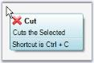

N> A SuperToolTip can be hidden at runtime by calling the `SuperToolTip.Hide()` method.

### Adding RenderHtml and Size properties to the SuperToolTip

Text given in the `Text` property will be considered as an HTML string and displayed as HTML when the `RenderHtml` property is set to `true`.

The `Size` property sets the size of the header, body, and footer item. The `Size` property is enabled only when `RenderHtml` is set to `true`.

Common CSS properties and the standard text-formatting HTML tags are supported.

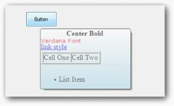

The following code illustrates setting the `RenderHtml`, `Text`, and `Size` properties.




toolTipInfo2.Footer.Size = new System.Drawing.Size(200, 50);
toolTipInfo2.Footer.RenderHtml = true;
toolTipInfo2.Footer.Text = "<ul><li>List Item</li></ul>";





Me. toolTipInfo2.Footer.Size= New System.Drawing.Size(200,50)
Me.toolTipInfo2.Footer.RenderHtml = true
Me.toolTipInfo2.Footer.Text = "<ul><li>List Item</li></ul>"




## SuperToolTip in Windows Forms SuperToolTip(Classic) events

Below are the events for the SuperToolTip control.

### Popup ToolTip

The [PopupToolTip](https://help.syncfusion.com/cr/windowsforms/Syncfusion.Windows.Forms.Tools.SuperToolTip.html) event of the SuperToolTip control can be handled to position the tooltip at a desired location. The `component` parameter identifies the control, and the `rectangle` parameter receives the (x, y) coordinates for that control.

<table>
<tr>
<th>
Member</th><th>
Description</th></tr>
<tr>
<td>
Rectangle</td><td>
Stores a set of four integers that represents the location and size of a rectangle.</td></tr>
</table>




private void superToolTip1_PopupToolTip(Component component, ref Rectangle rc) 
{
    if (component == this.buttonAdv1 ) 
   { 
       rc.X = 10; 
       rc.Y = 20; 
   } 
   if (component == this.gradientLabel1) 
   { 
       rc.X = 100; 
       rc.Y = 200; 
   } 
} 





Private Sub superToolTip1_PopupToolTip(ByVal component As Component, ByRef rc As Rectangle)  
If component = Me.buttonAdv1 Then  
rc.X = 10  
rc.Y = 20  
End If  
If component = Me.gradientLabel1 Then  
rc.X = 100  
rc.Y = 200  
End If  
End Sub 




N> You can also use the `Show` method to display a SuperToolTip at a specified location. See [Show and Hide](#show-and-hide).

### UpdateToolTip

The `UpdateToolTip` event of the SuperToolTip control can be handled to update the tooltip text. The `ToolTipInfo` must be associated with a control using `SetToolTip` before this event will fire.




private void superToolTip1_UpdateToolTip(Component component, ref ToolTipInfo info)
{
    if (component == this.boldToolStripBtn)
    info.Body.Text = "This is a updated Super ToolTip";
}





' Wire the event after instantiating superToolTip1.
AddHandler Me.superToolTip1.UpdateToolTip, AddressOf superToolTip1_UpdateToolTip

Private Sub superToolTip1_UpdateToolTip(ByVal component As Component, ByRef info As ToolTipInfo)
    If component = Me.boldToolStripBtn AndAlso info.Body IsNot Nothing Then
        info.Body.Text = "This is an updated SuperToolTip"
    End If
End Sub




N> You can also set the tooltip using the `SetToolTip` method.

## Supporting SuperTooltip for .NET controls embedded in MFC containers

SupperTooltip can be displayed in the User Control embedded in the MFC Dialog.

N> Support has been given in source level.

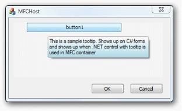

## Troubleshooting

| Issue | Likely cause | Fix |
|---|---|---|
| Tooltip does not appear on hover. | The target control was not associated with a `ToolTipInfo` via `SetToolTip`, or `ShowToolTip` is set to `false`. | Call `superToolTip1.SetToolTip(control, toolTipInfo)` and ensure `ShowToolTip` is `true`. |
| Balloon style has no effect. | The `Style` property is set on a `ToolTipInfo` rather than the `SuperToolTip` component. | Set `Style` on the `SuperToolTip` itself: `this.superToolTip1.Style = SuperToolTipStyle.Balloon;`. |
| `UpdateToolTip` never fires. | `SetToolTip` was never called for the target control. | Call `superToolTip1.SetToolTip(control, toolTipInfo)` for every control you want to update. |
| HTML text renders as plain text. | `RenderHtml` is `false`. | Set `toolTipInfo.Footer.RenderHtml = true;` (or on the relevant `Header`/`Body`). |

