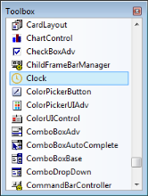

# Adding clock to an application

## Adding through Visual Studio

Follow the steps given below to add the Clock control to an application through Visual Studio:

1. Create a new Windows Form application in Visual Studio.
2. Drag Clock from the Toolbox tab to the designer.

   

3. Clock control is added.
4. Customize the properties of Clock in the Properties Window.

## Adding through code

Follow the steps given below to add the Clock control to an application through code:

1. Include the Tools Windows namespace as given in the following code:

   
    

    

        using Syncfusion.Windows.Forms.Tools;

    
   
    

        Imports Syncfusion.Windows.Forms.Tools

    

    

2. Create an instance of Clock control and add it to the form as given in the following code:

    

    

        Syncfusion.Windows.Forms.Tools.Clock clock1;

		this.clock1 = new Syncfusion.Windows.Forms.Tools.Clock();

		this.Controls.Add(clock1);

    
   
    

        Dim clock1 As Syncfusion.Windows.Forms.Tools.clock

		Me.clock1 = New Syncfusion.Windows.Forms.Tools.clock()

		Me.Controls.Add(clock1)

    

    

