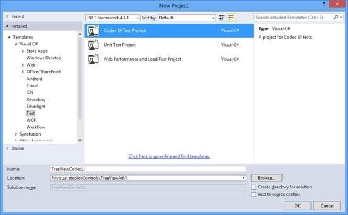
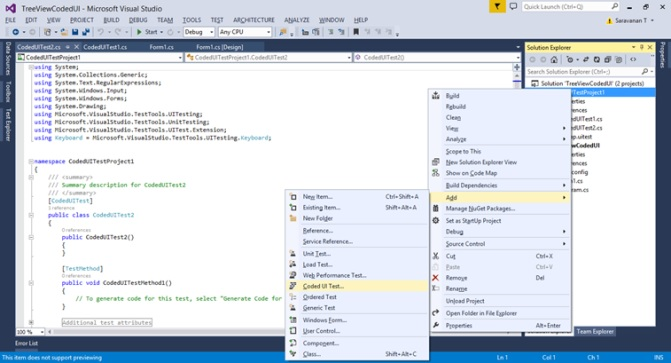
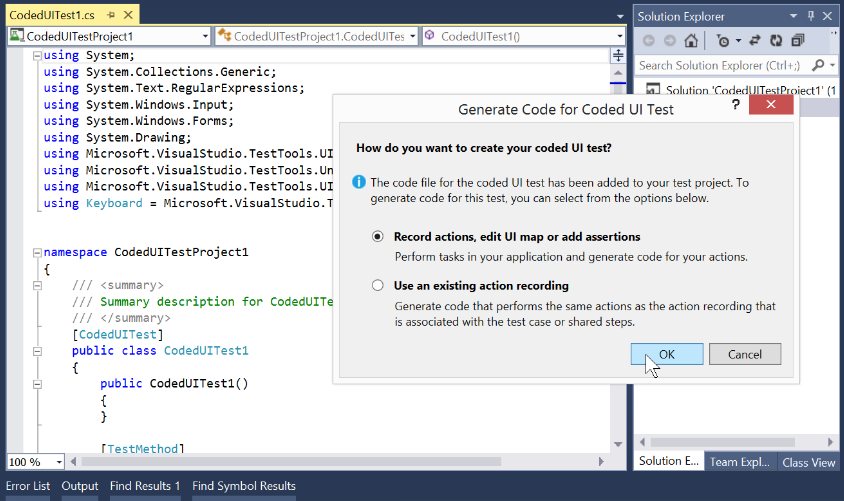
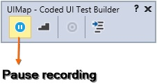
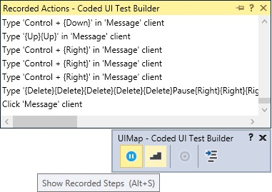
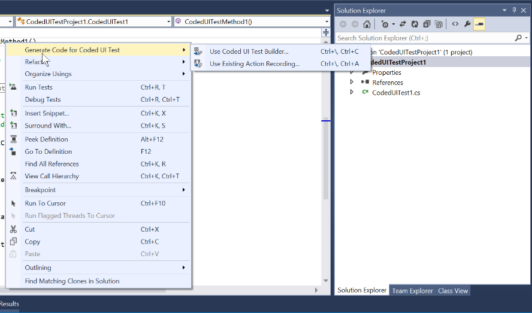
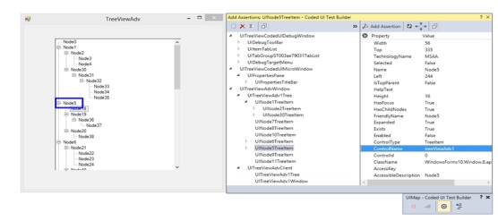

# Coded UI

## Getting Started

This section demonstrates how to create a simple test with TreeViewAdv and Coded UI.

The Essential Tools TreeViewAdv control has basic level of Coded UI automation testing support. The Coded UI functionality can be tested from VS2010 or above with Ultimate or Premium version. TreeViewAdv supports Coded UI from Syncfusion Essential Studio version v9.1.0.20. Refer to the following steps to provide Coded UI support in the TreeViewAdv.

### Creating Coded UI Project

CUIT should contain the coded UI test project. When your application does not contain the CUIT project, create a new project. In the Solutions Explorer, on the shortcut menu of the solution, choose Add, New Project, and then select either Visual Basic or Visual C#. Next, choose Test, Coded UI Test.

In case, the Coded UI test project does not appear on Visual Studio, you may be using a version that does not support CUIT. To create CUIT, you need to use Visual Studio Enterprise edition.

N> The CUIT file is generated automatically, when creating the Coded UI test project. To add another test file, choose shortcut menu of the CUIT project, point to add, and then choose Coded UI test

### Recording Steps

In the Generate Code for Coded UI Test dialog box, choose the Record actions as shown in the following image.

1) After choosing the option, Coded UI Test Builder UIMap is shown at the BottomRight of the window.  
2) Choose the Start recording option from the UI Map to record the testing. You can also pause the recording while testing the application.  

3) The recorded steps can be viewed by using the UIMap or by pressing Alt + S key.  
4) To delete actions that you had recorded by mistake, choose Edit Actions.  
5) To generate code that replicates your action, choose the Generate Code icon and type a name and description for your CUIT method.  

6) After completion of the testing process, choose the Generate code option from the UI Map to generate the code in the test project. The generated code replicates your actions.  

7) Choose the required method and description for code generation.  

### Testing Recorded Steps

You can test the application with the generated CUIT method.

1) Add a TestMethod called CodedUITestMethod1.

The following code example demonstrates the same.





public void CodedUITestMethod1()
{
// Generates code for this test. Select "Generate Code for Coded UI Test" from the shortcut menu and select one of the menu items.
this.UIMap.RecordedMethod1();
}





Public Sub CodedUITestMethod1()
'Generates code for this test. Select "Generate Code for Coded UI Test" from the shortcut menu and select one of the menu items.
Me.UIMap.RecordedMethod1()





2) Build and run the application that has already been configured. You can also open the CUIT builder with the following steps.  

3) Right click the body of the CodedUITestMethod and then select Generate Code for Coded UI Test -> Use CUIT builder as shown in the following screenshots.  

## Supported Controls

The following controls are featured with Coded UI Testing support.

<table>
<tr>
<th>
Supported controls  </th><th>
Level  </th></tr>
<tr>
<td>
GridGroupingControl  </td><td>
3 Level  </td></tr>
<tr>
<td>
DataBoundGrid  </td><td>
3 Level  </td></tr>
<tr>
<td>
TreeViewAdv  </td><td>
2 Level  </td></tr>
</table>
 

