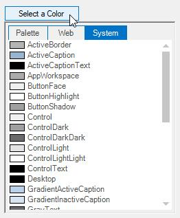
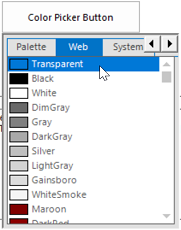

# Customization Settings in Windows Forms Color Picker DropDown

ColorPickerButton displays the ColorUIControl as its dropdown. ColorPickerButton has properties to customize the ColorUIControl. Refer the [User Guide](/windowsforms/colorui/overview) for ColorUIControl. The size for the dropdown, i.e, ColorUIControl can be set using ColorUISize property.




this.colorPickerButton1.ColorUISize = new System.Drawing.Size(250, 280);





Me.colorPickerButton1.ColorUISize = New System.Drawing.Size(250, 280)




 

## ColorPicker Appearance

The appearance and behavior of the ColorPickerButton can be controlled using the below properties.

<table>
<tr>
<th>
ColorPickerButton Properties</th><th>
Description</th></tr>
<tr>
<td>
SelectedAsBackColor</td><td>
Specifies whether the SelectedColor is set as the button backcolor.</td></tr>
<tr>
<td>
SelectedAsText</td><td>
Specifies whether the SelectedColor is set as the button text value.</td></tr>
</table>




this.colorPickerButton1.SelectedAsBackcolor = true;
this.colorPickerButton1.SelectedAsText = true;





Me.colorPickerButton1.SelectedAsBackcolor = True
Me.colorPickerButton1.SelectedAsText = True




 

## Visual Style

The ColorPickerButton control supports visual style such as Office2016White,Office2016Black,Office2016DarkGray,Office2016Colorful,Default and Metro. This style can be set using `Appearance` property.




this.colorPickerButton1.Appearance = Syncfusion.Windows.Forms.ButtonAppearance.Colorful;





Me.colorPickerButton1.Appearance = Syncfusion.Windows.Forms.ButtonAppearance.Colorful;




 

 
 
[Color Groups](/windowsforms/colorui/color-groups),[Tab Text](/windowsforms/colorui/tab-text), [ColorUIControlAppearance](/windowsforms/colorui/coloruicontrol-appearance).


 
 
