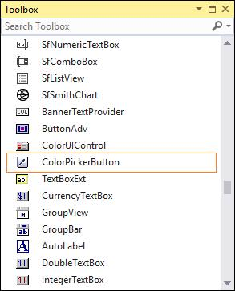
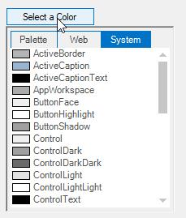
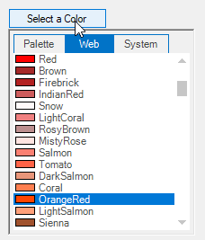

# Getting Started with WinForms Color Picker DropDown

This section briefly describes how to create a new Windows Forms project in Visual Studio and add a **WinForms Color Picker DropDown** with its basic functionalities.

## Assembly deployment

Refer to the [Control Dependencies](https://help.syncfusion.com/windowsforms/control-dependencies#colorpickerbutton) section to get the list of assemblies or NuGet package details that need to be added as a reference to use the control in any application.

[Refer here](https://help.syncfusion.com/windowsforms/installation/install-nuget-packages) to find more details on how to install NuGet packages in a Windows Forms application.

## Adding the WinForms Color Picker DropDown control via designer

1. Create a new Windows Forms application in Visual Studio.

2. The **WinForms Color Picker DropDown** control can be added to an application by dragging it from the toolbox to the design view. The following dependent assembly will be added automatically:

* Syncfusion.Shared.Base

## Adding the WinForms Color Picker DropDown control via code

The following steps illustrate how to create a **WinForms Color Picker DropDown** control programmatically:

1. Create a C# or VB application via Visual Studio.

2. Add the following assembly reference to the project.

* Syncfusion.Shared.Base

3. Include the required namespace `Syncfusion.Windows.Forms`.





using Syncfusion.Windows.Forms;





Imports Syncfusion.Windows.Forms




{{ codesnippet1 | OrderList_Indent_Level_1 }}

4. Create an instance of the **WinForms Color Picker DropDown** control and add it to the form.





private Syncfusion.Windows.Forms.ColorPickerButton colorPickerButton1;
this.colorPickerButton1 = new Syncfusion.Windows.Forms.ColorPickerButton();
this.colorPickerButton1.Text = "Select a Color";
this.Controls.Add(this.colorPickerButton1);





Private colorPickerButton1 As Syncfusion.Windows.Forms.ColorPickerButton
Me.colorPickerButton1 = New Syncfusion.Windows.Forms.ColorPickerButton()
Me.colorPickerButton1.Text = "Select a Color"
Me.Controls.Add(Me.colorPickerButton1)




{{ codesnippet2 | OrderList_Indent_Level_1 }}

5. Clicking this button at runtime displays the ColorUIControl.

## Select a color and group

At runtime, a particular color group tab can be focused or selected using the `SelectedColorGroup` property.

The available options are:

* `SystemColors`
* `StandardColors`
* `CustomColors`
* `UserColors`
* `None` (default)

Use the `SelectedColor` property to specify the initially selected color.





this.colorPickerButton1.SelectedColor = System.Drawing.Color.OrangeRed;
this.colorPickerButton1.SelectedColorGroup = Syncfusion.Windows.Forms.ColorUISelectedGroup.StandardColors;





Me.colorPickerButton1.SelectedColor = System.Drawing.Color.OrangeRed
Me.colorPickerButton1.SelectedColorGroup = Syncfusion.Windows.Forms.ColorUISelectedGroup.StandardColors






 
[Appearance and Behavior Settings](https://help.syncfusion.com/windowsforms/color-picker-dropdown/customization-settings)


 
 