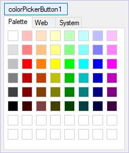

# About Syncfusion® WinForms Color Picker DropDown

The WinForms Color Picker DropDown allows .NET developers to provide a standard user interface similar to the Visual Studio .NET color picker dropdown for selecting colors in Windows Forms applications. It displays the ColorUIControl as a drop-down in combination with a button. The .NET Framework provides a color dialog control to allow applications to collect color information from users. However, the color dialog control does not provide any way to place a control within the layout of the application to collect color information. The ColorUIControl provides an easy-to-use color palette control that can be placed inline in your applications.


[ColorUI Overview](/windowsforms/colorui/overview)


## Key Features

* **Color Groups** - The embedded ColorUI has a predefined set of colors organized as `Standard`, `System`, `Custom`, and `User`.

* **Selected Color** - You can choose or get the selected color both interactively and programmatically through the `SelectedColor` property.

* **ColorUI Size** - The size of the drop-down ColorUI can be customized using the `ColorUISize` property.