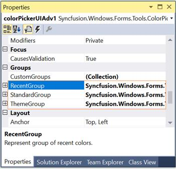
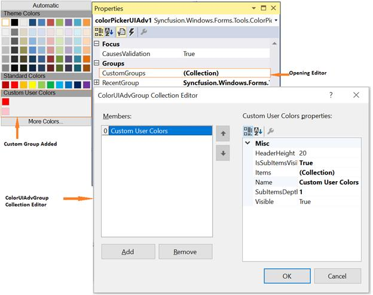
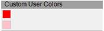
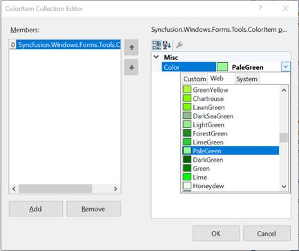

# Color Groups in Windows Forms Color Picker (ColorPickerUIAdv)

The default color groups available for ColorPickerUIAdv control are listed in the below table.

<table>
<tr>
<th>
ColorPickerUIAdv Color Groups</th><th>
Description</th></tr>
<tr>
<td>
RecentGroup</td><td>
Represents the group of recent colors.</td></tr>
<tr>
<td>
StandardGroup</td><td>
Represents the group of standard colors.</td></tr>
<tr>
<td>
ThemeGroup</td><td>
Represents the group of theme colors.</td></tr>
</table>

 

N>  You can also add custom ColorGroups apart from the above default groups. Refer Custom ColorGroups topic to know more.

## Sections of Color Groups 

The sections of a color group is illustrated in the below image.



[Custom Color Groups](#custom-color-groups), [Customizing the Color Groups](#customizing-the-color-groups)



## Custom Color Groups

Custom Color Groups can be added to ColorPickerUIAdv control using CustomGroups property. This property invokes ColorUIAdvGroup Collection Editor and lets you to add custom user groups.

 




Syncfusion.Windows.Forms.Tools.GroupColorItem groupColorItem1 = new Syncfusion.Windows.Forms.Tools.GroupColorItem(colorUIAdvGroup1, System.Drawing.Color.Crimson);
groupColorItem1.Color = System.Drawing.Color.Crimson;
groupColorItem1.Index = 0;
groupColorItem1.SubItems.Add(new Syncfusion.Windows.Forms.Tools.ColorItem(groupColorItem1, System.Drawing.Color.LightPink));

colorUIAdvGroup1.Items.Add(groupColorItem1);
colorUIAdvGroup1.Name = "Custom User Colors";
colorUIAdvGroup1.SubItemsDepth = 1;
this.colorPickerUIAdv1.CustomGroups.Add(colorUIAdvGroup1);





Dim groupColorItem1 As New Syncfusion.Windows.Forms.Tools.GroupColorItem(colorUIAdvGroup1, System.Drawing.Color.Crimson)
groupColorItem1.Color = System.Drawing.Color.Crimson
groupColorItem1.Index = 0
groupColorItem1.SubItems.Add(New Syncfusion.Windows.Forms.Tools.ColorItem(groupColorItem1, System.Drawing.Color.LightPink)) 

colorUIAdvGroup1.Items.Add(groupColorItem1) 
colorUIAdvGroup1.Name = "Custom User Colors" 
colorUIAdvGroup1.SubItemsDepth = 1 
Me.colorPickerUIAdv1.CustomGroups.Add(colorUIAdvGroup1) 




 

N> The properties to customize the color groups are similar to default color groups. 
See how to Customize the Color Groups in [Customizing the Color Groups](#customizincolor-items) topic.

## Customizing the Color Groups

### Adding Color Items and Sub-Items to Color Groups

The below properties lets you add color items and sub items.

<table>
<tr>
<th>
ColorPickerUIAdv Properties</th><th>
Description</th></tr>
<tr>
<td>
Items</td><td>
This property invokes a ColorItem Collection Editor, which lets you add the colors to the group. You can also add sub items to this particular color item using another ColorItem Collection Editor which is invoked using SubItems property.</td></tr>
<tr>
<td>
IsSubItemsVisible</td><td>
Specifies if sub items should be visible.</td></tr>
<tr>
<td>
SubItemsDepth</td><td>
Specifies the depth of the sub items, i.e the number of sub items that can be added to a color item.</td></tr>
</table>

* Opening ColorItem Collection Editor using Items property.

 

* Adding GroupColor items.

 

* Adding color / sub items to the GroupColor items.

 




this.colorPickerUIAdv1.RecentGroup.Items.Add(groupColorItem0);
this.colorPickerUIAdv1.RecentGroup.IsSubItemsVisible = true;
this.colorPickerUIAdv1.RecentGroup.SubItemsDepth = 1;





Me.colorPickerUIAdv1.RecentGroup.Items.Add(groupColorItem0)
Me.colorPickerUIAdv1.RecentGroup.IsSubItemsVisible = True
Me.colorPickerUIAdv1.RecentGroup.SubItemsDepth = 1




 

N> To know how to customize a color item, refer_ Color Items _topic.

## Color Items

### Customizing Color Items

Size of the color items can be set through ColorItemSize property. Default width is 13 and height is 13.

N> The colors within the groups are click able at design time and you can change the color using property grid as in the below image.




this.colorPickerUIAdv1.ColorItemSize = new System.Drawing.Size(20, 20);





Me.colorPickerUIAdv1.ColorItemSize = New System.Drawing.Size(20, 20)




 

### Spacing Between Color Items

HorizontalItemsSpacing and VerticalItemsSpacing properties of ColorPickerUIAdv control can be used to set the horizontal and vertical spacing between the color items respectively. Default value of these properties are 4 and 0 respectively.




this.colorPickerUIAdv1.HorizontalItemsSpacing = 15;
this.colorPickerUIAdv1.VerticalItemsSpacing = 15;





Me.colorPickerUIAdv1.HorizontalItemsSpacing = 15
Me.colorPickerUIAdv1.VerticalItemsSpacing = 15




 



[Header Settings](#header-settings)



## Header Settings

The below properties are used to change the default appearance of the color group headers.

<table>
<tr>
<th>
Color Group Properties</th><th>
Description</th></tr>
<tr>
<td>
HeaderHeight</td><td>
Sets the height for the color group header. Default value is 20.</td></tr>
<tr>
<td>
Name</td><td>
Sets the name of the color group, i.e, the header text.</td></tr>
</table>

<table>
<tr>
<th>
ColorPickerUIAdv Property</th><th>
Description</th></tr>
<tr>
<td>
TextAlignment</td><td>
Sets the header text alignment of all the color groups. By default it is set to MiddleLeft.</td></tr>
<tr>
<td>
Font</td><td>
Sets the font for the header text.</td></tr>
</table>




//Sets header height for Theme group
this.colorPickerUIAdv1.ThemeGroup.HeaderHeight = 25;

//Sets header text for Theme group
this.colorPickerUIAdv1.ThemeGroup.Name = "Recent Colors";

//Sets text alignment of the color group headers
this.colorPickerUIAdv1.TextAlign = System.Drawing.ContentAlignment.MiddleCenter;

//Sets the font style for the header text
this.colorPickerUIAdv1.Font = new System.Drawing.Font("Microsoft Sans Serif",9F, System.Drawing.FontStyle.Bold);





'Sets header height for Theme group
Me.colorPickerUIAdv1.ThemeGroup.HeaderHeight = 25

'Sets header text for Theme group
Me.colorPickerUIAdv1.ThemeGroup.Name = "Recent Colors"

'Sets text alignment of the color group headers
Me.colorPickerUIAdv1.TextAlign = System.Drawing.ContentAlignment.MiddleCenter

'Sets the font style for the header text
Me.colorPickerUIAdv1.Font = New System.Drawing.Font("Microsoft Sans Serif",9F, System.Drawing.FontStyle.Bold)




 

