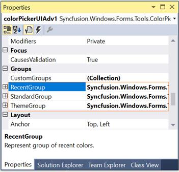
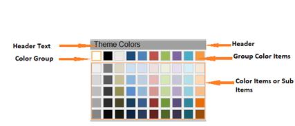
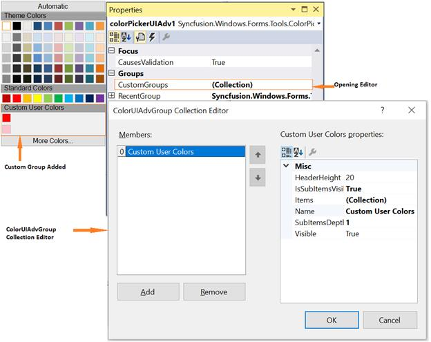
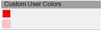
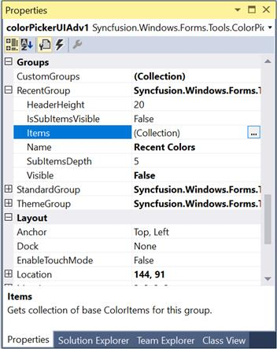
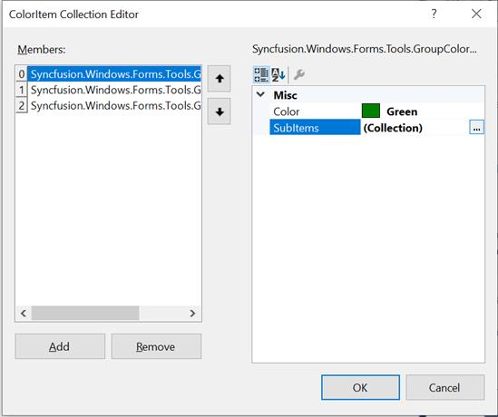
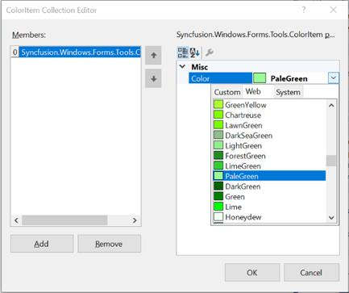
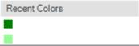
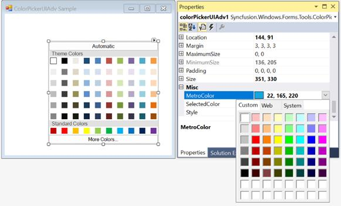
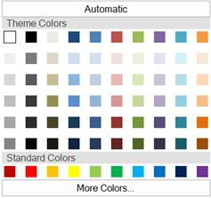

# Color Groups in WinForms Color Picker

The default color groups available for the WinForms Color Picker control are listed in the following table.

<table>
<tr>
<th>
Color Groups in WinForms Color Picker</th><th>
Description</th></tr>
<tr>
<td>
RecentGroup</td><td>
Represents a group of recent colors.</td></tr>
<tr>
<td>
StandardGroup</td><td>
Represents a group of standard colors.</td></tr>
<tr>
<td>
ThemeGroup</td><td>
Represents a group of theme colors.</td></tr>
</table>

>**NOTE**: You can also add custom color groups apart from the default groups listed above. Refer to the [Custom Color Groups](#custom-color-groups) section to know more.

## Sections of Color Groups

The sections of a color group are illustrated in the following image.



[Custom Color Groups](#custom-color-groups), [Customizing the Color Groups](#customizing-the-color-groups)



## Custom Color Groups

Custom color groups can be added to the WinForms Color Picker control using the `CustomGroups` property. This property invokes the `ColorUIAdvGroup` Collection Editor and lets you add custom user groups.




// Create a custom group instance.
Syncfusion.Windows.Forms.Tools.ColorUIAdvGroup colorUIAdvGroup1 = new Syncfusion.Windows.Forms.Tools.ColorUIAdvGroup();

Syncfusion.Windows.Forms.Tools.GroupColorItem groupColorItem1 = new Syncfusion.Windows.Forms.Tools.GroupColorItem(colorUIAdvGroup1, System.Drawing.Color.Crimson);
groupColorItem1.Color = System.Drawing.Color.Crimson;
groupColorItem1.Index = 0;
groupColorItem1.SubItems.Add(new Syncfusion.Windows.Forms.Tools.ColorItem(groupColorItem1, System.Drawing.Color.LightPink));

colorUIAdvGroup1.Items.Add(groupColorItem1);
colorUIAdvGroup1.Name = "Custom User Colors";
colorUIAdvGroup1.SubItemsDepth = 1;
this.colorPickerUIAdv1.CustomGroups.Add(colorUIAdvGroup1);





' Create a custom group instance.
Dim colorUIAdvGroup1 As New Syncfusion.Windows.Forms.Tools.ColorUIAdvGroup()

Dim groupColorItem1 As New Syncfusion.Windows.Forms.Tools.GroupColorItem(colorUIAdvGroup1, System.Drawing.Color.Crimson)
groupColorItem1.Color = System.Drawing.Color.Crimson
groupColorItem1.Index = 0
groupColorItem1.SubItems.Add(New Syncfusion.Windows.Forms.Tools.ColorItem(groupColorItem1, System.Drawing.Color.LightPink))

colorUIAdvGroup1.Items.Add(groupColorItem1)
colorUIAdvGroup1.Name = "Custom User Colors"
colorUIAdvGroup1.SubItemsDepth = 1
Me.colorPickerUIAdv1.CustomGroups.Add(colorUIAdvGroup1)




>**NOTE**: The properties used to customize the color groups are similar to those used for the default color groups. Refer to the [Customizing the Color Groups](#customizing-the-color-groups) section to know more.

## Customizing the Color Groups

### Adding Color Items and Sub-Items to Color Groups

The below properties lets you add color items and sub items.

<table>
<tr>
<th>
WinForms Color Picker Properties</th><th>
Description</th></tr>
<tr>
<td>
Items</td><td>
This property invokes a ColorItem Collection Editor, which lets you add the colors to the group. You can also add sub items to this particular color item using another ColorItem Collection Editor which is invoked using SubItems property.</td></tr>
<tr>
<td>
IsSubItemsVisible</td><td>
Specifies if sub items should be visible.</td></tr>
<tr>
<td>
SubItemsDepth</td><td>
Specifies the depth of the sub items, i.e the number of sub items that can be added to a color item.</td></tr>
</table>

* Opening ColorItem Collection Editor using Items property.

* Adding `GroupColor` items.

* Adding color / sub items to the `GroupColor` items.




// Create a color item to add to the RecentGroup.
Syncfusion.Windows.Forms.Tools.GroupColorItem groupColorItem0 = new Syncfusion.Windows.Forms.Tools.GroupColorItem(this.colorPickerUIAdv1.RecentGroup, System.Drawing.Color.LightSalmon);

this.colorPickerUIAdv1.RecentGroup.Items.Add(groupColorItem0);
this.colorPickerUIAdv1.RecentGroup.IsSubItemsVisible = true;
this.colorPickerUIAdv1.RecentGroup.SubItemsDepth = 1;





' Create a color item to add to the RecentGroup.
Dim groupColorItem0 As New Syncfusion.Windows.Forms.Tools.GroupColorItem(Me.colorPickerUIAdv1.RecentGroup, System.Drawing.Color.LightSalmon)

Me.colorPickerUIAdv1.RecentGroup.Items.Add(groupColorItem0)
Me.colorPickerUIAdv1.RecentGroup.IsSubItemsVisible = True
Me.colorPickerUIAdv1.RecentGroup.SubItemsDepth = 1




>**NOTE**: To know how to customize a color item, refer to the [Color Items](#color-items) section.

## Color Items

### Customizing Color Items

The size of the color items can be set through the `ColorItemSize` property. The default width is 13 and the default height is 13.

>**NOTE**: The colors within the groups are clickable at design time, and you can change the color using the property grid as in the following image.




this.colorPickerUIAdv1.ColorItemSize = new System.Drawing.Size(20, 20);





Me.colorPickerUIAdv1.ColorItemSize = New System.Drawing.Size(20, 20)




### Spacing Between Color Items

The `HorizontalItemsSpacing` and `VerticalItemsSpacing` properties of the WinForms Color Picker control can be used to set the horizontal and vertical spacing between the color items, respectively. The default values of these properties are 4 and 0, respectively.




this.colorPickerUIAdv1.HorizontalItemsSpacing = 15;
this.colorPickerUIAdv1.VerticalItemsSpacing = 15;





Me.colorPickerUIAdv1.HorizontalItemsSpacing = 15
Me.colorPickerUIAdv1.VerticalItemsSpacing = 15




## Header Settings

The below properties are used to change the default appearance of the color group headers.

<table>
<tr>
<th>
Color Group Properties</th><th>
Description</th></tr>
<tr>
<td>
HeaderHeight</td><td>
Sets the height for the color group header. Default value is 20.</td></tr>
<tr>
<td>
Name</td><td>
Sets the name of the color group, i.e, the header text.</td></tr>
</table>

<table>
<tr>
<th>
WinForms Color Picker Property</th><th>
Description</th></tr>
<tr>
<td>
TextAlignment</td><td>
Sets the header text alignment of all the color groups. By default it is set to MiddleLeft.</td></tr>
<tr>
<td>
Font</td><td>
Sets the font for the header text.</td></tr>
</table>




//Sets header height for Theme group
this.colorPickerUIAdv1.ThemeGroup.HeaderHeight = 25;

//Sets header text for Theme group
this.colorPickerUIAdv1.ThemeGroup.Name = "Recent Colors";

//Sets text alignment of the color group headers
this.colorPickerUIAdv1.TextAlign = System.Drawing.ContentAlignment.MiddleCenter;

//Sets the font style for the header text
this.colorPickerUIAdv1.Font = new System.Drawing.Font("Microsoft Sans Serif",9F, System.Drawing.FontStyle.Bold);





'Sets header height for Theme group
Me.colorPickerUIAdv1.ThemeGroup.HeaderHeight = 25

'Sets header text for Theme group
Me.colorPickerUIAdv1.ThemeGroup.Name = "Recent Colors"

'Sets text alignment of the color group headers
Me.colorPickerUIAdv1.TextAlign = System.Drawing.ContentAlignment.MiddleCenter

'Sets the font style for the header text
Me.colorPickerUIAdv1.Font = New System.Drawing.Font("Microsoft Sans Serif",9F, System.Drawing.FontStyle.Bold)




 
