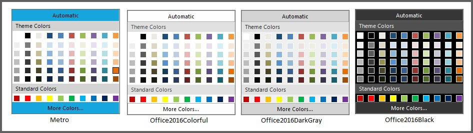
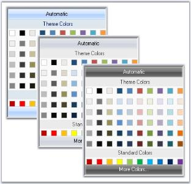
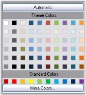
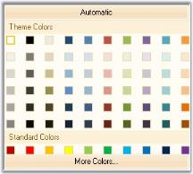
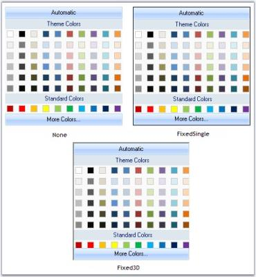

# Appearance in WinForms Color Picker

## Style Settings

### Visual Style

The appearance and behavior settings available for the WinForms Color Picker are discussed in this section. This control supports the following visual styles:

* Default
* Office2007
* Office2010
* Metro
* Office2016Colorful
* Office2016White
* Office2016Black
* Office2016DarkGray

The style can be applied using the `Style` property. The following code example sets the style for the WinForms Color Picker.




// Sets the Office2016 colorful style for the ColorPickerUIAdv.
this.colorPickerUIAdv1.Style = Syncfusion.Windows.Forms.Tools.ColorPickerUIAdvStyle.Office2016Colorful;





' Sets the Office2016 colorful style for the ColorPickerUIAdv.
Me.colorPickerUIAdv1.Style = Syncfusion.Windows.Forms.Tools.ColorPickerUIAdvStyle.Office2016Colorful




### Office2007 Color Schemes

By default, the WinForms Color Picker control has the Office2007 look and feel.

<table>
<tr>
<th>
WinForms Color Picker Properties</th><th>
Description</th></tr>
<tr>
<td>
UseOffice2007Style</td><td>
The Office2007 style can be enabled or disabled using this property. By default, it is true.</td></tr>
<tr>
<td>
Office2007Theme</td><td>
Sets the color scheme for the Office2007 style. Supported values include `Blue`, `Silver`, and `Black`.</td></tr>
</table>




colorPickerUIAdv1.UseOffice2007Style = true;

// Sets Office2007 Black color theme.
colorPickerUIAdv1.Office2007Theme = Syncfusion.Windows.Forms.Office2007Theme.Black;





colorPickerUIAdv1.UseOffice2007Style = True

' Sets Office2007 Black color theme.
colorPickerUIAdv1.Office2007Theme = Syncfusion.Windows.Forms.Office2007Theme.Black




The Office2007 visual styles can be turned off by setting the `UseOffice2007Style` property to `false`.

### Custom Colors

You can also apply custom colors to the WinForms Color Picker control by setting `Office2007Theme` to `Managed` and specifying the custom color through the `ApplyManagedColors` method as follows. The `Office2007Colors` class resides in the `Syncfusion.Windows.Forms` namespace.




this.colorPickerUIAdv1.Office2007Theme = Syncfusion.Windows.Forms.Office2007Theme.Managed;
Office2007Colors.ApplyManagedColors(this, Color.Orange);





Me.colorPickerUIAdv1.Office2007Theme = Syncfusion.Windows.Forms.Office2007Theme.Managed
Office2007Colors.ApplyManagedColors(Me, Color.Orange)




## Border Settings

### Border Styles

Border for WinForms Color Picker control can be Fixed Single, Fixed3D or None, which is set using BorderStyle property. By default the border style is None.




this.colorPickerUIAdv1.BorderStyle = System.Windows.Forms.BorderStyle.Fixed3D;





Me.colorPickerUIAdv1.BorderStyle = System.Windows.Forms.BorderStyle.Fixed3D




### BorderOffset

The below property is used to change the border height.

<table>
<tr>
<th>WinForms Color Picker Property</th>
<th>Description</th></tr>
<tr>
<td>BorderOffset</td>
<td>Set the border height for WinForms Color Picker control. The default value is 3.</td>
</tr>
</table>
