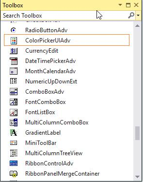
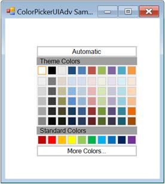
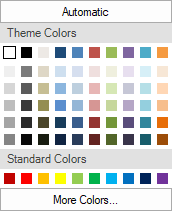

# Getting Started with WinForms Color Picker

This section briefly describes how to create a new Windows Forms project in Visual Studio and add **WinForms Color Picker** with its basic functionalities.

## Assembly deployment

Refer to the [Control Dependencies](https://help.syncfusion.com/windowsforms/control-dependencies#colorpickeruiadv) section to get the list of assemblies or details of the NuGet package that needs to be added as a reference to use the control in any application.

Click [NuGet Packages](https://help.syncfusion.com/windowsforms/installation/install-nuget-packages) to learn how to install NuGet packages in a Windows Forms application.

## Adding the WinForms Color Picker control via designer

1. Create a new Windows Forms application in Visual Studio.

2. The [WinForms Color Picker](https://help.syncfusion.com/cr/windowsforms/Syncfusion.Windows.Forms.Tools.ColorPickerUIAdv.html) control can be added to an application by dragging it from the toolbox to the design view. The following dependent assemblies will be added automatically:

   * Syncfusion.Grid.Base
   * Syncfusion.Grid.Windows
   * Syncfusion.Shared.Base
   * Syncfusion.Shared.Windows
   * Syncfusion.Tools.Base
   * Syncfusion.Tools.Windows

## Adding the WinForms Color Picker control via code

The control can be added programmatically by performing the following steps.

1. Create a C# or VB application via Visual Studio.

2. Add the following assembly references to the project:
	
   * Syncfusion.Grid.Base
   * Syncfusion.Grid.Windows
   * Syncfusion.Shared.Base
   * Syncfusion.Shared.Windows
   * Syncfusion.Tools.Base
   * Syncfusion.Tools.Windows

3. Include the required namespace `Syncfusion.Windows.Forms.Tools`.





using Syncfusion.Windows.Forms.Tools;





Imports Syncfusion.Windows.Forms.Tools




{{ codesnippet1 | OrderList_Indent_Level_1 }}

4. Create an instance of [WinForms Color Picker](https://help.syncfusion.com/cr/windowsforms/Syncfusion.Windows.Forms.Tools.ColorPickerUIAdv.html), and add it to the form.





private Syncfusion.Windows.Forms.Tools.ColorPickerUIAdv colorPickerUIAdv1;
this.colorPickerUIAdv1 = new ColorPickerUIAdv();
this.colorPickerUIAdv1.Size = new Size(200, 180);
this.Controls.Add(this.colorPickerUIAdv1);





Private colorPickerUIAdv1 As Syncfusion.Windows.Forms.Tools.ColorPickerUIAdv
Me.colorPickerUIAdv1 = New ColorPickerUIAdv()
Me.colorPickerUIAdv1.Size = New Size(200, 180)
Me.Controls.Add(Me.colorPickerUIAdv1)




{{ codesnippet2 | OrderList_Indent_Level_1 }}

### Color selection

At runtime, a particular color can be focused or selected using the [SelectedColor](https://help.syncfusion.com/cr/windowsforms/Syncfusion.Windows.Forms.Tools.ColorPickerUIAdv.html#Syncfusion_Windows_Forms_Tools_ColorPickerUIAdv_SelectedColor) property.





this.colorPickerUIAdv1.SelectedColor = System.Drawing.Color.White;





Me.colorPickerUIAdv1.SelectedColor = System.Drawing.Color.White





