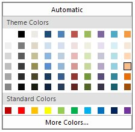

# About Syncfusion® WinForms Color Picker Control

The Essential® Tools WinForms Color Picker allows .NET developers to provide Microsoft Word 2007 ColorCells for selecting colors in their applications. It comprises a panel displaying themed colors and standard colors. It also comes with a More Colors option, in a color dialog, that displays more sub-colors of the base colors in the control.

The .NET Framework provides a color dialog control to allow applications to collect color information from users. However, the color dialog control does not provide any way to place a control within the layout of the application to collect color information. The Essential® Tools WinForms Color Picker provides an easy-to-use color palette control that can be placed inline in your applications.