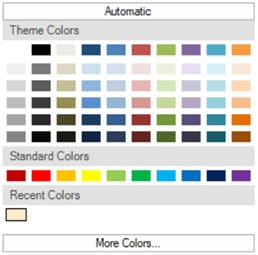

# Runtime Selection in Windows Forms Color Picker (ColorPickerUIAdv)

The ColorPickerUIAdv control at run time provides a Color dialog, using which we can select and add colors to the color groups.

 

## Color Selection at Runtime

Automatic color that has to be selected, when Automatic button is clicked at run time, is set through AutomaticColor property. Default color is black.




this.colorPickerUIAdv1.AutomaticColor = System.Drawing.Color.OrangeRed;





Me.colorPickerUIAdv1.AutomaticColor = System.Drawing.Color.OrangeRed




 

N>  Height of this Automatic button can be specified in ColorPickerUIAdv.ButtonHeight property. Default value is 23.
