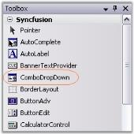
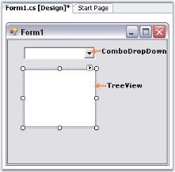
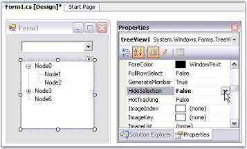
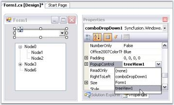

# Getting Started with Windows Forms ComboDropDown

ComboDropDown can host any Windows Forms control in its popup. This section shows how to host a `TreeView` control, which is the most common scenario.

* [Assembly deployment](#assembly-deployment)
* [Adding ComboDropDown through the designer](#adding-combodropdown-through-the-designer)
* [Adding ComboDropDown through code](#adding-combodropdown-through-code)

## Assembly deployment

Refer to the [Control Dependencies](https://help.syncfusion.com/windowsforms/control-dependencies#combodropdown) section for the list of assemblies or the NuGet package details that must be referenced to use the control in any application.

Refer to [NuGet Packages](https://help.syncfusion.com/windowsforms/installation/install-nuget-packages) to learn how to install NuGet packages in a Windows Forms application.

To install via the NuGet Package Manager Console, run:

```
Install-Package Syncfusion.Shared.Base
```

## Adding ComboDropDown through the designer

1. Add the **Syncfusion.Shared.Base** assembly references to the project.
2. Create a new **Windows Forms Application** project in Visual Studio and drag a **ComboDropDown** control and a **TreeView** control from the Toolbox onto the form.

    

    

3. Add a few `TreeNode` entries to the `TreeView` (for example, in the Properties window or in code), and set the `TreeView.HideSelection` property to `false` so the selected node remains highlighted when the TreeView loses focus.

    

4. Select the ComboDropDown on the form, and in the **Properties** window set the `PopupControl` property to the `TreeView` instance you added.

    

> **NOTE:** To set up two-way interaction between the ComboDropDown and the TreeView (selecting a node updates the text and editing the text selects a node), see [Setting Interaction between ComboDropDown and TreeView](https://help.syncfusion.com/windowsforms/combobox-dropdown/event-handling#setting-interaction-between-combodrop-down-and-treeview) in the Event Handling topic.

## Adding ComboDropDown through code

Add the ComboDropDown control programmatically by following the steps below.

1. **Add reference and namespace**

    Add the **Syncfusion.Shared.Base** assembly to the **References** folder through the Solution Explorer, and include the `Syncfusion.Windows.Forms.Tools` namespace in the code.

    
    
    

    using Syncfusion.Windows.Forms.Tools;

    
    

    Imports Syncfusion.Windows.Forms.Tools

    
    
    
    {{ codesnippet_ns | OrderList_Indent_Level_1 }}

2. **Create ComboDropDown instance**

    
    
    

    private Syncfusion.Windows.Forms.Tools.ComboDropDown comboDropDown1;
    this.comboDropDown1 = new Syncfusion.Windows.Forms.Tools.ComboDropDown();

    
    

    Private comboDropDown1 As Syncfusion.Windows.Forms.Tools.ComboDropDown
    Me.comboDropDown1 = New Syncfusion.Windows.Forms.Tools.ComboDropDown()

    
    
    
    {{ codesnippet_instance | OrderList_Indent_Level_1 }}

3. **Initialize TreeView and wire to ComboDropDown**

    Initialize the `TreeView` with sample nodes, then assign it as the drop-down portion through the `PopupControl` property.

    
    
    

    // Populate the TreeView with sample nodes
    this.treeView1.Nodes.Add("Root");
    this.treeView1.Nodes[0].Nodes.Add("Child 1");
    this.treeView1.Nodes[0].Nodes.Add("Child 2");
    this.treeView1.HideSelection = false;

    // Host the TreeView in the ComboDropDown's popup
    this.comboDropDown1.PopupControl = this.treeView1;

    
    

    ' Populate the TreeView with sample nodes
    Me.treeView1.Nodes.Add("Root")
    Me.treeView1.Nodes(0).Nodes.Add("Child 1")
    Me.treeView1.Nodes(0).Nodes.Add("Child 2")
    Me.treeView1.HideSelection = False

    ' Host the TreeView in the ComboDropDown's popup
    Me.comboDropDown1.PopupControl = Me.treeView1

    
    
    
    {{ codesnippet_wire | OrderList_Indent_Level_1 }}

4. **Add the controls to the form**

    Add the `ComboDropDown` and the `TreeView` to the form's `Controls` collection.

    
    
    

    this.Controls.Add(this.comboDropDown1);
    this.Controls.Add(this.treeView1);

    
    

    Me.Controls.Add(Me.comboDropDown1)
    Me.Controls.Add(Me.treeView1)

    
    
    
    {{ codesnippet_final | OrderList_Indent_Level_1 }}

### Full code

The following complete example combines all the steps above for quick reference.





using Syncfusion.Windows.Forms.Tools;

public partial class Form1 : Form
{
    private Syncfusion.Windows.Forms.Tools.ComboDropDown comboDropDown1;
    private System.Windows.Forms.TreeView treeView1;

    public Form1()
    {
        InitializeComponent();

        this.comboDropDown1 = new Syncfusion.Windows.Forms.Tools.ComboDropDown();
        this.treeView1 = new TreeView();

        this.comboDropDown1.Location = new System.Drawing.Point(20, 20);
        this.comboDropDown1.Size = new System.Drawing.Size(200, 21);

        // Populate the TreeView with sample nodes
        this.treeView1.Nodes.Add("Root");
        this.treeView1.Nodes[0].Nodes.Add("Child 1");
        this.treeView1.Nodes[0].Nodes.Add("Child 2");
        this.treeView1.HideSelection = false;

        // Host the TreeView in the ComboDropDown's popup
        this.comboDropDown1.PopupControl = this.treeView1;

        this.Controls.Add(this.comboDropDown1);
        this.Controls.Add(this.treeView1);
    }
}





Imports Syncfusion.Windows.Forms.Tools

Public Partial Class Form1
    Inherits System.Windows.Forms.Form

    Private comboDropDown1 As Syncfusion.Windows.Forms.Tools.ComboDropDown
    Private treeView1 As System.Windows.Forms.TreeView

    Public Sub New()
        InitializeComponent()

        Me.comboDropDown1 = New Syncfusion.Windows.Forms.Tools.ComboDropDown()
        Me.treeView1 = New TreeView()

        Me.comboDropDown1.Location = New System.Drawing.Point(20, 20)
        Me.comboDropDown1.Size = New System.Drawing.Size(200, 21)

        ' Populate the TreeView with sample nodes
        Me.treeView1.Nodes.Add("Root")
        Me.treeView1.Nodes(0).Nodes.Add("Child 1")
        Me.treeView1.Nodes(0).Nodes.Add("Child 2")
        Me.treeView1.HideSelection = False

        ' Host the TreeView in the ComboDropDown's popup
        Me.comboDropDown1.PopupControl = Me.treeView1

        Me.Controls.Add(Me.comboDropDown1)
        Me.Controls.Add(Me.treeView1)
    End Sub
End Class




{{ codesnippet_complete | OrderList_Indent_Level_1 }}