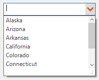
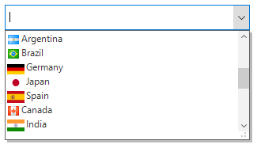
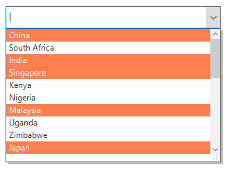
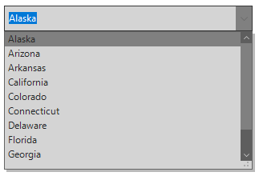
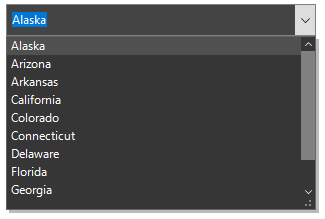

# Appearance in Windows Forms ComboBox (SfComboBox)

## Customizing editor appearance

Appearance of the editor portion can be customized by using the `Style.EditorStyle` property that contains all the needed properties for appearance customization.



sfComboBox1.Style.EditorStyle.BackColor = Color.Aqua;
sfComboBox1.Style.EditorStyle.BorderColor = Color.Red;
sfComboBox1.Style.EditorStyle.ForeColor = Color.Blue;
sfComboBox1.Style.EditorStyle.Font = new Font("Arial", 10F, FontStyle.Bold);


sfComboBox1.Style.EditorStyle.BackColor = Color.Aqua
sfComboBox1.Style.EditorStyle.BorderColor = Color.Red
sfComboBox1.Style.EditorStyle.ForeColor = Color.Blue
sfComboBox1.Style.EditorStyle.Font = New Font("Arial", 10F, FontStyle.Bold)



### Customizing non-editing mode appearance

Appearance of the editor portion can be customized by setting the `ReadOnlyEditorStyle` property when the editor portion is non-editable.



sfComboBox1.Style.ReadOnlyEditorStyle.BackColor = Color.Aqua;
sfComboBox1.Style.ReadOnlyEditorStyle.BorderColor = Color.Red;
sfComboBox1.Style.ReadOnlyEditorStyle.ForeColor = Color.Blue;
sfComboBox1.Style.ReadOnlyEditorStyle.Font = new Font("Arial", 10F, FontStyle.Bold);


sfComboBox1.Style.ReadOnlyEditorStyle.BackColor = Color.Aqua
sfComboBox1.Style.ReadOnlyEditorStyle.BorderColor = Color.Red
sfComboBox1.Style.ReadOnlyEditorStyle.ForeColor = Color.Blue
sfComboBox1.Style.ReadOnlyEditorStyle.Font = New Font("Arial", 10F, FontStyle.Bold)



## Customizing drop-down button appearance

Appearance of the drop-down button can be customized by setting the `DropDownButtonStyle` property.



sfComboBox1.Style.DropDownButtonStyle.BackColor = Color.Blue;
sfComboBox1.Style.DropDownButtonStyle.HoverBackColor = Color.Red;
sfComboBox1.Style.DropDownButtonStyle.PressedBackColor = Color.Aqua;
sfComboBox1.Style.DropDownButtonStyle.FocusedBackColor = Color.Pink;


sfComboBox1.Style.DropDownButtonStyle.BackColor = Color.Blue
sfComboBox1.Style.DropDownButtonStyle.HoverBackColor = Color.Red
sfComboBox1.Style.DropDownButtonStyle.PressedBackColor = Color.Aqua
sfComboBox1.Style.DropDownButtonStyle.FocusedBackColor = Color.Pink



Appearance of the drop-down button icon can be customized by setting the `DropDownButtonStyle` property and the ForeColor properties of the default icon as Transparent.



//To remove the old icon in the dropdown button
sfComboBox1.Style.DropDownButtonStyle.ForeColor = Color.Transparent;
sfComboBox1.Style.DropDownButtonStyle.FocusedForeColor = Color.Transparent;
sfComboBox1.Style.DropDownButtonStyle.HoverForeColor = Color.Transparent;
sfComboBox1.Style.DropDownButtonStyle.PressedForeColor = Color.Transparent;

//Setting the new icon in the dropdown button
sfComboBox1.Style.DropDownButtonStyle.Image = Image.FromFile(@"..\..\Arrow.png");


'To remove the old icon in the dropdown button
sfComboBox1.Style.DropDownButtonStyle.ForeColor = Color.Transparent
sfComboBox1.Style.DropDownButtonStyle.FocusedForeColor = Color.Transparent
sfComboBox1.Style.DropDownButtonStyle.HoverForeColor = Color.Transparent
sfComboBox1.Style.DropDownButtonStyle.PressedForeColor = Color.Transparent

'Setting the New icon in the dropdown button
sfComboBox1.Style.DropDownButtonStyle.Image = Image.FromFile("..\..\Arrow.png")



## Customizing drop-down appearance

Appearance of the drop-down control can be customized by setting the [DropDownStyle](https://help.syncfusion.com/cr/windowsforms/Syncfusion.WinForms.ListView.SfComboBox.html#Syncfusion_WinForms_ListView_SfComboBox_DropDownStyle) property.



sfComboBox1.Style.DropDownStyle.GripperBackColor = Color.Aqua;
sfComboBox1.Style.DropDownStyle.GripperForeColor = Color.Blue;


sfComboBox1.Style.DropDownStyle.GripperBackColor = Color.Aqua
sfComboBox1.Style.DropDownStyle.GripperForeColor = Color.Blue



### Setting image in drop-down list item

Images can be added to the drop-down list items by using the [DrawItem](https://help.syncfusion.com/cr/windowsforms/Syncfusion.WinForms.ListView.Events.DrawItemEventArgs.html) event.



sfComboBox1.DropDownListView.DrawItem += new EventHandler<Syncfusion.WinForms.ListView.Events.DrawItemEventArgs>(DropDownListView_DrawItem);
private void DropDownListView_DrawItem(object sender, Syncfusion.WinForms.ListView.Events.DrawItemEventArgs e)
{
   if (e.Text == "Spain")
     e.Image = Image.FromFile(@"..\..\Flags\Spain.png");
   else if (e.Text == "Germany")
     e.Image = Image.FromFile(@"..\..\Flags\Germany.png");
   else if (e.Text == "Japan")
     e.Image = Image.FromFile(@"..\..\Flags\Japan.png");
   else if (e.Text == "Brazil")
     e.Image = Image.FromFile(@"..\..\Flags\Brazil.png");
   else if (e.Text == "Argentina")
     e.Image = Image.FromFile(@"..\..\Flags\Argentina.png");
   else if (e.Text == "Canada")
     e.Image = Image.FromFile(@"..\..\Flags\Canada.png");
   else if (e.Text == "India")
     e.Image = Image.FromFile(@"..\..\Flags\India.png");
   e.ImageAlignment = ContentAlignment.BottomLeft;
}


AddHandler sfComboBox1.DropDownListView.DrawItem, AddressOf DropDownListView_DrawItem
Private Sub DropDownListView_DrawItem(ByVal sender As Object, ByVal e As Syncfusion.WinForms.ListView.Events.DrawItemEventArgs)
   If e.Text = "Spain" Then
	 e.Image = Image.FromFile("..\..\Flags\Spain.png")
   ElseIf e.Text = "Germany" Then
	 e.Image = Image.FromFile("..\..\Flags\Germany.png")
   ElseIf e.Text = "Japan" Then
	 e.Image = Image.FromFile("..\..\Flags\Japan.png")
   ElseIf e.Text = "Brazil" Then
	 e.Image = Image.FromFile("..\..\Flags\Brazil.png")
   ElseIf e.Text = "Argentina" Then
	 e.Image = Image.FromFile("..\..\Flags\Argentina.png")
   ElseIf e.Text = "Canada" Then
	 e.Image = Image.FromFile("..\..\Flags\Canada.png")
   ElseIf e.Text = "India" Then
	 e.Image = Image.FromFile("..\..\Flags\India.png")
   End If
   e.ImageAlignment = ContentAlignment.BottomLeft
End Sub



## Conditional styling

Appearance of the drop-down list view items can be customized before opening the drop-down by using the [DrawItem](https://help.syncfusion.com/cr/windowsforms/Syncfusion.WinForms.ListView.Events.DrawItemEventArgs.html) event.



sfComboBox1.DropDownListView.DrawItem += new EventHandler<Syncfusion.WinForms.ListView.Events.DrawItemEventArgs>(DropDownListView_DrawItem);
private void DropDownListView_DrawItem(object sender, Syncfusion.WinForms.ListView.Events.DrawItemEventArgs e)
{
  if((e.ItemData as CountryInfo).Continent == "Asia") 
    {
       e.Style.BackColor = Color.Coral;
       e.Style.ForeColor = Color.White; 
    }
}


AddHandler sfComboBox1.DropDownListView.DrawItem, AddressOf DropDownListView_DrawItem
Private Sub DropDownListView_DrawItem(ByVal sender As Object, ByVal e As Syncfusion.WinForms.ListView.Events.DrawItemEventArgs)
  If (TryCast(e.ItemData, CountryInfo)).Continent = "Asia" Then
	   e.Style.BackColor = Color.Coral
	   e.Style.ForeColor = Color.White
  End If
End Sub



## Themes

Four built-in themes for professional representation of SfComboBox are as follows:

* Office2016Colorful
* Office2016White
* Office2016DarkGray
* Office2016Black

Themes can be applied to the SfComboBox by using the following steps:

1.	Loading theme assembly
2.	Apply theme

### Loading theme assembly

The Syncfusion.Office2016Theme.WinForms assembly should be added as a reference to set theme for the SfComboBox in any application.

Before applying theme to the SfComboBox, required theme assembly should be loaded.



using Syncfusion.WinForms.Controls;
namespace WindowsFormsApplication1
{
    static class Program
    {
        /// 

        /// The main entry point for the application.
        /// 

        static void Main()
        {
            SfSkinManager.LoadAssembly(typeof(Office2016Theme).Assembly);
            Application.EnableVisualStyles();
            Application.SetCompatibleTextRenderingDefault(false);
            Application.Run(new Form1());
        }
    }
}


Imports Syncfusion.WinForms.Controls
Namespace WindowsFormsApplication1
	Friend NotInheritable Class Program
		''' 

		''' The main entry point for the application.
		''' 

		Private Sub New()
		End Sub
		Shared Sub Main()
			SfSkinManager.LoadAssembly(GetType(Office2016Theme).Assembly)
			Application.EnableVisualStyles()
			Application.SetCompatibleTextRenderingDefault(False)
			Application.Run(New Form1())
		End Sub
	End Class
End Namespace



### Apply theme

Appearance of the SfComboBox can be changed by using the `ThemeName` property.

#### Office2016Colorful

Sets the Office2016Colorful theme.



sfComboBox1.ThemeName = "Office2016Colorful";


sfComboBox1.ThemeName = "Office2016Colorful"



#### Office2016White

Sets the Office2016White theme.



sfComboBox1.ThemeName = "Office2016White";


sfComboBox1.ThemeName = "Office2016White"



#### Office2016DarkGray

Sets the Office2016DarkGray theme.



sfComboBox1.ThemeName = "Office2016White";


sfComboBox1.ThemeName = "Office2016White"



#### Office2016Black

Sets the Office2016Black theme.



sfComboBox1.ThemeName = "Office2016Black";


sfComboBox1.ThemeName = "Office2016Black"



