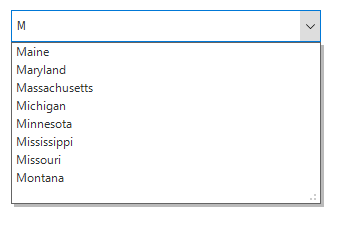

# Auto Complete in Windows Forms ComboBox (SfComboBox)

Auto complete can be enabled by using the [SfComboBox.AutoCompleteMode](https://help.syncfusion.com/cr/windowsforms/Syncfusion.WinForms.ListView.SfComboBox.html#Syncfusion_WinForms_ListView_SfComboBox_AutoCompleteMode) property. Three different ways to display the suggestions are:

* Suggest: Displays suggestion in drop-down list.
* Append: Appends the first suggestion to text.
* SuggestAppend: Performs both the above ways.

## Auto complete modes

### Suggest

A list of probable matches will be suggested and displayed in the drop-down list by setting the [AutoCompleteMode](https://help.syncfusion.com/cr/windowsforms/Syncfusion.WinForms.ListView.SfComboBox.html#Syncfusion_WinForms_ListView_SfComboBox_AutoCompleteMode) property as `Suggest`.



sfComboBox1.AutoCompleteMode = AutoCompleteMode.Suggest;


sfComboBox1.AutoCompleteMode = AutoCompleteMode.Suggest



### Append

The closest match will be added to the editor portion of the [SfComboBox](https://www.syncfusion.com/winforms-ui-controls/combobox) control with partial string selection in the drop-down list. This mode can be enabled by setting the [AutoCompleteMode](https://help.syncfusion.com/cr/windowsforms/Syncfusion.WinForms.ListView.SfComboBox.html#Syncfusion_WinForms_ListView_SfComboBox_AutoCompleteMode) property as `Append`.



sfComboBox1.AutoCompleteMode = AutoCompleteMode.Append;


sfComboBox1.AutoCompleteMode = AutoCompleteMode.Append



### Suggest append

The closest match will be added in the editor portion of the SfComboBox control with partial string selection. The list of matched items will be displayed in the drop-down list by setting the [AutoCompleteMode](https://help.syncfusion.com/cr/windowsforms/Syncfusion.WinForms.ListView.SfComboBox.html#Syncfusion_WinForms_ListView_SfComboBox_AutoCompleteMode) property as `SuggestAppend`.



sfComboBox1.AutoCompleteMode = AutoCompleteMode. SuggestAppend;


sfComboBox1.AutoCompleteMode = AutoCompleteMode.SuggestAppend



## Auto complete by case sensitive

By default, auto completion is case in-sensitive. Case sensitivity can be enabled by setting the [AllowCaseSensitiveOnAutoComplete](https://help.syncfusion.com/cr/windowsforms/Syncfusion.WinForms.ListView.SfComboBox.html#Syncfusion_WinForms_ListView_SfComboBox_AllowCaseSensitiveOnAutoComplete) property to `true`.



sfComboBox1.AllowCaseSensitiveOnAutoComplete = true;


sfComboBox1.AllowCaseSensitiveOnAutoComplete = True



## Different modes for suggesting items

StartsWith and Contains modes are used to auto complete the items by using the [AutoCompleteSuggestMode](https://help.syncfusion.com/cr/windowsforms/Syncfusion.WinForms.ListView.SfComboBox.html#Syncfusion_WinForms_ListView_SfComboBox_AutoCompleteSuggestMode) property. The default value is `StartsWith`.



sfComboBox1.AutoCompleteSuggestMode = AutoCompleteSuggestMode.Contains;


sfComboBox1.AutoCompleteSuggestMode = AutoCompleteSuggestMode.Contains



## Setting delay for auto complete

The SfComboBox provides support to set delay in milliseconds when suggesting matches on auto completion process by using the [AutoCompleteSuggestDelay](https://help.syncfusion.com/cr/windowsforms/Syncfusion.WinForms.ListView.SfComboBox.html#Syncfusion_WinForms_ListView_SfComboBox_AutoCompleteSuggestDelay) property. The default suggest delay is 0.



sfComboBox1.AutoCompleteSuggestDelay = 1000;


sfComboBox1.AutoCompleteSuggestDelay = 1000



N> The `AutoCompleteSuggestDelay` property is valid only for `Suggest` and `SuggestAppend` modes.
