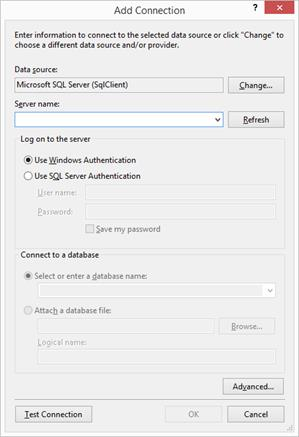
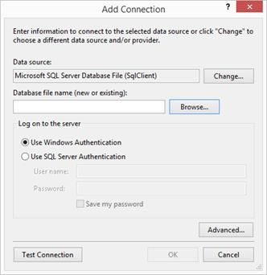
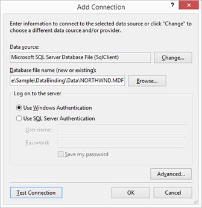

# Data Binding in Windows Forms ComboBox (SfComboBox)

The data source can be bound by using the [DataSource](https://help.syncfusion.com/cr/windowsforms/Syncfusion.WinForms.ListView.SfComboBox.html#Syncfusion_WinForms_ListView_SfComboBox_DataSource) property. The following properties controls the data binding:

* `DisplayMember`: To display the underlying datasource for [Windows Forms ComboBox](https://www.syncfusion.com/winforms-ui-controls/combobox).
* `ValueMember`: To use as the actual value for the items. 



//Bind the data source to combo box control
List<State> list = GetData();
sfComboBox1.DataSource = list;
//Bind the Display member and Value member to the data source
sfComboBox1.DisplayMember = "LongName";
sfComboBox1.ValueMember = "ShortName";

List<State> GetData()
{
    List<State> states = new List<State>();
    states.Add(new State("Alaska", "AK"));
    states.Add(new State("Arizona", "AZ"));
    states.Add(new State("Colorado", "CO"));
    return states;
}

public class State
{
    private string shortName;
    private string longName;

    public State(string LongName, string ShortName)
    {
        this.longName = LongName;
        this.shortName = ShortName;
    }

    public string ShortName
    {
        get { return shortName; }
    }

    public string LongName
    {
        get { return longName; }
    }
}



'Bind the data source to combo box control
Dim list As List(Of State) = GetData()
sfComboBox1.DataSource = list
'Bind the Display member and Value member to the data source
sfComboBox1.DisplayMember = "LongName"
sfComboBox1.ValueMember = "ShortName"

Private Function GetData() As List(Of State)
    Dim states As List(Of State) = New List(Of State)()
    states.Add(New State("Alaska", "AK"))
    states.Add(New State("Arizona", "AZ"))
    states.Add(New State("Colorado", "CO"))
    Return states
End Function

Public Class State
    Private shortName As String
    Private longName As String

    Public Sub New(ByVal LongName As String, ByVal ShortName As String)
        Me.longName = LongName
        Me.shortName = ShortName
    End Sub

    Public ReadOnly Property ShortName As String
        Get
            Return ShortName
        End Get
    End Property

    Public ReadOnly Property LongName As String
        Get
            Return LongName
        End Get
    End Property
End Class



[View sample in GitHub](https://github.com/SyncfusionExamples/How-to-bind-the-data-in-WinForms-SfComboBox)

## Binding Data from Microsoft Access

The [WinForms ComboBox](https://help.syncfusion.com/cr/windowsforms/Syncfusion.WinForms.ListView.SfComboBox.html) (SfComboBox) control supports to bind data from Microsoft Access database. This section describes about how to bind the data from Microsoft Access database to [`SfComboBox`](https://help.syncfusion.com/cr/windowsforms/Syncfusion.WinForms.ListView.SfComboBox.html).

### Importing Microsoft Access Database
To load the data from Microsoft Access database, follow the below steps.

1) On the **View** menu, select **Other Windows > Data Sources**.

2) In the **Data Sources** window, click **Add New Data Source**, the DataSource configuration wizard will be opened.

3) Select **Database** on the **Choose a Data Source Type** page, and then select **Next**.

4) On the **Choose your Data Connection** page, select **New Connection** to configure a new data connection and Change the **Data source** to **.NET Framework Data Provider for OLE DB**.

5) In **OLE DB Provider**, select **Microsoft Office 12.0 Access Database Engine OLE DB Provider**. In **Server or file name**, specify the path and name of the .accdb file to which want to connect, and then select **OK**.

6) Select **Next** on the **Choose your Data Connection** page.

7) Select **Next** on the **Save connection string to the Application Configuration file** page.

8) Expand the **Tables** node on the **Choose your Database Objects** page.

9) Select whatever tables or views in the dataset, and then select **Finish**.

### Loading Data from Microsoft Access Database
To access the Microsoft Access database, follow the below steps.
1) The [`DataSource`](https://help.syncfusion.com/cr/windowsforms/Syncfusion.WinForms.ListView.SfComboBox.html#Syncfusion_WinForms_ListView_SfComboBox_DataSource) property can be customized at designer level like below,

2) The value for [`DisplayMember`](https://help.syncfusion.com/cr/windowsforms/Syncfusion.WinForms.ListView.SfComboBox.html#Syncfusion_WinForms_ListView_SfComboBox_DisplayMember) and [`ValueMember`](https://help.syncfusion.com/cr/windowsforms/Syncfusion.WinForms.ListView.SfComboBox.html#Syncfusion_WinForms_ListView_SfComboBox_ValueMember) properties can be selected as like below, 

3) Based on the [`DataSource`](https://help.syncfusion.com/cr/windowsforms/Syncfusion.WinForms.ListView.SfComboBox.html#Syncfusion_WinForms_ListView_SfComboBox_DataSource) binding with the [`SfComboBox`](https://help.syncfusion.com/cr/windowsforms/Syncfusion.WinForms.ListView.SfComboBox.html) control, the items can be displayed by using [`DisplayMember`](https://help.syncfusion.com/cr/windowsforms/Syncfusion.WinForms.ListView.SfComboBox.html#Syncfusion_WinForms_ListView_SfComboBox_DisplayMember) and [`ValueMember`](https://help.syncfusion.com/cr/windowsforms/Syncfusion.WinForms.ListView.SfComboBox.html#Syncfusion_WinForms_ListView_SfComboBox_ValueMember) properties. 

## Binding Data from LINQ to SQL
The [`SfComboBox`](https://help.syncfusion.com/cr/windowsforms/Syncfusion.WinForms.ListView.SfComboBox.html) control supports to bind data from LINQ to SQL. This walkthrough, describes about binding data from LINQ to SQL and save back the changes to the Database.

### Adding Data Model using LINQ to SQL
To create data model using LINQ to SQL in WF project follow the below steps.
1) Right click on the project, Select **Add** option and then click **New Item**.
2) The Add New Item wizard appears, Select **LINQ to SQL Classes** from the **Visual C#**.
3) Name the file as **Northwind** and then select **Add** option to add the **Northwind.dbml** in the project.

4) Once the **Northwind.dbml** is added in the project, then the design view is opened.

5) New Database connection can be added by clicking add icon button in Server Explorer. 

6) The **Add Connection** wizard appeared with the default data source as **Microsoft SQL Server Database File (SqlClient**).

7) Click **Change** to open the **Change Data Source** dialog box and select the type of data source as **Microsoft SQL Server Database File (SqlClient).**

8) Select the Database file name and click on **Test Connection** to check the connection with the database.

9) Once the connection is succeeded, click **OK** button to add database in the server explorer.

10) Drag **Employees** table in to design view of **Northwind.dbml**. The Entity model diagram for **Employees** table is generated once it is dropped in to design view.

### Loading Data from LINQ to SQL Classes

The data from the defined data model of the LINQ to SQL classes can be loaded as a data source to the [`SfComboBox`](https://help.syncfusion.com/cr/windowsforms/Syncfusion.WinForms.ListView.SfComboBox.html) by loading the **Employees** table by the created data context for the **Northwnd** database.

1) The [`DataSource`](https://help.syncfusion.com/cr/windowsforms/Syncfusion.WinForms.ListView.SfComboBox.html#Syncfusion_WinForms_ListView_SfComboBox_DataSource) property can be customized at designer level like below,

2) The value for [`DisplayMember`](https://help.syncfusion.com/cr/windowsforms/Syncfusion.WinForms.ListView.SfComboBox.html#Syncfusion_WinForms_ListView_SfComboBox_DisplayMember) and [`ValueMember`](https://help.syncfusion.com/cr/windowsforms/Syncfusion.WinForms.ListView.SfComboBox.html#Syncfusion_WinForms_ListView_SfComboBox_ValueMember) properties can be selected as like below, 

3) Based on the [`DataSource`](https://help.syncfusion.com/cr/windowsforms/Syncfusion.WinForms.ListView.SfComboBox.html#Syncfusion_WinForms_ListView_SfComboBox_DataSource) binding with the SfComboBox control, the items can be displayed by using [`DisplayMember`](https://help.syncfusion.com/cr/windowsforms/Syncfusion.WinForms.ListView.SfComboBox.html#Syncfusion_WinForms_ListView_SfComboBox_DisplayMember) and [`ValueMember`](https://help.syncfusion.com/cr/windowsforms/Syncfusion.WinForms.ListView.SfComboBox.html#Syncfusion_WinForms_ListView_SfComboBox_ValueMember) properties. 

## See Also

[How to disable some items WinForms ComboBox dropdown?](https://support.syncfusion.com/kb/article/9692/how-to-disable-some-items-winforms-combobox-dropdown)
