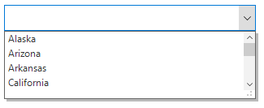
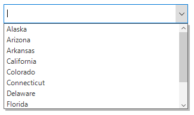
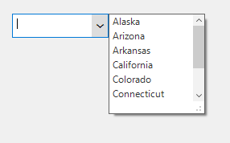
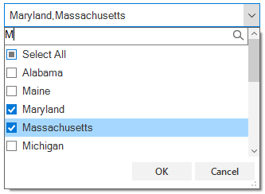

# DropDown in Windows Forms ComboBox (SfComboBox)

## Setting maximum drop-down items

Maximum number of items to be shown in the drop-down control can be customized by using the [MaxDropDownItems](https://help.syncfusion.com/cr/windowsforms/Syncfusion.WinForms.ListView.SfComboBox.html#Syncfusion_WinForms_ListView_SfComboBox_MaxDropDownItems) property.



sfComboBox1.MaxDropDownItems = 4;


sfComboBox1.MaxDropDownItems = 4



## Disabling the drop-down resizing

By default, the drop-down control can be resized by mouse clicking and dragging the gripper portion. The drop-down resizing can be disabled by using the [AllowDropDownResize](https://help.syncfusion.com/cr/windowsforms/Syncfusion.WinForms.ListView.SfComboBox.html#Syncfusion_WinForms_ListView_SfComboBox_AllowDropDownResize) property.



sfComboBox1.AllowDropDownResize = false;


sfComboBox1.AllowDropDownResize = False



## Cancel the drop-down opening

The [DropDownOpening](https://help.syncfusion.com/cr/windowsforms/Syncfusion.WinForms.ListView.Events.DropDownOpeningEventArgs.html) event can be used to cancel the drop-down opening by setting the `e.Cancel` property to `true`.



sfComboBox1.DropDownOpening += new EventHandler<DropDownOpeningEventArgs>(SfComboBox1_DropDownOpening);
private void SfComboBox1_DropDownOpening(object sender, DropDownOpeningEventArgs e)
{
  e.Cancel = true;
}


AddHandler sfComboBox1.DropDownOpening, AddressOf SfComboBox1_DropDownOpening
Private Sub SfComboBox1_DropDownOpening(ByVal sender As Object, ByVal e As DropDownOpeningEventArgs)
  e.Cancel = True
End Sub



## Cancel the drop-down closing

The [DropDownClosing](https://help.syncfusion.com/cr/windowsforms/Syncfusion.WinForms.ListView.Events.DropDownClosingEventArgs.html) event can be used to cancel the drop-down closing by setting the `e.Cancel` property to `true`.



sfComboBox1.DropDownClosing += new EventHandler<DropDownClosingEventArgs>(SfComboBox1_DropDownClosing);
private void SfComboBox1_DropDownClosing(object sender, DropDownClosingEventArgs e)
{
  e.Cancel = true;
}


AddHandler sfComboBox1.DropDownClosing, AddressOf SfComboBox1_DropDownClosing
Private Sub SfComboBox1_DropDownClosing(ByVal sender As Object, ByVal e As DropDownClosingEventArgs)
  e.Cancel = True
End Sub



## Customizing drop-down position

The [`SfComboBox`](https://help.syncfusion.com/cr/windowsforms/Syncfusion.WinForms.ListView.SfComboBox.html) allows to change the position of the dropdown list by using the [`DropDownPosition`](https://help.syncfusion.com/cr/windowsforms/Syncfusion.WinForms.ListView.SfComboBox.html#Syncfusion_WinForms_ListView_SfComboBox_DropDownPosition) property. The default value is [`PopupRelativeAlignment.Center`](https://help.syncfusion.com/cr/windowsforms/Syncfusion.WinForms.Core.Enums.PopupRelativeAlignment.html).





sfComboBox1.DropDownPosition = Syncfusion.WinForms.Core.Enums.PopupRelativeAlignment.RightTop;





## Load custom control in drop-down

SfComboBox allows you to show the header and footer items in drop-down by enabling the [SfComboBox.DropDownListView.ShowHeader](https://help.syncfusion.com/cr/windowsforms/Syncfusion.WinForms.ListView.SfListView.html#Syncfusion_WinForms_ListView_SfListView_ShowHeader) and [SfComboBox.DropDownListView.ShowFooter](https://help.syncfusion.com/cr/windowsforms/Syncfusion.WinForms.ListView.SfListView.html#Syncfusion_WinForms_ListView_SfListView_ShowFooter) properties. This also allows you to load a custom control using the [SfComboBox.DropDownListView.HeaderControl](https://help.syncfusion.com/cr/windowsforms/Syncfusion.WinForms.ListView.SfListView.html#Syncfusion_WinForms_ListView_SfListView_HeaderControl) and [SfComboBox.DropDownListView.FooterControl](https://help.syncfusion.com/cr/windowsforms/Syncfusion.WinForms.ListView.SfListView.html#Syncfusion_WinForms_ListView_SfListView_FooterControl) properties.



// Enable the header in DropDownListView and initialize the custom control.
this.sfComboBox1.DropDownListView.ShowHeader = true;
CustomHeaderUserControl customTextBox = new CustomHeaderUserControl(this.sfComboBox1);
customTextBox.TextBox.Font = this.sfComboBox1.DropDownListView.Style.ItemStyle.Font;  
this.sfComboBox1.DropDownListView.HeaderHeight = 23;
this.sfComboBox1.DropDownListView.HeaderControl = customTextBox;

// Create a custom control to add at header item on DropDownListView
internal class CustomHeaderUserControl : Panel
{
    internal PictureBox pictureBox = new PictureBox();

    internal SfListView ListView;

    internal CustomHeaderUserControl(SfComboBox comboBox)
    {
        this.ListView = comboBox.DropDownListView;
        TextBox = new TextBox();
        TextBox.AutoSize = false;
        TextBox.Anchor = AnchorStyles.Left | AnchorStyles.Right;
        TextBox.BorderStyle = System.Windows.Forms.BorderStyle.None;
        this.Controls.Add(TextBox);
        pictureBox.Image = Image.FromFile(@"../../Icon/search_Colorful.png");
        this.TextBox.TextAlign = HorizontalAlignment.Left;
        this.TextBox.Margin = new Padding(10, 0, 0, 0);
        this.TextBox.Controls.Add(pictureBox);
        TextBox.TextChanged += OnTextBoxTextChanged;
        ListView.MouseDown += OnDropDownListViewMouseDown;
        ListView.SizeChanged += OnDropDownSizeChanged;
        comboBox.DropDownClosing += OnComboBoxDropDownClosing;
        ListView.VerticalScroll.ScrollBar.VisibleChanged += OnScrollBarVisibleChanged;
        ListView.View.Filter = FilterItem;
    }
    
    internal TextBox TextBox { get; set; }
    
    void OnDropDownListViewMouseDown(object sender, MouseEventArgs e)
    {
        ListView.Focus();
    }
    
    private void OnScrollBarVisibleChanged(object sender, EventArgs e)
    {
        if (this.ListView.VerticalScroll.ScrollBar.Visible)
        {
            if (this.ListView.HeaderControl != null && this.ListView.HeaderControl.Width == this.ListView.Width)
            {
                this.ListView.HeaderControl.Width -= this.ListView.VerticalScroll.ScrollBar.Width;
            }

            if (this.ListView.FooterControl != null && this.ListView.FooterControl.Width == this.ListView.Width)
            {
                this.ListView.FooterControl.Width -= this.ListView.VerticalScroll.ScrollBar.Width;
            }
        }
        else
        {
            if (this.ListView.HeaderControl != null)
                this.ListView.HeaderControl.Width = this.ListView.Width;

            if (this.ListView.FooterControl != null)
                this.ListView.FooterControl.Width = this.ListView.Width;
        }
    }
    
    private void OnDropDownSizeChanged(object sender, EventArgs e)
    {
        this.Width = this.ListView.Size.Width - 14;
    }

    private void OnComboBoxDropDownClosing(object sender, Syncfusion.WinForms.ListView.Events.DropDownClosingEventArgs e)
    {
        TextBox.Text = string.Empty;
    }
    
    private void OnTextBoxTextChanged(object sender, EventArgs e)
    {            
        this.ListView.View.RefreshFilter();
    }

    private bool FilterItem(object data)
    {
        if ((data as USState).LongName.ToLower().Contains(this.TextBox.Text.ToLower()))
            return true;
        return false;
    }

    protected override void OnBackColorChanged(EventArgs e)
    {
        this.TextBox.BackColor = this.BackColor;
        base.OnBackColorChanged(e);
    }

    protected override void OnForeColorChanged(EventArgs e)
    {
        this.TextBox.ForeColor = this.ForeColor;
        base.OnForeColorChanged(e);
    }
    
    protected override void OnSizeChanged(EventArgs e)
    {
        this.TextBox.Width = this.Size.Width - 1;
        this.TextBox.Height = this.Size.Height - 1;
        this.pictureBox.Height = this.pictureBox.Image.Height;
        this.pictureBox.Width = this.pictureBox.Image.Width;
        this.TextBox.Location = new Point(0, 0);

        if (this.RightToLeft != System.Windows.Forms.RightToLeft.Yes)
            this.pictureBox.Location = new Point(this.TextBox.Width - this.pictureBox.Width - 4, 1);
        else
        {
            this.pictureBox.Location = new Point(1, 1);
        }

        base.OnSizeChanged(e);
    }
    
    protected override void OnRightToLeftChanged(EventArgs e)
    {
        if (this.RightToLeft != System.Windows.Forms.RightToLeft.Yes)
            this.pictureBox.Location = new Point(this.TextBox.Width - this.pictureBox.Width - 4, 0);
        else
            this.pictureBox.Location = new Point(0, 0);

        base.OnRightToLeftChanged(e);
    }
    
    protected override void OnPaint(PaintEventArgs e)
    {
        base.OnPaint(e);
        ControlPaint.DrawBorder(e.Graphics, this.ClientRectangle, ColorTranslator.FromHtml("#7A7A7A"), ButtonBorderStyle.Solid);
    }
}



'Enable the header in DropDownListView and initialize the custom control.
Me.sfComboBox1.DropDownListView.ShowHeader = True
Dim customTextBox As New CustomHeaderUserControl(Me.sfComboBox1)
customTextBox.TextBox.Font = Me.sfComboBox1.DropDownListView.Style.ItemStyle.Font
Me.sfComboBox1.DropDownListView.HeaderHeight = 23
Me.sfComboBox1.DropDownListView.HeaderControl = customTextBox

 'Create a custom control to add at header item on DropDownListView

 Friend Class CustomHeaderUserControl
	Inherits Panel
	Friend pictureBox As New PictureBox()

	Friend ListView As SfListView

	Private suspendFiltering As Boolean = False
	
	Friend Sub New(ByVal comboBox As SfComboBox)
		Me.ListView = comboBox.DropDownListView
		TextBox = New TextBox()
		TextBox.AutoSize = False
		TextBox.Anchor = AnchorStyles.Left Or AnchorStyles.Right
		TextBox.BorderStyle = System.Windows.Forms.BorderStyle.None
		Me.Controls.Add(TextBox)
		pictureBox.Image = Image.FromFile("../../Icon/search_Colorful.png")
		Me.TextBox.TextAlign = HorizontalAlignment.Left
		Me.TextBox.Margin = New Padding(10, 0, 0, 0)
		Me.TextBox.Controls.Add(pictureBox)
		AddHandler TextBox.TextChanged, AddressOf OnTextBoxTextChanged
		AddHandler ListView.MouseDown, AddressOf OnDropDownListViewMouseDown
		AddHandler ListView.SizeChanged, AddressOf OnDropDownSizeChanged
		AddHandler comboBox.DropDownClosing, AddressOf OnComboBoxDropDownClosing
		AddHandler ListView.VerticalScroll.ScrollBar.VisibleChanged, AddressOf OnScrollBarVisibleChanged
		ListView.View.Filter = AddressOf FilterItem
	End Sub
	
	Private privateTextBox As TextBox
	Friend Property TextBox() As TextBox
		Get
			Return privateTextBox
		End Get
		Set(ByVal value As TextBox)
			privateTextBox = value
		End Set
	End Property

	Private Sub OnDropDownListViewMouseDown(ByVal sender As Object, ByVal e As MouseEventArgs)
		ListView.Focus()
	End Sub
	
	Private Sub OnScrollBarVisibleChanged(ByVal sender As Object, ByVal e As EventArgs)
		If Me.ListView.VerticalScroll.ScrollBar.Visible Then
			If Me.ListView.HeaderControl IsNot Nothing AndAlso Me.ListView.HeaderControl.Width = Me.ListView.Width Then
				Me.ListView.HeaderControl.Width -= Me.ListView.VerticalScroll.ScrollBar.Width
			End If

			If Me.ListView.FooterControl IsNot Nothing AndAlso Me.ListView.FooterControl.Width = Me.ListView.Width Then
				Me.ListView.FooterControl.Width -= Me.ListView.VerticalScroll.ScrollBar.Width
			End If
		Else
			If Me.ListView.HeaderControl IsNot Nothing Then
				Me.ListView.HeaderControl.Width = Me.ListView.Width
			End If

			If Me.ListView.FooterControl IsNot Nothing Then
				Me.ListView.FooterControl.Width = Me.ListView.Width
			End If
		End If
	End Sub

	Private Sub OnDropDownSizeChanged(ByVal sender As Object, ByVal e As EventArgs)
		Me.Width = Me.ListView.Size.Width - 14
	End Sub

	Private Sub OnComboBoxDropDownClosing(ByVal sender As Object, ByVal e As Syncfusion.WinForms.ListView.Events.DropDownClosingEventArgs)
		TextBox.Text = String.Empty
	End Sub

	Private Sub OnTextBoxTextChanged(ByVal sender As Object, ByVal e As EventArgs)
		Me.ListView.View.RefreshFilter()
	End Sub
	
	Private Function FilterItem(ByVal data As Object) As Boolean
		If (TryCast(data, USState)).LongName.ToLower().Contains(Me.TextBox.Text.ToLower()) Then
			Return True
		End If
		Return False
	End Function

	Protected Overrides Sub OnBackColorChanged(ByVal e As EventArgs)
		Me.TextBox.BackColor = Me.BackColor
		MyBase.OnBackColorChanged(e)
	End Sub
	
	Protected Overrides Sub OnForeColorChanged(ByVal e As EventArgs)
		Me.TextBox.ForeColor = Me.ForeColor
		MyBase.OnForeColorChanged(e)
	End Sub
	
	Protected Overrides Sub OnSizeChanged(ByVal e As EventArgs)
		Me.TextBox.Width = Me.Size.Width - 1
		Me.TextBox.Height = Me.Size.Height - 1
		Me.pictureBox.Height = Me.pictureBox.Image.Height
		Me.pictureBox.Width = Me.pictureBox.Image.Width
		Me.TextBox.Location = New Point(0, 0)

		If Me.RightToLeft <> System.Windows.Forms.RightToLeft.Yes Then
			Me.pictureBox.Location = New Point(Me.TextBox.Width - Me.pictureBox.Width - 4, 1)
		Else
			Me.pictureBox.Location = New Point(1, 1)
		End If

		MyBase.OnSizeChanged(e)
	End Sub

	Protected Overrides Sub OnRightToLeftChanged(ByVal e As EventArgs)
		If Me.RightToLeft <> System.Windows.Forms.RightToLeft.Yes Then
			Me.pictureBox.Location = New Point(Me.TextBox.Width - Me.pictureBox.Width - 4, 0)
		Else
			Me.pictureBox.Location = New Point(0, 0)
		End If

		MyBase.OnRightToLeftChanged(e)
	End Sub

	Protected Overrides Sub OnPaint(ByVal e As PaintEventArgs)
		MyBase.OnPaint(e)
		ControlPaint.DrawBorder(e.Graphics, Me.ClientRectangle, ColorTranslator.FromHtml("#7A7A7A"), ButtonBorderStyle.Solid)
	End Sub
End Class



**Sample location:** 
&lt;Installed_Location&gt;\Syncfusion\EssentialStudio\&lt;Version_Number&gt;\Windows\ListView.WinForms\Samples\SfComboBox\MultiSelection

## See Also

[How to add separator line in WinForms SfComboBox dropdown items?](https://support.syncfusion.com/kb/article/9947/how-to-add-separator-line-in-winforms-sfcombobox-dropdown-iems)
