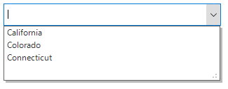

# Filtering in Windows Forms ComboBox (SfComboBox)

The [Windows Forms ComboBox](https://www.syncfusion.com/winforms-ui-controls/combobox) (SfComboBox) support you to filter the items by setting the [Filter](https://help.syncfusion.com/cr/windowsforms/Syncfusion.DataSource.DataSource.html#Syncfusion_DataSource_DataSource_Filter) property of `DropDownListView` to a predicate that will be called for every data item to determine whether the item is visible or not.

N> The [RefreshFilter()](https://help.syncfusion.com/cr/windowsforms/Syncfusion.DataSource.DataSource.html#Syncfusion_DataSource_DataSource_RefreshFilter) method should be called after the filter predicate set.




    public partial class Form1 : SfForm 
    {
        private Syncfusion.WinForms.ListView.SfComboBox sfComboBox1;
        
        public Form1()
        {
            InitializeComponent();
            
            List<USState> list = GetData();
            this.sfComboBox1.DataSource = list;
            this.sfComboBox1.DisplayMember = "LongName";
            this.sfComboBox1.ThemeName = "Office2016Colorful";
            this.sfComboBox1.DropDownListView.Style.ItemStyle.Font = new Font("Microsoft Sans Serif", 9.75f);

            // Filter
            sfComboBox1.DropDownListView.View.Filter = FilterItem;
            sfComboBox1.DropDownListView.View.RefreshFilter();
        }

        // Filter predicate
        private bool FilterItem(object data)
        {
            if ((data as USState).LongName.StartsWith("C"))
                return true;
            return false;
        }

        List<USState> GetData()
        {
            // DisplayMember is used to display just the long name of each state.
            List<USState> USStates = new List<USState>();
            USStates.Add(new USState("Alaska", "AK", 1));
            USStates.Add(new USState("Arizona", "AZ", 2));
            USStates.Add(new USState("Arkansas", "AK", 3));
            USStates.Add(new USState("California", "CA", 4));
            USStates.Add(new USState("Colorado", "CO", 5));
            USStates.Add(new USState("Connecticut", "CT", 6));
            USStates.Add(new USState("Delaware", "DE", 3));
            USStates.Add(new USState("Florida", "FL", 4));
            USStates.Add(new USState("Georgia", "GA", 1));
            USStates.Add(new USState("Hawaii", "HI", 0));
            USStates.Add(new USState("Idaho", "ID", 3));
            return USStates;
        }
    }

    public class USState
    {
        private string myShortName;
        private string myLongName;
        private int imgIndex;

        public USState(string strLongName, string strShortName, int imageIndex)
        {
            this.myShortName = strShortName;
            this.myLongName = strLongName;
            this.imgIndex = imageIndex;
        }

        public string ShortName
        {
            get
            {
                return myShortName;
            }
        }

        public string LongName
        {
            get
            {
                return myLongName;
            }
        }

        public int ImageIndex
        {
            get
            {
                return imgIndex;
            }
            set
            {
                imgIndex = value;
            }
        }

        public override string ToString()
        {
            return this.LongName + " - " + this.ShortName;
        }
    }





    Partial Public Class Form1
      Inherits SfForm
        Private sfComboBox1 As Syncfusion.WinForms.ListView.SfComboBox

        Public Sub New()
          InitializeComponent()

          Dim list As List(Of USState) = GetData()
          Me.sfComboBox1.DataSource = list
          Me.sfComboBox1.DisplayMember = "LongName"
          Me.sfComboBox1.ThemeName = "Office2016Colorful"
          Me.sfComboBox1.DropDownListView.Style.ItemStyle.Font = New Font("Microsoft Sans Serif", 9.75f)

          ' Filter
          sfComboBox1.DropDownListView.View.Filter = AddressOf FilterItem
          sfComboBox1.DropDownListView.View.RefreshFilter()
        End Sub

        ' Filter predicate
        Private Function FilterItem(ByVal data As Object) As Boolean
          If (TryCast(data, USState)).LongName.StartsWith("C") Then
            Return True
          End If
          Return False
        End Function

        Private Function GetData() As List(Of USState)
          ' DisplayMember is used to display just the long name of each state.
          Dim USStates As New List(Of USState)()
          USStates.Add(New USState("Alaska", "AK", 1))
          USStates.Add(New USState("Arizona", "AZ", 2))
          USStates.Add(New USState("Arkansas", "AK", 3))
          USStates.Add(New USState("California", "CA", 4))
          USStates.Add(New USState("Colorado", "CO", 5))
          USStates.Add(New USState("Connecticut", "CT", 6))
          USStates.Add(New USState("Delaware", "DE", 3))
          USStates.Add(New USState("Florida", "FL", 4))
          USStates.Add(New USState("Georgia", "GA", 1))
          USStates.Add(New USState("Hawaii", "HI", 0))
          USStates.Add(New USState("Idaho", "ID", 3))
          Return USStates
        End Function
    End Class

    Public Class USState
        Private myShortName As String
        Private myLongName As String
        Private imgIndex As Integer

        Public Sub New(ByVal strLongName As String, ByVal strShortName As String, ByVal imageIndex As Integer)
          Me.myShortName = strShortName
          Me.myLongName = strLongName
          Me.imgIndex = imageIndex
        End Sub

        Public ReadOnly Property ShortName() As String
          Get
            Return myShortName
          End Get
        End Property

        Public ReadOnly Property LongName() As String
          Get
            Return myLongName
          End Get
        End Property

        Public Property ImageIndex() As Integer
          Get
            Return imgIndex
          End Get
          Set(ByVal value As Integer)
            imgIndex = value
          End Set
        End Property

        Public Overrides Function ToString() As String
          Return Me.LongName & " - " & Me.ShortName
        End Function
	End Class




