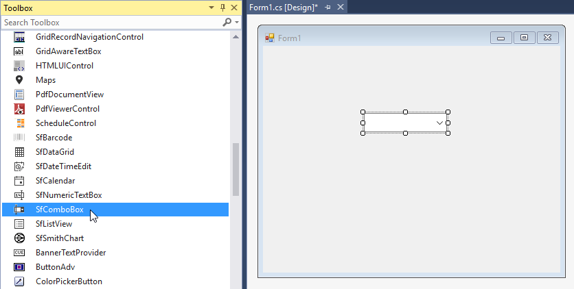

# Getting Started with Windows Forms ComboBox (SfComboBox)
This section provides a quick overview for working with combo box in WinForms. 

## Assembly Deployment
Refer [control dependencies](https://help.syncfusion.com/windowsforms/control-dependencies#sfcombobox) section to get the list of assemblies or NuGet package needs to be added as reference to use the control in any application. 

## Creating Application with SfComboBox control
In this walk through, user will create a WinForms application that contains SfComboBox control.

### Creating the Project
Create a new Windows Forms Project in Visual Studio to display the SfCombobox control.

### Adding Control via Designer
The SfCombobox control can be added to the application by dragging it from the toolbox and dropping it in designer. The required assembly references will be added automatically.

### Adding Control in Code
To add control manually, follow the steps:

1.Add the below required assembly references to the project,

* 	Syncfusion.Core.WinForms

*	Syncfusion.DataSource.WinForms

* 	Syncfusion.GridCommon.WinForms

*   Syncfusion.SfListView.WinForms

2.Create the SfComboBox control instance and add it to the control collection of Form.



using Syncfusion.WinForms.ListView;

namespace WindowsFormsApplication1
{
    public partial class Form1 : Form
    {
        public Form1()
        {
            InitializeComponent();
            SfComboBox sfComboBox1 = new SfComboBox();
            sfComboBox1.Location = new Point(100, 100);
            this.Controls.Add(sfComboBox1);
        }
    }
}


Imports Syncfusion.WinForms.ListView

Namespace WindowsFormsApplication1
	Partial Public Class Form1
		Inherits Form
		Public Sub New()
			InitializeComponent()
			Dim sfComboBox1 As New SfComboBox()
			sfComboBox1.Location = New Point(100, 100)
			Me.Controls.Add(sfComboBox1)
		End Sub
	End Class
End Namespace



### Binding to data

To bind the SfComboBox to data, set the [SfComboBox.DataSource](https://help.syncfusion.com/cr/windowsforms/Syncfusion.WinForms.ListView.SfComboBox.html#Syncfusion_WinForms_ListView_SfComboBox_DataSource) property to `IEnumerable` implementation. You can bind a property of the underlying data source to display for SfComboBox by using the [DisplayMember](https://help.syncfusion.com/cr/windowsforms/Syncfusion.WinForms.ListView.SfComboBox.html#Syncfusion_WinForms_ListView_SfComboBox_DisplayMember) property and you can bind a property to use as the actual value for the items by using the [ValueMember](https://help.syncfusion.com/cr/windowsforms/Syncfusion.WinForms.ListView.SfComboBox.html#Syncfusion_WinForms_ListView_SfComboBox_ValueMember) property.



List<string> usStates = new List<string>();
usStates.Add("Alaska");
usStates.Add("Arizona");
usStates.Add("Arkansas");
usStates.Add("California");
usStates.Add("Colorado");
usStates.Add("Connecticut");
usStates.Add("Delaware");
usStates.Add("Florida");
usStates.Add("Georgia");
sfComboBox1.DataSource = usStates;


Dim usStates As New List(Of String)()
usStates.Add("Alaska")
usStates.Add("Arizona")
usStates.Add("Arkansas")
usStates.Add("California")
usStates.Add("Colorado")
usStates.Add("Connecticut")
usStates.Add("Delaware")
usStates.Add("Florida")
usStates.Add("Georgia")
sfComboBox1.DataSource = usStates



## Auto complete
Auto complete provides three different ways to display suggestions in drop-down list.

They are, 
 
* Suggest: Displays suggestion in drop-down list.

* Append: Appends first suggestion to the text.

* SuggestAppend: Both of these.

Auto complete can be set by using the [AutoCompleteMode](https://help.syncfusion.com/cr/windowsforms/Syncfusion.WinForms.ListView.SfComboBox.html#Syncfusion_WinForms_ListView_SfComboBox_AutoCompleteMode) property.



sfComboBox1.AutoCompleteMode = AutoCompleteMode.Append;


sfComboBox1.AutoCompleteMode = AutoCompleteMode.Append



## Multi selection
This allows you to select multiple values from the drop-down list. The multi selection combo box can be enabled by setting the [ComboBoxMode](https://help.syncfusion.com/cr/windowsforms/Syncfusion.WinForms.ListView.SfComboBox.html#Syncfusion_WinForms_ListView_SfComboBox_ComboBoxMode) property as `MultiSelection`.



sfComboBox1.ComboBoxMode = ComboBoxMode.MultiSelection;


sfComboBox1.ComboBoxMode = ComboBoxMode.MultiSelection



## Selected Items

Index of the selected item can be retrieved by using the [SelectedIndex](https://help.syncfusion.com/cr/windowsforms/Syncfusion.WinForms.ListView.SfComboBox.html#Syncfusion_WinForms_ListView_SfComboBox_SelectedIndex) property. The value of the selected item can be retrieved by using the [SelectedValue](https://help.syncfusion.com/cr/windowsforms/Syncfusion.WinForms.ListView.SfComboBox.html#Syncfusion_WinForms_ListView_SfComboBox_SelectedValue) property. It returns the value of the property bound to the `ValueMember` property. If the `ValueMember` is not initialized, it will return the value of the property bound to the `DisplayMember`. The selected item of the SfComboBox can be retrieved by using the [SelectedItem](https://help.syncfusion.com/cr/windowsforms/Syncfusion.WinForms.ListView.SfComboBox.html#Syncfusion_WinForms_ListView_SfComboBox_SelectedItem) property.

N> N> You can also explore our [WinForms ComboBox example](https://github.com/syncfusion/winforms-demos/tree/master/sfcombobox) that shows how to allows users to type a value, choose an item, or choose multiple items using a multiselect option. 