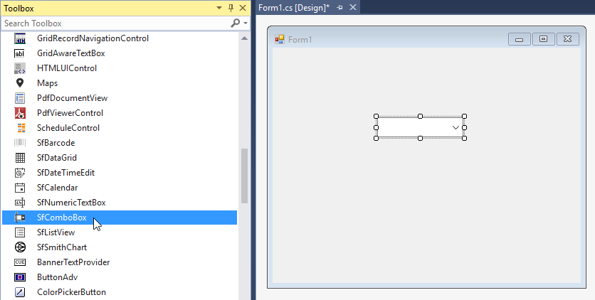
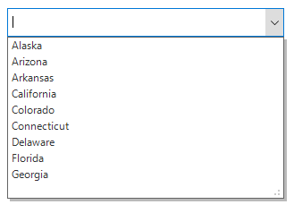
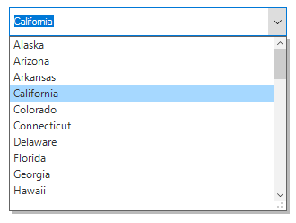
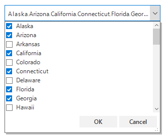

# Getting Started with Windows Forms SfComboBox

This section explains how to use the SfComboBox control to build a drop-down selection component in a Windows Forms application.

## Assembly deployment

Refer to the [Control Dependencies](https://help.syncfusion.com/windowsforms/control-dependencies#sfcombobox) section for the list of assemblies or the NuGet package details that must be referenced to use the control in any application.

Refer to [NuGet Packages](https://help.syncfusion.com/windowsforms/installation/install-nuget-packages) to learn how to install NuGet packages in a Windows Forms application.

To install via the NuGet Package Manager Console, run:

```
Install-Package Syncfusion.SfListView.WinForms
```

## Adding SfComboBox via designer

1. Create a new Windows Forms project in Visual Studio.

2. Add the [SfComboBox](https://help.syncfusion.com/cr/windowsforms/Syncfusion.WinForms.ListView.SfComboBox.html) to the application by dragging it from the toolbox to the designer surface. The following dependent assemblies are added automatically:

    * Syncfusion.SfListView.WinForms
	* Syncfusion.Core.WinForms
	* Syncfusion.DataSource.WinForms
	* Syncfusion.GridCommon.WinForms
	



## Adding SfComboBox via code

To add the control manually, follow these steps:

1. Create a C# or VB.NET application in Visual Studio.

2. Add the following assembly references to the project:

    * Syncfusion.SfListView.WinForms
	* Syncfusion.Core.WinForms
	* Syncfusion.DataSource.WinForms
	* Syncfusion.GridCommon.WinForms
	
3. Create an instance of the [SfComboBox](https://help.syncfusion.com/cr/windowsforms/Syncfusion.WinForms.ListView.SfComboBox.html) and add it to the form.





using System.Drawing;
using System.Windows.Forms;
using Syncfusion.WinForms.ListView;

namespace WindowsFormsApplication1
{
    public partial class Form1 : Form
    {
        public Form1()
        {
            InitializeComponent();
            SfComboBox sfComboBox1 = new SfComboBox();
            sfComboBox1.Location = new Point(100, 100);
            this.Controls.Add(sfComboBox1);
        }
    }
}




Imports System.Drawing
Imports System.Windows.Forms
Imports Syncfusion.WinForms.ListView

Namespace WindowsFormsApplication1
	Partial Public Class Form1
		Inherits Form
		Public Sub New()
			InitializeComponent()
			Dim sfComboBox1 As New SfComboBox()
			sfComboBox1.Location = New Point(100, 100)
			Me.Controls.Add(sfComboBox1)
		End Sub
	End Class
End Namespace




{{ codesnippet1 | OrderList_Indent_Level_1 }}

## Binding to data

To bind the SfComboBox to data, set the [SfComboBox.DataSource](https://help.syncfusion.com/cr/windowsforms/Syncfusion.WinForms.ListView.SfComboBox.html#Syncfusion_WinForms_ListView_SfComboBox_DataSource) property to an `IEnumerable` implementation. Set the [DisplayMember](https://help.syncfusion.com/cr/windowsforms/Syncfusion.WinForms.ListView.SfComboBox.html#Syncfusion_WinForms_ListView_SfComboBox_DisplayMember) property to the name of the property to display, and set the [ValueMember](https://help.syncfusion.com/cr/windowsforms/Syncfusion.WinForms.ListView.SfComboBox.html#Syncfusion_WinForms_ListView_SfComboBox_ValueMember) property to the name of the property to use as the actual value for the items.




using System.Collections.Generic;

List<string> usStates = new List<string>();
usStates.Add("Alaska");
usStates.Add("Arizona");
usStates.Add("Arkansas");
usStates.Add("California");
usStates.Add("Colorado");
usStates.Add("Connecticut");
usStates.Add("Delaware");
usStates.Add("Florida");
usStates.Add("Georgia");
sfComboBox1.DataSource = usStates;




Imports System.Collections.Generic

Dim usStates As New List(Of String)()
usStates.Add("Alaska")
usStates.Add("Arizona")
usStates.Add("Arkansas")
usStates.Add("California")
usStates.Add("Colorado")
usStates.Add("Connecticut")
usStates.Add("Delaware")
usStates.Add("Florida")
usStates.Add("Georgia")
sfComboBox1.DataSource = usStates




> When the underlying data is a primitive type such as `string` or `int`, `DisplayMember` and `ValueMember` are not required.



## AutoComplete

AutoComplete provides three different ways to display suggestions in the drop-down list:

* `Suggest`: Displays a suggestion in the drop-down list.
* `Append`: Appends the first suggestion to the text.
* `SuggestAppend`: Combines `Suggest` and `Append` behaviors.

Set the [AutoCompleteMode](https://help.syncfusion.com/cr/windowsforms/Syncfusion.WinForms.ListView.SfComboBox.html#Syncfusion_WinForms_ListView_SfComboBox_AutoCompleteMode) property to choose a mode, and set the [AutoCompleteSuggestMode](https://help.syncfusion.com/cr/windowsforms/Syncfusion.WinForms.ListView.SfComboBox.html#Syncfusion_WinForms_ListView_SfComboBox_AutoCompleteSuggestMode) property to control case sensitivity and match strategy (e.g., `StartsWith`, `Contains`, `Equals`).




sfComboBox1.AutoCompleteMode = AutoCompleteMode.Append;
sfComboBox1.AutoCompleteSuggestMode = AutoCompleteSuggestMode.StartsWith;




sfComboBox1.AutoCompleteMode = AutoCompleteMode.Append
sfComboBox1.AutoCompleteSuggestMode = AutoCompleteSuggestMode.StartsWith






## Multi Selection

SfComboBox allows you to select multiple values from the drop-down list. Multi selection is enabled by setting the [ComboBoxMode](https://help.syncfusion.com/cr/windowsforms/Syncfusion.WinForms.ListView.SfComboBox.html#Syncfusion_WinForms_ListView_SfComboBox_ComboBoxMode) property to `MultiSelection`.




sfComboBox1.ComboBoxMode = ComboBoxMode.MultiSelection;




sfComboBox1.ComboBoxMode = ComboBoxMode.MultiSelection






## Selected Items

Use the following properties to retrieve the selection from SfComboBox:

* [SelectedIndex](https://help.syncfusion.com/cr/windowsforms/Syncfusion.WinForms.ListView.SfComboBox.html#Syncfusion_WinForms_ListView_SfComboBox_SelectedIndex) returns the index of the selected item.
* [SelectedValue](https://help.syncfusion.com/cr/windowsforms/Syncfusion.WinForms.ListView.SfComboBox.html#Syncfusion_WinForms_ListView_SfComboBox_SelectedValue) returns the value of the property bound to the `ValueMember`. If `ValueMember` is not initialized, it returns the value of the property bound to the `DisplayMember`.
* [SelectedItem](https://help.syncfusion.com/cr/windowsforms/Syncfusion.WinForms.ListView.SfComboBox.html#Syncfusion_WinForms_ListView_SfComboBox_SelectedItem) returns the selected item.
* [SelectedItems](https://help.syncfusion.com/cr/windowsforms/Syncfusion.WinForms.ListView.SfComboBox.html#Syncfusion_WinForms_ListView_SfComboBox_SelectedItems) returns all selected items in `MultiSelection` mode.

N> You can also explore our [WinForms SfComboBox example](https://github.com/syncfusion/winforms-demos/tree/master/sfcombobox) that shows how to allow users to type a value, choose an item, or choose multiple items using a multiselect option.