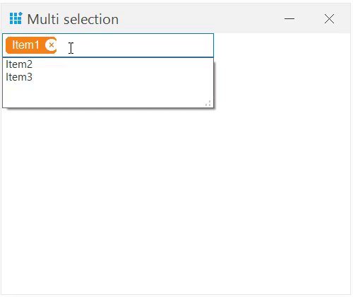

# Token in Windows Forms ComboBox (SfComboBox)

Token represents the selected item(s) in combobox. The selected items are displayed in rounded-polygon shape with close icon. This option also helps to select multiple items without using check box and remove the token at run time. 

The [EnableToken](https://help.syncfusion.com/cr/windowsforms/Syncfusion.WinForms.ListView.SfComboBox.html#Syncfusion_WinForms_ListView_SfComboBox_EnableToken) property determines whether the selected item(s) in the combobox should be displayed as token. And, the [SelectedItems](https://help.syncfusion.com/cr/windowsforms/Syncfusion.WinForms.ListView.SfComboBox.html#Syncfusion_WinForms_ListView_SfComboBox_SelectedItems) property holds the tokens collection.



sfComboBox1.EnableToken = true;


sfComboBox1.EnableToken = True



The important characteristics of the token support are as follows.

{{'**Searching**'| markdownify }}- Items can be searched from the combobox by entering appropriate characters in the text area.

{{'**Adding**'| markdownify }}- When an item is selected from the combobox, the item will be added as token in text area and removed from the drop-down area. 

{{'**Removing**'| markdownify }}- By clicking the remove icon, the appropriate item will be removed from the text area, and it will be added automatically back to the drop-down area.

{{'**AutoSizing**'| markdownify }}- Text area height will be increased automatically based on the placement of the selected items.

## Token appearance

The appearance of token can be customized using the [TokenStyle](https://help.syncfusion.com/cr/windowsforms/Syncfusion.WinForms.ListView.Styles.ComboBoxVisualStyle.html#Syncfusion_WinForms_ListView_Styles_ComboBoxVisualStyle_TokenStyle) property. It includes the background color, border color, foreground color, close button color, and font.



sfComboBox1.Style.TokenStyle.BackColor = Color.Aqua;
sfComboBox1.Style.TokenStyle.BorderColor = Color.Red;
sfComboBox1.Style.TokenStyle.ForeColor = Color.Black;
sfComboBox1.Style.TokenStyle.CloseButtonBackColor = Color.Black;
sfComboBox1.Style.TokenStyle.Font = new Font(“Arial”, 10F, FontStyle.Bold);


sfComboBox1.Style.TokenStyle.BackColor = Color.Aqua
sfComboBox1.Style.TokenStyle.BorderColor = Color.Red
sfComboBox1.Style.TokenStyle.ForeColor = Color.Black
sfComboBox1.Style.TokenStyle.CloseButtonBackColor = Color.Black
sfComboBox1.Style.TokenStyle.Font = New Font(“Arial”, 10F, FontStyle.Bold)



## Keyboard access

* Using the <kbd>Down Arrow</kbd>, <kbd>Up Arrow</kbd>, and <kbd>Enter</kbd> keys, item can be selected from the combobox.
* Using the <kbd>Backspace</kbd> key, the last positioned token will be removed from the text area.
* When the <kbd>Esc</kbd> key is pressed, the drop-down area will be closed if it has been opened already. 

## Events Fired When Selecting and Deselecting Tokens 

The events [SelectedValueChanged](https://help.syncfusion.com/cr/windowsforms/Syncfusion.WinForms.ListView.SfComboBox.html#Syncfusion_WinForms_ListView_SfComboBox_SelectedValueChanged) and [SelectedIndexChanged](https://help.syncfusion.com/cr/windowsforms/Syncfusion.WinForms.ListView.SfComboBox.html#Syncfusion_WinForms_ListView_SfComboBox_SelectedIndexChanged) are triggered when tokens are selected or deselected in the SfComboBox control.




private List<object> _previousSelectedTokens;
SfComboBox sfComboBox1 = new SfComboBox
{
    EnableToken = true, 
    DisplayMember = "Name",  
    ValueMember = "Id", 
};
// Set the DataSource
sfComboBox1.DataSource = new List<dynamic>
{
    new { Id = 1, Name = "Item1" },
    new { Id = 2, Name = "Item2" },
    new { Id = 3, Name = "Item3" }
};
sfComboBox1.SelectedItems.Add(sfComboBox1.DropDownListView.View.DisplayItems[0]);
_previousSelectedTokens = sfComboBox1.SelectedItems.Cast<object>().ToList();   
sfComboBox1.SelectedValueChanged += SfComboBox1_SelectedValueChanged;
sfComboBox1.SelectedIndexChanged += SfComboBox1_SelectedIndexChanged;
this.Controls.Add(sfComboBox1);

private void TokenComboBox_SelectedValueChanged(object sender, EventArgs e)
{
    var comboBox = sender as SfComboBox;

    // Get the current selected tokens
    var currentSelectedTokens = comboBox.SelectedItems.Cast<dynamic>().ToList();

    // Determine added tokens
    var addedTokens = currentSelectedTokens.Except(_previousSelectedTokens).ToList();

    // Determine removed tokens
    var removedTokens = _previousSelectedTokens.Except(currentSelectedTokens).ToList();

    // Update the previous token list
    _previousSelectedTokens = currentSelectedTokens;

    // Handle added tokens
    foreach (var token in addedTokens)
    {
       MessageBox.Show($"Token Added: {token.Name}", "Token Added");
       // Additional logic for added tokens
    }
    // Handle removed tokens
    foreach (var token in removedTokens)
    {
       MessageBox.Show($"Token Removed: {token.Name}", "Token Removed");    
       // Additional logic for removed tokens
    }
}

private void TokenComboBox_SelectedIndexChanged(object sender, EventArgs e)
{
    // Handle the event when the selection changes (tokens are selected or deselected)
}




Private _previousSelectedTokens As List(Of Object)

' Initialize the SfComboBox
Dim sfComboBox1 As New SfComboBox() With {
    .EnableToken = True,
    .DisplayMember = "Name",
    .ValueMember = "Id"
}

' Set the DataSource
sfComboBox1.DataSource = New List(Of Object) From {
    New With {.Id = 1, .Name = "Item1"},
    New With {.Id = 2, .Name = "Item2"},
    New With {.Id = 3, .Name = "Item3"}
}

' Add initial tokens
sfComboBox1.SelectedItems.Add(sfComboBox1.DropDownListView.View.DisplayItems(0))
_previousSelectedTokens = sfComboBox1.SelectedItems.Cast(Of Object).ToList()

' Subscribe to events
AddHandler sfComboBox1.SelectedValueChanged, AddressOf TokenComboBox_SelectedValueChanged
AddHandler sfComboBox1.SelectedIndexChanged, AddressOf TokenComboBox_SelectedIndexChanged

' Add SfComboBox to the form
Me.Controls.Add(sfComboBox1)

Private Sub TokenComboBox_SelectedValueChanged(sender As Object, e As EventArgs)
    Dim comboBox = TryCast(sender, SfComboBox)

    ' Get the current selected tokens
    Dim currentSelectedTokens = comboBox.SelectedItems.Cast(Of Object).ToList()

    ' Determine added tokens
    Dim addedTokens = currentSelectedTokens.Except(_previousSelectedTokens).ToList()

    ' Determine removed tokens
    Dim removedTokens = _previousSelectedTokens.Except(currentSelectedTokens).ToList()

    ' Update the previous token list
    _previousSelectedTokens = currentSelectedTokens

    ' Handle added tokens
    For Each token In addedTokens
        MessageBox.Show($"Token Added: {token.Name}", "Token Added")
        ' Additional logic for added tokens
    Next

    ' Handle removed tokens
    For Each token In removedTokens
        MessageBox.Show($"Token Removed: {token.Name}", "Token Removed")
        ' Additional logic for removed tokens
    Next
End Sub

Private Sub TokenComboBox_SelectedIndexChanged(sender As Object, e As EventArgs)
    ' Handle the event when the selection changes (tokens are selected or deselected)
End Sub




