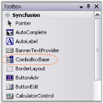

# Getting Started with Windows Forms ComboBoxBase

ComboBoxBase can be created easily through designer, by just dragging and dropping the ComboBoxBase control from the Toolbox.

 

 

To add data for the popup, add a listbox control to the form and select it in ListControl property.

 

 

It can be created through code by following the below steps.

1. Added Shared.Base to the reference folder through solution explorer and include the below namespace in the code.




using Syncfusion.Windows.Forms.Tools;





Imports Syncfusion.Windows.Forms.Tools




2. Create an instance of the ComboBoxBase control and ListBox.




private Syncfusion.Windows.Forms.Tools.ComboBoxBase comboBoxBase1;
private System.Windows.Forms.ListBox listBox1;
this.comboBoxBase1=new Syncfusion.Windows.Forms.Tools.ComboBoxBase();
this.listBox1=new ListBox();





Private comboBoxBase1 As Syncfusion.Windows.Forms.Tools.ComboBoxBase
Private listBox1 As System.Windows.Forms.ListBox
Me.comboBoxBase1 = New Syncfusion.Windows.Forms.Tools.ComboBoxBase()
Me.listBox1 = New ListBox()



 
3. Set the ListControl that will be used in the dropdown portion of ComboBoxBase and specify the size of ComboBoxBase. 




this.comboBoxBase1.ListControl=this.listBox1;
this.comboBoxBase1.Size=new Size(120,20);





Me.comboBoxBase1.ListControl=Me.listBox1
Me.comboBoxBase1.Size = New Size(120,20)




4. Specify the datasource. 




// Sets the datasource.
ArrayList USStates = new ArrayList(); 
USStates.Add(new USState("Washington", "WA")); 
USStates.Add(new USState("West Virginia", "WV")); 
USStates.Add(new USState("Wisconsin", "WI")); 
USStates.Add(new USState("Wyoming", "WY")); 
ListBox1.DataSource = USStates; 





' Sets the datasource.
Dim USStates As ArrayList = New ArrayList()
USStates.Add(New USState("Washington", "WA"))
USStates.Add(New USState("West Virginia", "WV"))
USStates.Add(New USState("Wisconsin", "WI"))
USStates.Add(New USState("Wyoming", "WY"))
ListBox1.DataSource = USStates




5. Finally add ComboBoxBase and Listbox to the Form.




this.Controls.Add(this.listBox1);
this.Controls.Add(this.comboBoxBase1);





Me.Controls.Add(Me.listBox1)
Me.Controls.Add(Me.comboBoxBase1)




 

Refer [Creating ListControl-Derived Controls](/windowsforms/ComboBoxBase/Creating-ListControl-Derived-Controls) about ListControl-Derived controls in detail.