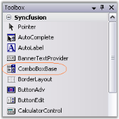
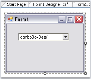
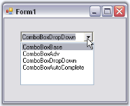
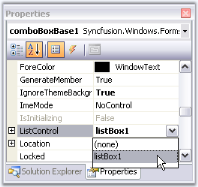
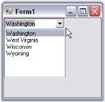

# Getting Started with Windows Forms ComboBoxBase

You can add ComboBoxBase to a form by dragging it from the Toolbox. ComboBoxBase is a base control that hosts a separate `ListControl` (typically a `ListBox`) for its popup portion.

* [Assembly deployment](#assembly-deployment)
* [Adding ComboBoxBase through the designer](#adding-comboboxbase-through-the-designer)
* [Adding ComboBoxBase through code](#adding-comboboxbase-through-code)

## Assembly deployment

Refer to the [Control Dependencies](https://help.syncfusion.com/windowsforms/control-dependencies#comboboxbase) section for the list of assemblies or the NuGet package details that must be referenced to use the control in any application.

Refer to [NuGet Packages](https://help.syncfusion.com/windowsforms/installation/install-nuget-packages) to learn how to install NuGet packages in a Windows Forms application.

To install via the NuGet Package Manager Console, run:

```
Install-Package Syncfusion.Shared.Base
```

## Adding ComboBoxBase through the designer

1. Add the **Syncfusion.Shared.Base** assembly references to the project.
2. Drag the **ComboBoxBase** control from the Toolbox onto the form.

    

    

3. To add data for the popup, drag a `ListBox` (or another `ListControl`-derived control) onto the form.

    

4. Select the ComboBoxBase on the form, and in the **Properties** window set the `ListControl` property to the `ListBox` you added.

    

## Adding ComboBoxBase through code

Add the ComboBoxBase control programmatically by following the steps below.

1. **Add the required assembly and namespace.**

    Add the **Syncfusion.Shared.Base** assembly to the **References** folder through the Solution Explorer, and include the following namespace in the code.

    
    
    

    using Syncfusion.Windows.Forms.Tools;

    
    

    Imports Syncfusion.Windows.Forms.Tools

    
    
    
    {{ codesnippet1 | OrderList_Indent_Level_1 }}

2. **Create instances of the ComboBoxBase control and ListBox.**

    
    
    

    private Syncfusion.Windows.Forms.Tools.ComboBoxBase comboBoxBase1;
    private System.Windows.Forms.ListBox listBox1;

    this.comboBoxBase1 = new Syncfusion.Windows.Forms.Tools.ComboBoxBase();
    this.listBox1 = new ListBox();

    
    

    Private comboBoxBase1 As Syncfusion.Windows.Forms.Tools.ComboBoxBase
    Private listBox1 As System.Windows.Forms.ListBox

    Me.comboBoxBase1 = New Syncfusion.Windows.Forms.Tools.ComboBoxBase()
    Me.listBox1 = New ListBox()

    
    
    
    {{ codesnippet2 | OrderList_Indent_Level_1 }}

3. **Set the ListControl used in the dropdown portion of ComboBoxBase and specify the size.**

    
    
    

    this.comboBoxBase1.ListControl = this.listBox1;
    this.comboBoxBase1.Size = new Size(120, 20);

    
    

    Me.comboBoxBase1.ListControl = Me.listBox1
    Me.comboBoxBase1.Size = New Size(120, 20)

    
    
    
    {{ codesnippet3 | OrderList_Indent_Level_1 }}

4. **Specify the data source.**

    
    
    

    // Sets the data source.
    ArrayList USStates = new ArrayList();
    USStates.Add(new USState("Washington", "WA"));
    USStates.Add(new USState("West Virginia", "WV"));
    USStates.Add(new USState("Wisconsin", "WI"));
    USStates.Add(new USState("Wyoming", "WY"));
    this.listBox1.DataSource = USStates;

    
    

    ' Sets the data source.
    Dim USStates As ArrayList = New ArrayList()
    USStates.Add(New USState("Washington", "WA"))
    USStates.Add(New USState("West Virginia", "WV"))
    USStates.Add(New USState("Wisconsin", "WI"))
    USStates.Add(New USState("Wyoming", "WY"))
    Me.listBox1.DataSource = USStates

    
    
    
    {{ codesnippet4 | OrderList_Indent_Level_1 }}

5. **Add the ComboBoxBase and ListBox to the form.**

    
    
    

    this.Controls.Add(this.listBox1);
    this.Controls.Add(this.comboBoxBase1);

    
    

    Me.Controls.Add(Me.listBox1)
    Me.Controls.Add(Me.comboBoxBase1)

    
    
    
    {{ codesnippet5 | OrderList_Indent_Level_1 }}

    

### Full code

The following complete example combines all the steps above for quick reference.





using Syncfusion.Windows.Forms.Tools;
using System.Collections;
using System.Drawing;

public partial class Form1 : Form
{
    private Syncfusion.Windows.Forms.Tools.ComboBoxBase comboBoxBase1;
    private System.Windows.Forms.ListBox listBox1;

    public Form1()
    {
        InitializeComponent();

        this.comboBoxBase1 = new Syncfusion.Windows.Forms.Tools.ComboBoxBase();
        this.listBox1 = new ListBox();

        this.comboBoxBase1.Location = new Point(20, 20);
        this.comboBoxBase1.Size = new Size(120, 20);
        this.listBox1.DisplayMember = "LongName";
        this.listBox1.ValueMember = "Abbreviation";

        // Sets the data source.
        ArrayList USStates = new ArrayList();
        USStates.Add(new USState("Washington", "WA"));
        USStates.Add(new USState("West Virginia", "WV"));
        USStates.Add(new USState("Wisconsin", "WI"));
        USStates.Add(new USState("Wyoming", "WY"));
        this.listBox1.DataSource = USStates;

        this.comboBoxBase1.ListControl = this.listBox1;

        this.Controls.Add(this.listBox1);
        this.Controls.Add(this.comboBoxBase1);
    }
}

// USState class
public class USState
{
    public string LongName { get; set; }
    public string Abbreviation { get; set; }

    public USState(string longName, string abbreviation)
    {
        this.LongName = longName;
        this.Abbreviation = abbreviation;
    }
}




Imports Syncfusion.Windows.Forms.Tools
Imports System.Collections
Imports System.Drawing

Public Partial Class Form1
    Inherits System.Windows.Forms.Form

    Private comboBoxBase1 As Syncfusion.Windows.Forms.Tools.ComboBoxBase
    Private listBox1 As System.Windows.Forms.ListBox

    Public Sub New()
        InitializeComponent()

        Me.comboBoxBase1 = New Syncfusion.Windows.Forms.Tools.ComboBoxBase()
        Me.listBox1 = New ListBox()

        Me.comboBoxBase1.Location = New Point(20, 20)
        Me.comboBoxBase1.Size = New Size(120, 20)
        Me.listBox1.DisplayMember = "LongName"
        Me.listBox1.ValueMember = "Abbreviation"

        ' Sets the data source.
        Dim USStates As ArrayList = New ArrayList()
        USStates.Add(New USState("Washington", "WA"))
        USStates.Add(New USState("West Virginia", "WV"))
        USStates.Add(New USState("Wisconsin", "WI"))
        USStates.Add(New USState("Wyoming", "WY"))
        Me.listBox1.DataSource = USStates

        Me.comboBoxBase1.ListControl = Me.listBox1

        Me.Controls.Add(Me.listBox1)
        Me.Controls.Add(Me.comboBoxBase1)
    End Sub
End Class

' USState class
Public Class USState
    Public Property LongName As String
    Public Property Abbreviation As String

    Public Sub New(ByVal longName As String, ByVal abbreviation As String)
        Me.LongName = longName
        Me.Abbreviation = abbreviation
    End Sub
End Class




{{ codesnippet6 | OrderList_Indent_Level_1 }}

Refer to the [Creating ListControl-Derived Controls](https://help.syncfusion.com/windowsforms/comboboxbase/creating-listcontrol-derived-controls) topic for more information.
