# Appearance Customization

In this topic the customization and enhancing the appearance of the command bar control is discussed

## Close button

The close button of command bar gets displayed when it is in the float state. This appearance can be customized done via the [`HideCloseButton`](https://help.syncfusion.com/cr/windowsforms/Syncfusion.Windows.Forms.Tools.CommandBar.html#Syncfusion_Windows_Forms_Tools_CommandBar_HideCloseButton) property. By default the property is set to `false` and always be visible whenever the command bar is in float state. The below code snippet shows the close button is being hidden.





commandBar1.HideCloseButton = true;





commandBar1.HideCloseButton = True





The below image shows the disabled close button in float state.

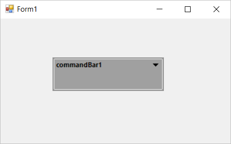

The close button state can also be retrieved from the [`GetCloseButtonState`](https://help.syncfusion.com/cr/windowsforms/Syncfusion.Windows.Forms.Tools.CommandBar.html#Syncfusion_Windows_Forms_Tools_CommandBar_GetCloseButtonState) method.

## Chevron button

The term "chevron" is used for a menu that contains the toolbar icons that do not fit in the space available on the toolbar. The chevron button can be customized via the [`HideChevron`](https://help.syncfusion.com/cr/windowsforms/Syncfusion.Windows.Forms.Tools.CommandBar.html#Syncfusion_Windows_Forms_Tools_CommandBar_HideChevron) property.

The below image shows the default visibility of chevron button.

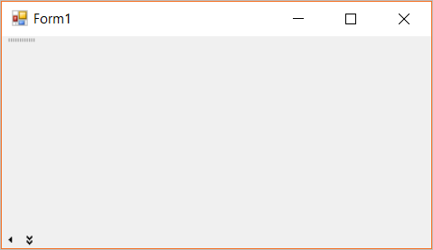

To hide the chevron visibility, the `HideChevron` property is set to `true`. The below code snippet shows the chevron button is being hidden.





commandBar1.HideChevron = true;





commandBar1.HideChevron = True





The below image shows the hidden chevron button in the docked state.

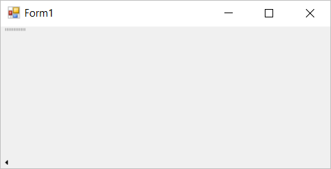

N> Chevron button is visible by default only in docked state of the command bar.

The chevron button state can be retrieved via the [IsChevronVisible](https://help.syncfusion.com/cr/windowsforms/Syncfusion.Windows.Forms.Tools.CommandBar.html#Syncfusion_Windows_Forms_Tools_CommandBar_IsChevronVisible) property or the command bar instance.

The color value applied for chevron can be customized with the [`ChevronColor`](https://help.syncfusion.com/cr/windowsforms/Syncfusion.Windows.Forms.Tools.CommandBar.html#Syncfusion_Windows_Forms_Tools_CommandBar_ChevronColor) property. The below code snippet shows a new chevron color is being applied to the chevron button.

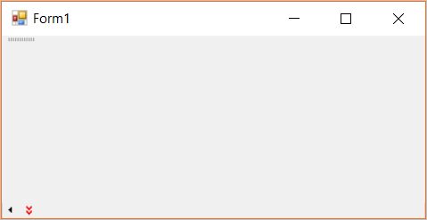

## Drop down button

The drop down button of command bar gets displayed either it is in the float state or docked state. This appearance can be customized done via the [`HideDropDownButton`](https://help.syncfusion.com/cr/windowsforms/Syncfusion.Windows.Forms.Tools.CommandBar.html#Syncfusion_Windows_Forms_Tools_CommandBar_HideDropDownButton) property. By default the property is set to `false` and always be visible. The below code snippet shows the drop down button is being hidden.





commandBar1.HideDropDownButton = true;





commandBar1.HideDropDownButton = True





The below image shows the disabled close button in float state.

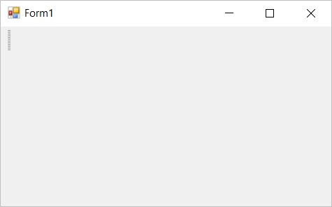

The drop down button state also can be retrieved from the [`GetDropDownState`](https://help.syncfusion.com/cr/windowsforms/Syncfusion.Windows.Forms.Tools.CommandBar.html#Syncfusion_Windows_Forms_Tools_CommandBar_GetDropDownState) method.

## Cursor

The mouse cursor settings of the command bar can be customized using the [`Cursor`](https://help.syncfusion.com/cr/windowsforms/Syncfusion.Windows.Forms.Tools.CommandBar.html#Syncfusion_Windows_Forms_Tools_CommandBar_Cursor) property. The below code snippet shows the command bar is set with `Hand` value whenever the command bar bounds is reached.





this.commandBar1.Cursor = System.Windows.Forms.Cursors.Hand;





Me.commandBar1.Cursor = System.Windows.Forms.Cursors.Hand





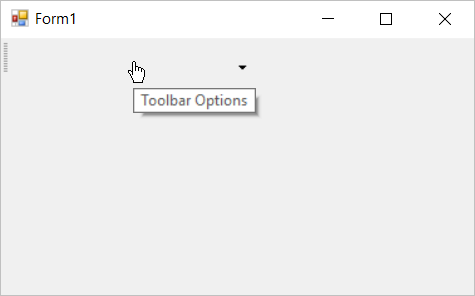.

Also, the [`ResetCursor`](https://help.syncfusion.com/cr/windowsforms/Syncfusion.Windows.Forms.Tools.CommandBar.html#Syncfusion_Windows_Forms_Tools_CommandBar_ResetCursor) method can be used to, reset the cursor state to default state.

## Gripper

The gripper allows the user to dock / float the command bar dynamically. In order to hide the gripper the [`HideGripper`](https://help.syncfusion.com/cr/windowsforms/Syncfusion.Windows.Forms.Tools.CommandBar.html#Syncfusion_Windows_Forms_Tools_CommandBar_HideGripper) property is used. By default it is set to `false`. The below code snippet shows the gripper is being hidden.





this.commandBar1.HideGripper = true;





Me.commandBar1.HideGripper = True





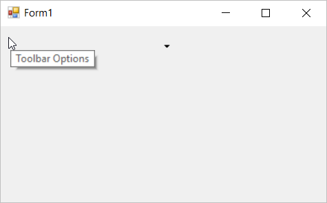

## Background

The back color of the command bar can be customized in either of the following scenarios.

* Customizing the back color of docked bar
* Customizing the command bar back color.

### Docked bar background

The docked bar background color can be customized via the `BackColor` property of `CommandBarController` instance that manages the command bars. The below code snippet shows the back color of the docked bar is being customized.





this.commandBarController1.BackColor = Color.Green;





Me.commandBarController1.BackColor = Color.Green





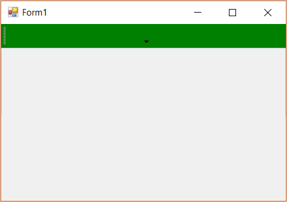

The default back color of the docked bar can be applied via the [`ResetBackColor`](https://help.syncfusion.com/cr/windowsforms/Syncfusion.Windows.Forms.Tools.CommandBarController.html#Syncfusion_Windows_Forms_Tools_CommandBarController_ResetBackColor) method of the command bar controller instance.

### Command bar background

The command bar back color can be customized by specifying the required color via the [`BackColor`](https://help.syncfusion.com/cr/windowsforms/Syncfusion.Windows.Forms.Tools.CommandBarController.html#Syncfusion_Windows_Forms_Tools_CommandBarController_BackColor) property of the command bar instance. The below code snippet shows the back color of the command bar is being customized.





this.commandBar1.BackColor = Color.Green;





Me.commandBar1.BackColor = Color.Green





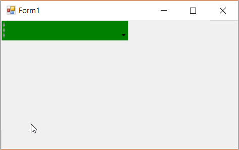

The default back color of the command bar can be applied by reseting the command bar back color via the [`ResetBackColor`](https://help.syncfusion.com/cr/windowsforms/Syncfusion.Windows.Forms.Tools.CommandBar.html#Syncfusion_Windows_Forms_Tools_CommandBar_ResetBackColor). Once the default back color gets modified the [`BackColorChanged`](https://docs.microsoft.com/en-us/dotnet/api/system.windows.forms.control.backcolorchanged?redirectedfrom=MSDN&view=netframework-4.7.2) event occurs.

## Command bar text

The command bar text can be customized either it is in dock / float state. The dock state text can be disabled using the [`ShowDockStateText`]() property. By default this is set to `true` and it applies for the caption text in float mode. The below code snippet shows the command bar dock text is being disabled.





this.commandBar1.ShowDockModeText = false;





Me.commandBar1.ShowDockModeText = False





The below image shows the command bar with dock state text being disabled whereas for the float state the text is being displayed in the caption region.

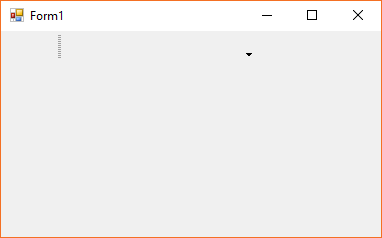

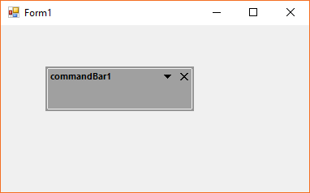

## Font style

The font of the text displayed in the command bar can be customized using the `Font` property. The below code snippet sets a specified font family to the command bar.





this.commandBar1.Font = new Font("AgencyFB", 15.0F);





this.commandBar1.Font = new Font("AgencyFB", 15.0F);





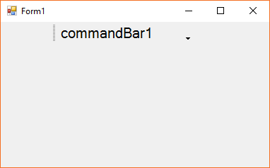
