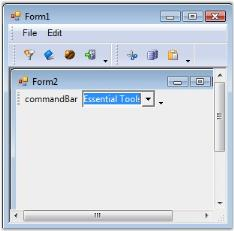

# Why is it not possible to add a CommandBarController to a form containing XP Menus and ToolBars?

The CommandBars Framework should be used only with the standard .NET Menus/ToolBars and not with the Essential® Tools XP Menus. This is because the XP Menus designer infrastructure will freeze the .NET environment.

But it is possible to add a CommandBar to a form containing XP Menus through code as shown in the sample screenshot.