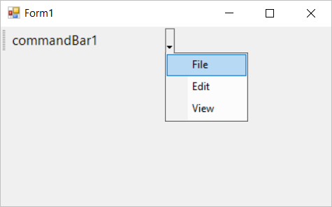
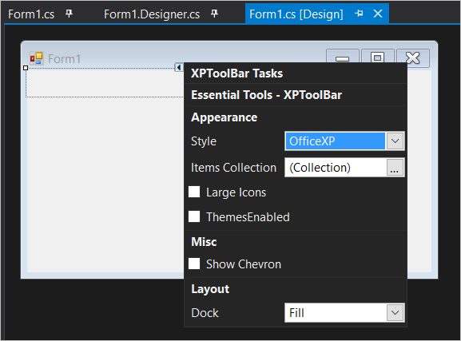

# Hosting Controls in Windows Forms CommandBar (CommandBars)

In this topic the integrating of controls with command bar is discussed.

## Integrating with popup menu

Popup menu can be integrated with command bar controller and can be utilized as a drop-down menu. This can be done in either of the following ways.

### Through designer

The popup menu control is drag and dropped from the tool box and then it can be integrated with the command bar via the [`PopupMenu`](https://help.syncfusion.com/cr/windowsforms/Syncfusion.Windows.Forms.Tools.CommandBar.html#Syncfusion_Windows_Forms_Tools_CommandBar_PopupMenu) property of the [CommandBar](https://help.syncfusion.com/cr/windowsforms/Syncfusion.Windows.Forms.Tools.CommandBar.html) instance. The below code image shows the popup menu being integrated with the command bar.

### Through code

Th popup menu can be added via code by initializing an instance of [`PopupMenu`](https://help.syncfusion.com/cr/windowsforms/Syncfusion.Windows.Forms.Tools.CommandBar.html#Syncfusion_Windows_Forms_Tools_CommandBar_PopupMenu) property of the command bar. The below code snippet shows the popup menu is being integrated with the command bar.





PopupMenu popup_Menu = new PopupMenu();
popup_Menu.ParentBarItem = new ParentBarItem();
popup_Menu.ParentBarItem.Items.AddRange(new BarItem[]
{
    new BarItem() { BarName="baarItem1", Text="File" },
    new BarItem() { BarName="baarItem2", Text="Edit" },
    new BarItem() { BarName="baarItem3", Text="View" }
});
this.commandBar1.PopupMenu = popup_Menu;





Dim popup_Menu As New PopupMenu()
popup_Menu.ParentBarItem = New ParentBarItem()
popup_Menu.ParentBarItem.Items.AddRange(New BarItem()
{
    New BarItem() With {.BarName="baarItem1", .Text="File"},
    New BarItem() With {.BarName="baarItem2", .Text="Edit"},
    New BarItem() With {.BarName="baarItem3", .Text="View"}
})
Me.commandBar1.PopupMenu = popup_Menu





## Integrating XP toolbar

The menu items could only be added to command bar is via the [XPToolBar](https://help.syncfusion.com/cr/windowsforms/Syncfusion.Windows.Forms.Tools.XPMenus.XPToolBar.html) control. It acts itself as a container control hosting the menu items.

### Through designer

The XP Tool bar can be drag and dropped to the command bar directly from the tool box. The basic properties are enabled via the smart tag options in the xp tool bar. The below image shows the integration of xp tool bar.

Now, the required menu items can be added to the created XP tool bar instance.

### Through code

An instance of [XPToolBar](https://help.syncfusion.com/cr/windowsforms/Syncfusion.Windows.Forms.Tools.XPMenus.XPToolBar.html) should be initialized with required properties and added using `Controls` property. The below code snippet shows the XP tool bar is being added to the command bar.





XPToolBar xpToolbar1 = new XPToolBar();
xpToolbar1.Name = "xpToolbar1";
this.commandBar1.Controls.Add(xpToolbar1);





Dim xpToolbar1 as New XPToolBar()
xpToolbar1.Name = "xpToolbar1"
Me.commandBar1.Controls.Add(xpToolbar1)







[Adding menu items to XP tool bar](https://help.syncfusion.com/windowsforms/xptoolbar/baritem-types)


