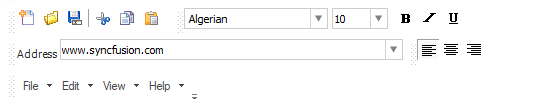

# About Syncfusion® Windows Forms CommandBar Control

[CommandBar](https://help.syncfusion.com/cr/windowsforms/Syncfusion.Windows.Forms.Tools.CommandBar.html) implements a framework for creating and hosting ToolBars, ReBars, and StatusBars similar to those that are found in the Visual Studio .NET and Office XP user interfaces.

## Key features

* **Dock states** - Supports Dock states in Top, Bottom, Left, Right directions and also empowered to be displayed in Floating state.

* **Button options** - Provides close and drop-down buttons.

* **Chevron** - Supports chevron which displays toolbar icons that do not fit in the space available in the toolbar.

* **Gripper** - Provides options to show and hide Gripper.

* **Visual style** - Provides rich set of Visual Style to customize the look and feel of CommandBar

* **Serialization** - Provides options to save and load the state of the CommandBar.

N> The CommandBar Framework should be used directly in an application only when there is no requirement for XP style menus and toolbars. Refer to the Essential® Tools Menus Package for implementing XP style menus and toolbars.
