# Theming in Windows Forms CommandBars

The command bar supports various built in themes via the `Style` property of the command bar controller instance that are discussed in this topic.

## Default theme

The `Default` theme applies the default color styles to the visual components of command bar. The following code snippet shows the command bar is applied with default theme.





this.commandBarController1.Style = Syncfusion.Windows.Forms.VisualStyle.Default;





Me.commandBarController1.Style = Syncfusion.Windows.Forms.VisualStyle.Default





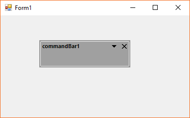

## Office XP theme

The command bar supports XP theme color styles when the style is applied as `OfficeXP`. The below code snippet shows the command bar is being applied with Office XP theme.





this.commandBarController1.ThemesEnabled = true;
this.commandBarController1.Style = Syncfusion.Windows.Forms.VisualStyle.OfficeXP;





Me.commandBarController1.ThemesEnabled = True
Me.commandBarController1.Style = Syncfusion.Windows.Forms.VisualStyle.OfficeXP





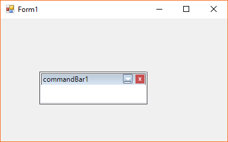

N> The `ThemesEnabled` property should be enabled to apply the XP theme color styles to the command bar.

## Metro Theme

The command bar supports metro theme color styles when the style is applied as `Metro`. The below code snippet shows the command bar is being applied with metro theme.





this.commandBarController1.Style = Syncfusion.Windows.Forms.VisualStyle.Metro;





Me.commandBarController1.Style = Syncfusion.Windows.Forms.VisualStyle.Metro





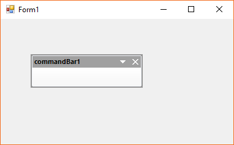

## Office 2003 theme

The Office 2003 color styles can be applied to the command bar by applying the `Office2003` theme. The below code snippet shows the command bar is being applied with Office 2003 theme.





this.commandBarController1.Style = Syncfusion.Windows.Forms.VisualStyle.Office2003;





Me.commandBarController1.Style = Syncfusion.Windows.Forms.VisualStyle.Office2003





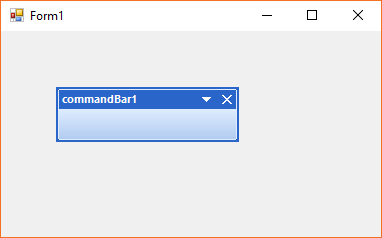

## Office 2007 theme

The Office 2007 color styles can be applied to the command bar by applying the `Office2007` theme and the respective color style can be selected via the `Office2007Theme` property. By default, the color scheme is set as `Blue`. Likewise the `Black`, `Silver` is applied. The below code snippet shows the command bar is being applied with office 2007 theme.





this.commandBarController1.Style = Syncfusion.Windows.Forms.VisualStyle.Office2007;
this.commandBarController1.Office2007Theme = Office2007Theme.Blue;





Me.commandBarController1.Style = Syncfusion.Windows.Forms.VisualStyle.Office2007
Me.commandBarController1.Office2007Theme = Office2007Theme.Blue





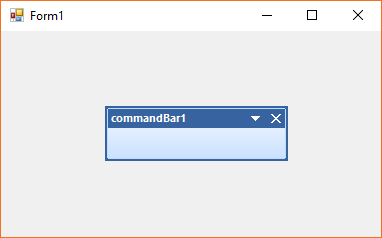

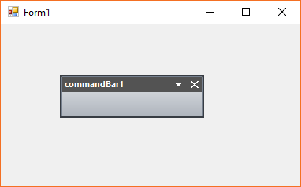

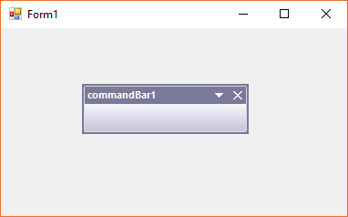

The color schemes can also be modified with the `Managed` color style. The below code snippet shows the command bar is being applied with office 2007 theme with custom color via the **Office2007Colors** class.





this.commandBarController1.Style = Syncfusion.Windows.Forms.VisualStyle.Office2007;
this.commandBarController1.Office2007Theme = Office2007Theme.Managed;
Office2007Colors.ApplyManagedColors(this, Color.Red);





Me.commandBarController1.Style = Syncfusion.Windows.Forms.VisualStyle.Office2007
Me.commandBarController1.Office2007Theme = Office2007Theme.Managed
Office2007Colors.ApplyManagedColors(Me, Color.Red);





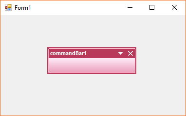

## Office 2007 Outlook theme

The Office 2007 Outlook-like color styles can be applied to the command bar by applying the `Office2007Outlook` theme. The below code snippet shows the command bar is being applied with it.





this.commandBarController1.Style = Syncfusion.Windows.Forms.VisualStyle.Office2007Outlook;





Me.commandBarController1.Style = Syncfusion.Windows.Forms.VisualStyle.Office2007Outlook





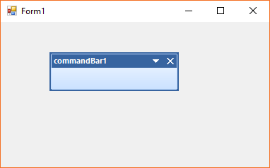

## Office 2010 theme

The Office 2010 color styles can be applied to the command bar by applying the `Office2010` theme and the respective color style can be selected via the `Office2010Theme` property. By default, the color scheme is set as `Blue`. Likewise the `Black`, `Silver` is applied. The below code snippet shows the command bar is being applied with office 2010 theme.





this.commandBarController1.Style = Syncfusion.Windows.Forms.VisualStyle.Office2010;
this.commandBarController1.Office2010Theme = Office2010Theme.Blue;





Me.commandBarController1.Style = Syncfusion.Windows.Forms.VisualStyle.Office2010
Me.commandBarController1.Office2010Theme = Office2010Theme.Blue





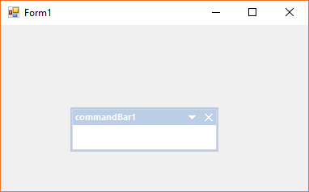

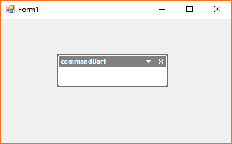

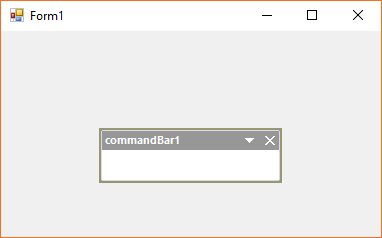

The color schemes can also be modified with the `Managed` color style. The below code snippet shows the command bar is being applied with office 2010 theme with custom color via the **Office2010Colors** class.





this.commandBarController1.Style = Syncfusion.Windows.Forms.VisualStyle.Office2010;
this.commandBarController1.Office2010Theme = Office2010Theme.Managed;
Office2010Colors.ApplyManagedColors(this, Color.Green);





Me.commandBarController1.Style = Syncfusion.Windows.Forms.VisualStyle.Office2010
Me.commandBarController1.Office2010Theme = Office2010Theme.Managed
Office2010Colors.ApplyManagedColors(Me, Color.Green);





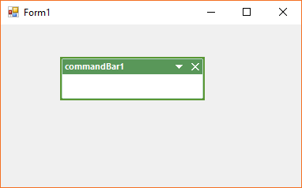

## Office 2016 theme

Command bar supports the Office 2016-like color styles and color schemes. The applicable color schemes of Office 2016 themes are as follows.

* Office 2016 dark gray
* Office 2016 black
* Office 2016 white
* Office 2016 colorful

### Office 2016 dark gray theme

The command bar is applied with `Office2016Darkgray` color scheme by using the below code snippet.





this.commandBarController1.Style = Syncfusion.Windows.Forms.VisualStyle.Office2016Darkgray;





Me.commandBarController1.Style = Syncfusion.Windows.Forms.VisualStyle.Office2016Darkgray





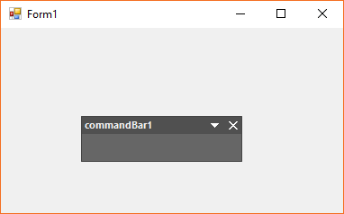

### Office 2016 black theme

The command bar is applied with `Office2016Black` color scheme by using the below code snippet.





this.commandBarController1.Style = Syncfusion.Windows.Forms.VisualStyle.Office2016Black;





Me.commandBarController1.Style = Syncfusion.Windows.Forms.VisualStyle.Office2016Black





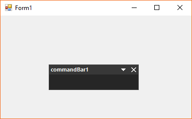

### Office 2016 white theme

The command bar is applied with `Office2016White` color scheme by using the below code snippet.





this.commandBarController1.Style = Syncfusion.Windows.Forms.VisualStyle.Office2016White;





Me.commandBarController1.Style = Syncfusion.Windows.Forms.VisualStyle.Office2016White





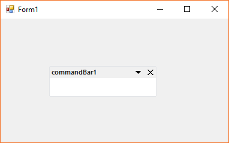

### Office 2016 colorful theme

The command bar is applied with `Office2016Colorful` color scheme by using the below code snippet.





this.commandBarController1.Style = Syncfusion.Windows.Forms.VisualStyle.Office2016Colorful;





Me.commandBarController1.Style = Syncfusion.Windows.Forms.VisualStyle.Office2016Colorful





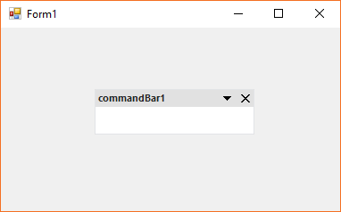

## VS 2005 theme

The Visual Studio-2005 like color styles are applied via the `VS2005` theme. The below code snippet shows the command bar is applied with VS 2005-like theme.





this.commandBarController1.Style = Syncfusion.Windows.Forms.VisualStyle.VS2005;





Me.commandBarController1.Style = Syncfusion.Windows.Forms.VisualStyle.VS2005





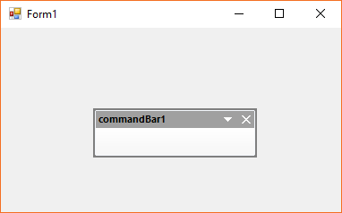

## VS 2010 theme

The Visual Studio-2005 like color styles are applied via the `VS2010` theme. The below code snippet shows the command bar is applied with VS 2010-like theme.





this.commandBarController1.Style = Syncfusion.Windows.Forms.VisualStyle.VS2010;





Me.commandBarController1.Style = Syncfusion.Windows.Forms.VisualStyle.VS2010





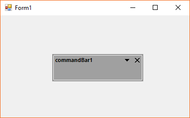