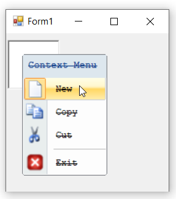
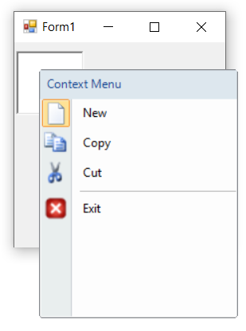
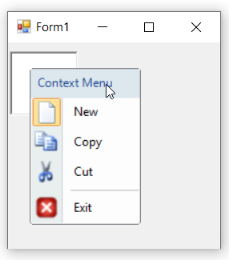
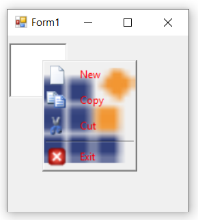

# Appearance in Windows Forms ContextMenuStrip (ContextMenuStripEx)

## Background Color

The [`BackColor`](https://learn.microsoft.com/en-us/dotnet/api/system.windows.forms.toolstrip.backcolor?redirectedfrom=MSDN&view=netframework-4.7.2#System_Windows_Forms_ToolStrip_BackColor) property is to set the background color of ContextMenuStrip control. Background color is used to improve the visual appearance of the ContextMenu.

The below code snippet will explain how to set background color of ContextMenuStrip control.




this.contextMenuStripEx.BackColor = System.Drawing.Color.SkyBlue;





Me.contextMenuStripEx.BackColor = System.Drawing.Color.SkyBlue




## Font

The [`Font`](https://learn.microsoft.com/en-us/dotnet/api/system.windows.forms.toolstripdropdown.font?redirectedfrom=MSDN&view=netframework-4.7.2#System_Windows_Forms_ToolStripDropDown_Font) property is to set the "FontFamily" and "FontStyle" of ContextMenuStrip control.

The below code snippet will explain the procedure to set font for menu items.




this.contextMenuStripEx.Font = new System.Drawing.Font("Courier New", 9F, System.Drawing.FontStyle.Strikeout);





Me.contextMenuStripEx.Font = New System.Drawing.Font("Courier New", 9F, System.Drawing.FontStyle.Strikeout)




## Foreground Color

The [`ForeColor`](https://learn.microsoft.com/en-us/dotnet/api/system.windows.forms.toolstrip.forecolor?redirectedfrom=MSDN&view=netframework-4.7.2#System_Windows_Forms_ToolStrip_ForeColor) property is to set foreground color for menu items. 




this.contextMenuStripEx.ForeColor = System.Drawing.Color.Red;





Me.contextMenuStripEx.ForeColor = System.Drawing.Color.Red




## Size

The [`Size`](https://learn.microsoft.com/en-us/dotnet/api/system.windows.forms.control.size?redirectedfrom=MSDN&view=netframework-4.7.2#System_Windows_Forms_Control_Size) property is to set the height and width of context menu items.

>**NOTE**:
In-order to set size for context menu, set [`AutoSize`](https://learn.microsoft.com/en-us/dotnet/api/system.windows.forms.toolstripdropdown.autosize?redirectedfrom=MSDN&view=netframework-4.7.2#System_Windows_Forms_ToolStripDropDown_AutoSize) property to false.

The below code snippet is to set the size of context menu.




this.contextMenuStripEx.AutoSize = false;
this.contextMenuStripEx.Size = new System.Drawing.Size(200, 250);





Me.contextMenuStripEx.AutoSize = False
Me.contextMenuStripEx.Size = New System.Drawing.Size(200, 250)




## Text

The [`Text`](https://learn.microsoft.com/en-us/dotnet/api/system.windows.forms.control.text?redirectedfrom=MSDN&view=netframework-4.7.2#System_Windows_Forms_Control_Text) property is used to set the caption of ContextMenuStripEx control.

The below code snippet will explain how to set text for ContextMenu.




this.contextMenuStripEx.Text = "Context Menu";





Me.contextMenuStripEx.Text = "Context Menu"




## Background Image

The [`BackgroundImage`](https://learn.microsoft.com/en-us/dotnet/api/system.windows.forms.control.backgroundimage?redirectedfrom=MSDN&view=netframework-4.7.2#System_Windows_Forms_Control_BackgroundImage) property is to set the background image of ContextMenuStripEx control.

The below code snippet is to set the background image of ContextMenu.




 this.contextMenuStripEx.BackgroundImage = System.Drawing.Image.FromFile(@"..\..\..\cut.png");





 Me.contextMenuStripEx.BackgroundImage = System.Drawing.Image.FromFile("..\..\..\cut.png")




